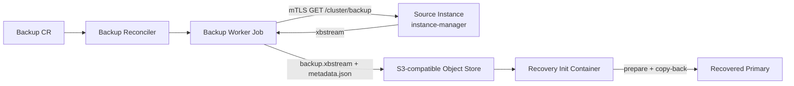

# Physical backup and recovery architecture

cnmsql physical backups are Percona XtraBackup streams stored in an
S3-compatible object store. A `Backup` object is immutable once completed: it
selects a source instance, creates a worker Job, uploads a single xbstream
archive plus metadata, and records enough status for a future Cluster recovery.

PITR builds on this base-backup mechanism. This page focuses on the physical
backup and restore-to-backup-point path.



## Object store configuration

Backups need an S3-compatible object store on the source Cluster or directly on
the Backup object:

```yaml
spec:
  backup:
    objectStore:
      bucket: cnmsql-backups
      path: production
      endpoint: http://minio.minio.svc:9000
      region: us-east-1
      forcePathStyle: true
      credentials:
        accessKeyId:
          name: minio-creds
          key: accessKey
        secretAccessKey:
          name: minio-creds
          key: secretKey
```

When `Backup.spec.objectStore` is omitted, the backup inherits
`Cluster.spec.backup.objectStore`. The object store supports custom endpoints,
path-style addressing, signature v2 or v4, TLS CA bundles, insecure test
endpoints, server-side encryption, storage class, static credentials, and IAM
role inheritance.

## Creating a backup

A one-shot Backup references its Cluster. Use the plugin for a quick on-demand
backup with sensible defaults:

```bash
kubectl cnmsql backup cluster-sample
```

This creates a `Backup` object with `xtrabackup` method, `prefer-standby`
target, and online mode. The Backup reconciler runs the XtraBackup-to-object-store
data path.

You can also define a Backup by hand when you need more control:

```yaml
apiVersion: mysql.cnmsql.co/v1alpha1
kind: Backup
metadata:
  name: backup-sample
spec:
  cluster:
    name: cluster-sample
  method: xtrabackup
  target: prefer-standby
  online: true
```

`target: prefer-standby` takes the backup from a healthy replica when one is
available and falls back to the primary. `target: primary` requires the current
primary.

The reconciler creates a Kubernetes Job owned by the Backup. The Job uses the
same cnmsql instance image as the Cluster so the XtraBackup version matches the
server version. Object-store credentials are mounted into the short-lived Job,
not into the long-running database Pods.

A finished worker Job is kept for 24h by default so you can inspect its logs,
then Kubernetes garbage-collects it (`ttlSecondsAfterFinished`). Tune this with
`spec.backup.jobTTL` on the Cluster (the default for every backup) or
`spec.jobTTL` on an individual Backup, which wins. Both take a duration such as
`1h` or `0s`; a zero duration deletes the Job as soon as it finishes.

## Backup data path

The worker Job:

1. resolves the selected source instance;
2. connects to its instance-manager endpoint over mTLS;
3. requests `GET /cluster/backup`;
4. streams XtraBackup stdout directly to the object store;
5. computes SHA256 while uploading;
6. uploads `metadata.json`;
7. exits and lets the controller mirror Job outcome into Backup status.

The backup stream itself is data and is not logged. Child process stderr is
captured as structured logs.

## Object layout

cnmsql uses deterministic, inspectable object keys:

```text
<path>/<cluster>/<backup-name>/<backup-id>/backup.xbstream
<path>/<cluster>/<backup-name>/<backup-id>/metadata.json
```

`metadata.json` includes cluster identity, Backup identity, source instance,
method, backup ID, object key, timing, size, checksum, and GTID/binlog metadata
when available.

SHA256 in cnmsql metadata is the integrity source of truth. S3 ETag may be
useful provider metadata, but it is not used as the backup checksum.

## Backup status

The `Backup` status reports:

- `phase`: `pending`, `running`, `completed`, or `failed`;
- `instanceName`: selected backup source;
- `method`;
- `backupId`;
- `jobName`;
- `destinationPath`;
- `sha256`;
- `beginGTID` and `endGTID`;
- `beginBinlog` and `endBinlog`;
- `startedAt` and `stoppedAt`;
- `error`;
- `conditions`.

A completed Backup is not rerun. To take another backup, create another Backup
object or use a `ScheduledBackup`.

## Restore from a backup

A new Cluster can recover from a completed Backup:

```yaml
apiVersion: mysql.cnmsql.co/v1alpha1
kind: Cluster
metadata:
  name: restored-cluster
spec:
  instances: 3
  imageName: ghcr.io/cnmsql/cnmsql-instance:8.4
  storage:
    size: 10Gi
  bootstrap:
    recovery:
      backup:
        name: backup-sample
  backup:
    objectStore:
      bucket: cnmsql-backups
      path: production
      endpoint: http://minio.minio.svc:9000
      credentials:
        accessKeyId:
          name: minio-creds
          key: accessKey
        secretAccessKey:
          name: minio-creds
          key: secretKey
```

The recovery init container downloads `backup.xbstream`, verifies the checksum,
extracts it, runs XtraBackup prepare, copy-backs into the data directory, and
starts the first instance as the recovered primary. Additional replicas clone
from that recovered primary through the normal replica join path.

Without `recoveryTarget`, the Cluster restores to the backup's consistent point.
With `recoveryTarget`, the PITR path replays archived binlogs after the base
backup restore.

## Restore from raw object store (no Backup CR)

A Cluster can also recover directly from an object-store bucket without any
`Backup` object existing in the API server. This is the disaster-recovery path:
the source cluster's API server (and its `Backup` CRs) may be gone, GC'd by
retention, or in another cluster entirely. Recovery is driven entirely by the
objects already in S3.

Point `bootstrap.recovery.source` at an `externalClusters` entry. The entry
carries its own `objectStore` (bucket, path, credentials) and its `name` is the
S3 key prefix the backups were stored under. No source `Cluster` or `Backup` CR
needs to exist anywhere.

```yaml
apiVersion: mysql.cnmsql.co/v1alpha1
kind: Cluster
metadata:
  name: recovered-cluster
spec:
  instances: 3
  imageName: ghcr.io/cnmsql/cnmsql-instance:8.4
  storage:
    size: 10Gi
  bootstrap:
    recovery:
      source: prod-cluster          # externalClusters entry name = S3 key prefix
      backupID: ""                   # empty = latest; set to pin a specific backup
      recoveryTarget:                # optional PITR, identical to the Backup path
        targetGTID: "uuid:1-99"
  externalClusters:
    - name: prod-cluster
      objectStore:
        bucket: cnmsql-backups
        path: production
        endpoint: http://minio.minio.svc:9000
        credentials:
          accessKeyId:
            name: minio-creds
            key: accessKey
          secretAccessKey:
            name: minio-creds
            key: secretKey
```

The operator lists the base backups under the prefix, selects the latest
completed one (or the entry matching `backupID` when set), derives the archive
and metadata keys, and restores exactly as the Backup-based path does. `source`
and `backup` are mutually exclusive. PITR with `recoveryTarget` works
identically: the binlog archive is resolved from the same object store under the
source name.

## Failure surfaces

Common failure points are reported through Backup phase, Backup conditions, Job
status, and Events:

- missing referenced Cluster;
- missing object-store configuration;
- unsupported backup method;
- no healthy source instance;
- mTLS connection failure to the source instance manager;
- XtraBackup failure;
- object-store upload/download failure;
- checksum mismatch;
- failed restore prepare or copy-back;
- raw-S3 recovery: `source` does not name an `externalClusters` entry;
- raw-S3 recovery: the referenced external cluster entry has no `objectStore`;
- raw-S3 recovery: no base backups found under the source prefix;
- raw-S3 recovery: the requested `backupID` is not present in the object store.

The controller-manager never handles backup payload bytes. Large data movement
stays in Jobs and init containers so retries are isolated and observable through
Kubernetes primitives.

## Operational notes

- Keep completed Backup objects for as long as recovery clusters may reference
  them.
- Preserve both `backup.xbstream` and `metadata.json`; recovery needs metadata
  as well as bytes.
- Use the same major-version-compatible cnmsql instance image for recovery.
- Prefer standby backups for large clusters when replicas can absorb the backup
  load.
- Object-store retention and immutability are external responsibilities until
  cnmsql retention GC is implemented.
- Physical backup alone restores only to the backup consistency point. Enable
  continuous archiving when PITR is required.

## Verification coverage

Unit tests cover object-store key construction, checksum helpers, backup target
selection, Job rendering, status transitions, and restore command behavior. The
Kind + MinIO e2e suite validates backup upload, metadata writing, restore into a
new Cluster, and recovered data correctness.
