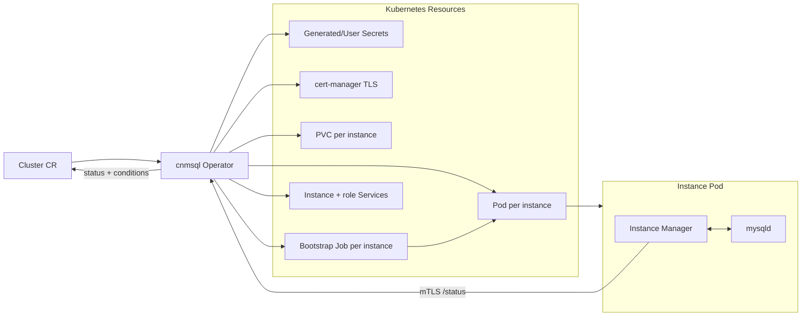

# Cluster lifecycle architecture

This document explains how cnmsql reconciles a `Cluster` into running Percona
Server for MySQL instances. The operator follows the CloudNativePG pattern:
Kubernetes owns the desired state, while each database pod runs an instance
manager that owns local mysqld lifecycle and reports database state back to the
operator.

cnmsql does not use StatefulSets. It creates one Pod and one PVC per instance
so it can control cloning, promotion, fencing, retained storage, and recovery
explicitly.



## Cluster shape

A fresh cluster usually defines an image, an instance count, storage, and an
`initdb` bootstrap:

```yaml
apiVersion: mysql.cnmsql.co/v1alpha1
kind: Cluster
metadata:
  name: cluster-sample
spec:
  instances: 3
  imageName: ghcr.io/cnmsql/cnmsql-instance:8.4
  storage:
    size: 10Gi
  mysql:
    binlogFormat: ROW
  bootstrap:
    initdb:
      database: app
      owner: app
```

`spec.imageName` selects the exact instance image. Alternatively, an
`imageCatalogRef` can resolve an image by MySQL series. cnmsql is built
for Percona Server for MySQL; the instance image includes mysqld, XtraBackup,
the manager binary, and the small tool set needed for backup and recovery.

## Reconciled resources

For each instance, the operator reconciles stable Kubernetes objects with
predictable names:

- Pod: `<cluster>-1`, `<cluster>-2`, and so on.
- PVC: one data volume per instance, retained during scale-down. See
  [Storage](./storage.md) for configuration and resizing.
- Bootstrap Job: one `<instance>-<mode>` Job per instance volume, which runs
  before the instance Pod exists (see [Instance bootstrap](#instance-bootstrap)).
- Headless per-instance Service: stable DNS for instance-to-instance traffic.
- Secrets: root, application, replication, backup, and control credentials when
  the user does not provide them.
- TLS material: cert-manager issuers/certificates for manager mTLS and MySQL TLS.
- Role Services: `<cluster>-rw`, `<cluster>-ro`, and `<cluster>-r`.

The operator labels owned resources with the cluster and instance identity.
Role labels are dynamic: the current primary receives `role=primary`, and the
other ready instances receive `role=replica`.

## Instance bootstrap

An instance's data volume comes up in a fixed order: the operator creates the
PVC, bootstraps it with a one-shot Job, and only then creates the instance Pod.
The Job is named `<instance>-<mode>` — `initdb` (fresh data directory),
`restore` (physical recovery and PITR), `join` (replica clone), or `import`
(initdb then logical load) — mounts the volume, and runs the same
`manager instance …` command under the instance's ServiceAccount. It follows
the instance's scheduling so the volume binds where the Pod can run, and the
Job and the Pod never run at the same time.

The PVC annotation `mysql.cnmsql.co/pvc-status` records the volume's state:
`initializing` on creation, `ready` once the Job succeeded and the operator
deleted it. The cluster waits for a running Job in phase `Pending`, with a
reason like "Waiting for bootstrap Job cluster-1 (restore) of cluster-1".

A failed Job stays for inspection and is surfaced on the Cluster:

- the `BootstrapFailed` condition turns True with the Job's own reason (for
  example `BackoffLimitExceeded` or `DeadlineExceeded`);
- the phase becomes `Blocked` (or `Degraded` when a replica's join fails on an
  established cluster), with a reason naming every failed Job;
- a `BootstrapJobFailed` Warning Event records the transition.

The Job is replaced only when the spec it was built from changes — a different
recovery source, a longer deadline. To retry with the same spec, delete it by
hand:

```bash
kubectl logs job/<instance>-<mode>
kubectl delete job <instance>-<mode>
```

Re-initialising an instance deletes its bootstrap Jobs together with its Pod
and PVC. Scaling an instance down deletes its bootstrap Jobs — running ones
included, even when its Pod was never created — and deletes its volume only
while it is still initializing; a bootstrapped volume is retained.

## Bootstrap modes

The first instance can start in one of two supported ways.

`bootstrap.initdb` creates a new MySQL data directory, initializes the root and
application users, creates the application database, and applies optional
post-init SQL:

```yaml
spec:
  bootstrap:
    initdb:
      database: app
      owner: app
      secret:
        name: app-credentials
      postInitSQL:
        - CREATE TABLE app.ready (id int primary key)
      characterSet: utf8mb4
      collation: utf8mb4_0900_ai_ci
```

`bootstrap.recovery.backup` restores from a `Backup` object into an empty PVC;
`bootstrap.recovery.source` restores directly from an object-store bucket by
referencing an `externalClusters` entry. A raw-S3 recovery discovers the latest
or named (`backupID`) base backup in the destination, needing no source
`Cluster` or `Backup` CR to exist. When a recovery target is present, PITR
planning and binlog replay run before the recovered mysqld is started as the new
primary. [Physical backup and recovery](./backup-recovery.md) and
[Point-in-time recovery](./pitr.md) cover both paths and the recovery targets.

Each `externalClusters` entry names an object store holding another cluster's
backups. `bootstrap.recovery.source`, `bootstrap.import.source` and a
`LogicalRestore`'s `spec.source` refer to an entry by name, and the name is the
key prefix the backups sit under.

Replicas do not run `initdb`. They join by pulling an XtraBackup stream from
the current primary over the instance-manager mTLS endpoint, preparing it, and
configuring GTID replication.

## Instance manager

Each Pod runs a cnmsql instance manager as PID 1. It is responsible for:

- rendering version-aware MySQL configuration;
- starting and stopping mysqld cleanly;
- bootstrapping the data directory (initdb, restore, join, import) in the
  instance's one-shot bootstrap Job;
- exposing an mTLS control API for status and backup streaming;
- running an in-pod role reconciler that promotes or follows based on Cluster
  status;
- running the binlog archiver when continuous archiving is enabled.

The manager uses MySQL's admin interface where available so control operations
do not get locked out by application connection pressure. Older versions fall
back to local socket access and reserved privileges.

## Configuration surface

cnmsql renders the managed MySQL configuration and lets users add safe MySQL
settings through:

```yaml
spec:
  mysql:
    parameters:
      require_secure_transport: "ON"
      max_connections: "500"
    binlogFormat: ROW
    semiSync:
      enabled: true
      timeoutMillis: 1000
      dataDurability: preferred
    additionalConfigFiles:
      custom.cnf: |
        [mysqld]
        sort_buffer_size=4M
```

The operator owns settings required for replication, backup, PITR, and lifecycle
control. User parameters are applied under the mysqld section, but managed keys
are protected by the renderer.

The operator checks `spec.mysql.parameters` before it provisions anything. Keys
are compared case-insensitively, and dashes match underscores (`log-bin` is
`log_bin`).

A denied key sets the cluster to `phase: Blocked` with a reason naming the key.
Denied keys are the ones the operator manages itself (replication identity,
topology, TLS material, binlog durability) and the ones that would move on-disk
paths or expose the administrative interface, for example `server_id`,
`gtid_mode`, `read_only`, `log_bin`, `ssl_cert`, `sync_binlog`, `datadir`,
`socket`, `tmpdir`, `plugin_dir`, `secure_file_priv`, `log_error`,
`admin_address`, `admin_ssl_cert`, `tls_ciphersuites`, `skip_replica_start` and
`auto_generate_certs`. `require_secure_transport` is allowed: whether clients
must use TLS is your choice.

A deprecated key is accepted, and the operator emits a `DeprecatedParameter`
Warning event with the current spelling: `slave_parallel_workers` becomes
`replica_parallel_workers`, and `master_info_repository` is gone from 8.0.23.

Scheduling and pod shape are controlled through the Cluster spec:
`resources`, `affinity`, `topologySpreadConstraints`, `priorityClassName`,
`schedulerName`, `imagePullPolicy`, `imagePullSecrets`, `env`, `envFrom`,
`podSecurityContext`, and `securityContext`.

TLS material is generated through cert-manager unless you provide Secret names
under `spec.certificates`:

```yaml
spec:
  certificates:
    serverCASecret: my-server-ca
    serverTLSSecret: my-server-tls
    clientCASecret: my-client-ca
    replicationTLSSecret: my-replication-tls
```

Partial overrides are allowed. For example, setting only `serverTLSSecret`
reuses your server certificate while cnmsql still generates the CA issuer and
operator client certificate.

## Status model

During reconciliation and periodic resyncs, the operator queries each
instance-manager `/status` endpoint over mTLS and combines that with Kubernetes
Pod readiness before writing the observed topology into `Cluster.status`.

Important fields include:

- `instances` and `readyInstances`;
- `instanceNames`;
- `currentPrimary` and `targetPrimary`;
- `currentPrimaryTimestamp`;
- `gtidExecutedByInstance`;
- `continuousArchiving`;
- `phase`, `phaseReason`, and Kubernetes conditions.

`Ready=True` means the desired topology is available. `Progressing=True` means
the cluster is still creating, cloning, restoring, or changing primary.
`Degraded=True` surfaces a failure that needs operator attention. Two examples
are a Pod stuck failing to start (`failedInstances`) and a reachable replica
whose replication has aborted with a recorded error (`replicationBrokenInstances`).
This holds even before the cluster first finishes provisioning, so a replica that
comes up but cannot replicate is reported instead of looking like it is still
bootstrapping.

The Cluster sets these condition types:

| Condition | True when |
|-----------|-----------|
| `Ready` | The desired topology is available. |
| `Progressing` | The cluster is being created, cloned, restored, or is changing primary. |
| `Degraded` | The cluster failed to reach or keep its desired state. |
| `ImageReady` | The image the cluster resolves to was probed and accepted as `status.targetImage`. False while a new image is probed or after it was rejected; the cluster then stays on its previous image. |
| `BootstrapFailed` | An instance's bootstrap Job failed and was not replaced. See [Instance bootstrap](#instance-bootstrap). |
| `DumpAccountReady` | The `cnmsql_dump` account exists on the primary with the password from the `<cluster>-dump` Secret, so logical backups can run. |
| `MetricsAccountReady` | The `cnmsql_metrics` account exists on the primary with its built-in grants plus exactly those in `spec.monitoring.privileges`. |
| `StoragePressure` | An instance's data volume is at least 85% full. See [Storage](./storage.md#the-storagepressure-condition). |
| `BinlogPurgeHeld` | The purge gate has kept the same archived binary log for a while because an instance has not applied it. The message names the instances. Absent when the gate is off. |

`Backup` and `LogicalRestore` use `Ready`, `Progressing` and `Degraded` with the
same meaning. `Database` and `DatabaseUser` set `Ready` only.

## Scale behavior

Scale-up is ordered. The operator creates one new replica at a time and waits
for it to become healthy before adding the next one. This bounds load on the
primary and makes failures easier to diagnose.

Scale-down removes highest-ordinal replicas first. The Pod is deleted, but the
PVC is retained so the user can inspect or delete data deliberately. A volume
that never finished bootstrapping (annotated `initializing`) holds no data and
is deleted together with the instance's bootstrap Jobs — running ones included,
also when the Pod was never created, as when a scale-down races a join Job.
cnmsql never scales below one instance and never removes the current primary as
part of ordinary scale-down. When the primary's ordinal is above the new count, the
operator performs a planned switchover to an in-range replica first and removes
the former primary afterwards; the cluster is not `Ready` until it has.

A later scale-up reuses a retained PVC as it is: the instance starts from the
data it held when it was removed and catches up from the primary's binary logs.
By default it is Ready, and in the `-ro` and `-r` Services, as soon as its
replication threads run, so it can serve reads that are as old as the volume
until it has caught up. Set
[spec.replication.maxReadyLag](./replication-failover.md#the-readiness-lag-gate)
to hold it out of the read Services until it has, or delete the PVC before
scaling up to clone the replica afresh.

## Operational notes

- Use at least three instances when relying on automatic failover.
- Keep `binlogFormat: ROW` for replication and PITR safety.
- Set `require_secure_transport` yourself if applications must be forced onto
  TLS; cnmsql renders TLS material but does not force the setting by default.
- Treat retained PVCs after scale-down or failed rejoin as database data, not
  disposable scratch space.
- Watch Events and conditions during bootstrap. Unsupported shapes are reported
  clearly instead of creating partial resources.

## Verification coverage

The controller has unit coverage for supported and unsupported cluster shapes,
image resolution, generated secrets, Pod/PVC templates, status transitions,
role labels, services, scale-up, scale-down, and recovery wiring. The Kind e2e
suite validates single-instance bootstrap, replicated clusters, role services,
switchover, failover, backup, restore, binlog archiving, and PITR flows.
