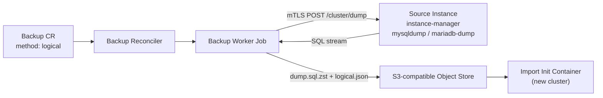

# Logical backups

A logical backup is a SQL dump of your application schemas, stored in the same
object store as your physical backups. Use it when a physical backup can't help:

- **Partial restore:** bring back one database without touching the others,
  into a new cluster or into the running one.
- **Moving across server versions:** load an 8.0 dump into a fresh 9.x cluster,
  or go back to an older series.
- **Exporting a schema** for a developer, a test environment or another tool.

Physical backups stay the right tool for disaster recovery and point-in-time
recovery. A logical backup is slower to take and much slower to restore on large
datasets, it is not a base for binlog replay, and it does not contain users or
grants.

| | Physical (`xtrabackup`) | Logical (`logical`) |
|---|---|---|
| Format | xbstream of the data directory | SQL (`dump.sql.zst`) |
| Restores onto | the same server series | any supported series of the same flavor |
| Restore granularity | whole cluster | whole dump or selected databases |
| Point-in-time recovery | yes, with binlog archiving | no |
| Users and grants | included | not included, declare them as CRs |
| Speed on large datasets | fast | slow (single-threaded dump and load) |

## How it works



The source instance manager runs the engine's dump client (`mysqldump` on
Percona Server, `mariadb-dump` on MariaDB) over its local socket and streams the
output to the backup worker Job over mTLS. The worker compresses the stream with
zstd, checksums it and uploads it. Object-store credentials never enter the
instance Pod, which is the same split as for
physical backups.

The dump runs as `cnmsql_dump`, a read-only account the operator creates on
every cluster. It can only connect over the instance's local socket. Its
password is in the `<cluster>-dump` Secret, which the source instance manager
reads itself through the Kubernetes API: the dump request carries no password
and the backup worker Job carries none. Clusters created before logical backup
support get the account on the first reconcile after the operator upgrade, with
no Pod restart. Logical Backups wait in `pending` (reason `DumpAccountNotReady`)
until the Cluster's `DumpAccountReady` condition is true:

```bash
kubectl get cluster shop -o jsonpath='{.status.conditions[?(@.type=="DumpAccountReady")]}'
```

To rotate the password, change `password` in the `<cluster>-dump` Secret. The
operator applies the new one to the account on its next reconcile.

Taking a logical backup needs an instance image that includes the dump tool.
Images published before logical backup support strip it. On such an image the
Backup fails with reason `LogicalToolUnavailable`; move the cluster to a newer
image tag of the same series (see [Instance Images and Versions](instance-images.md)).
The moving series tags (`8.4`, `11.4`, …) already point to images with the tool.
The first pinned tags that include it are:

| Image | First tag with the dump tool |
|---|---|
| `ghcr.io/cnmsql/cnmsql-instance` | `8.0-5`, `8.4-5`, `9.x-5` |
| `ghcr.io/cnmsql/cnmsql-mariadb-instance` | `10.11-4`, `11.4-4`, `11.8-4`, `12.3-4` |

Importing or restoring a dump works on any image: loading only needs the SQL
client, which every image ships.

Every dump is one consistent snapshot of all selected databases
(`--single-transaction`). Consistency covers InnoDB tables. Non-transactional
tables such as MyISAM can change while the dump runs.

## Taking a logical backup

```yaml
apiVersion: mysql.cnmsql.co/v1alpha1
kind: Backup
metadata:
  name: shop-dump
spec:
  cluster:
    name: shop
  method: logical
  target: prefer-standby
```

By default the dump contains every application schema. The system schemas
(`mysql`, `sys`, `performance_schema`, `information_schema`) and operator-owned
schemas such as `heartbeat` are always excluded. To dump only some databases:

```yaml
spec:
  method: logical
  logical:
    databases:
      - billing
      - catalog
```

With the plugin:

```bash
kubectl cnmsql backup shop --method logical --databases billing,catalog
```

`--databases` splits on commas: whitespace around each name is trimmed and
duplicates are dropped. Database names that contain a comma, or anything else
needing exact control, should go through a Backup manifest instead.

`target`, `objectStore`, `reclaimPolicy` and `jobTemplate` work the same as for
physical backups (see [Physical Backup and Recovery](backup-recovery.md)). The
dump always runs online: `online: false` is rejected, and so is a `logical`
block on a Backup whose method is not `logical`.

To pass extra flags to the dump tool, set `spec.backup.logicalOptions` on the
Cluster, or `logical.extraArgs` on one Backup (which replaces the cluster's
list). cnmsql does not check them: a flag that changes the output format or the
GTID handling can make the dump impossible to import.

```yaml
spec:
  method: logical
  logical:
    extraArgs:
      - --max-allowed-packet=1G
```

Taking the backup from a replica (`prefer-standby`, the default) is recommended.
The dump takes a brief global read lock at the start to record a consistent
binlog position, then reads for as long as the dump lasts.

### Scheduled logical backups

`ScheduledBackup` accepts the same `method` and `logical` fields:

```yaml
apiVersion: mysql.cnmsql.co/v1alpha1
kind: ScheduledBackup
metadata:
  name: shop-nightly-dump
spec:
  cluster:
    name: shop
  schedule: "0 0 3 * * *"
  method: logical
  successfulBackupsHistoryLimit: 7
```

A cluster often runs both: a physical schedule for disaster recovery and PITR,
and a logical one for exports and partial restores.

### Status

A completed logical Backup records:

- `status.method: logical`
- `status.destinationPath`: the `s3://` URI of `dump.sql.zst`
- `status.sha256`: checksum of the compressed object
- `status.databases`: the databases in the dump
- `status.beginBinlog` / `status.endBinlog`: the binlog position of the
  snapshot (`file:position`), for reference only
- `status.beginGTID` / `status.endGTID`: the GTID position of the snapshot, on
  MariaDB only. MySQL dumps are taken with `--set-gtid-purged=OFF` and do not
  report one.

`kubectl cnmsql status` lists logical backups with their method. They count as
the last successful backup, but never as a point of recoverability.

### When a logical backup fails

The Backup's `Degraded` condition carries the reason:

| Reason | Meaning |
|---|---|
| `DumpAccountNotReady` | Not a failure: the Backup waits in `pending` until the cluster's dump account exists. |
| `LogicalToolUnavailable` | The instance image has no dump tool. Move to a newer image tag (see above). |
| `InstanceManagerOutdated` | The source instance still runs an instance manager from before logical backups. Retry once the operator upgrade has reached it. |
| `DumpAccountMissing` | The source replica had not received the dump account yet after two minutes of retries. |
| `InvalidDumpRequest` | A database in `logical.databases` does not exist, or the cluster has no application database. |
| `DumpInProgress` | Another dump was still running on the source instance. |
| `DumpFailed` | The dump tool failed, or the stream ended without its completion footer. No manifest is written and the partial dump is removed. |
| `ManifestMissing` | The worker Job succeeded, but `logical.json` is missing from the object store or is not a valid manifest. Other errors reading it, such as the store being unreachable, are retried and leave the Backup running. |

## Object-store layout

Logical backups live next to physical ones under the cluster prefix:

```text
<path>/<cluster>/<backup-name>/<backup-id>/dump.sql.zst
<path>/<cluster>/<backup-name>/<backup-id>/logical.json
```

The manifest is `logical.json`, not `metadata.json`. Recovery from a raw object
store (`bootstrap.recovery.source`) and binlog retention only look at physical
backups, so a dump is never picked as a recovery base by mistake.

`dump.sql.zst` is plain zstd-compressed SQL. You can inspect it without cnmsql
(or download it with [`kubectl cnmsql backup download`](#downloading-a-dump)):

```bash
aws s3 cp s3://cnmsql-backups/production/shop/shop-dump/<id>/dump.sql.zst - | zstd -d | less
```

## Importing into a new cluster

To load a dump into a fresh cluster, use `bootstrap.initdb.import`. The cluster
is initialised on its own server version, then the dump is loaded, so the target
can be a newer (or older) series than the source:

```yaml
apiVersion: mysql.cnmsql.co/v1alpha1
kind: Cluster
metadata:
  name: shop-84
spec:
  instances: 3
  imageName: ghcr.io/cnmsql/cnmsql-instance:8.4
  bootstrap:
    initdb:
      database: app
      owner: app
      import:
        backup:
          name: shop-dump
        databases:
          - billing
        postImportSQL:
          - ANALYZE TABLE billing.invoices
  backup:
    objectStore:
      # ...
```

- `backup` names a completed logical Backup in the same namespace. The dump is
  read from the object store the Backup was written to, as recorded in its
  status, so a source cluster that moved to another store since does not
  matter. A Backup without that record falls back to its own `objectStore`,
  else its cluster's `spec.backup.objectStore`, else (when that cluster is
  gone) the new cluster's.
- `databases` is optional. When set, only those databases are loaded from the
  dump. Each one must be in the Backup's `status.databases`.
- `postImportSQL` is optional. The statements run as `root`, in order, after the
  load. They are passed to the init container as arguments, so they show in the
  Pod spec: don't put passwords in them.
- `initdb` still creates its application database and owner. A dump that holds
  a database of the same name is loaded into it.

To import from an object store without a `Backup` object, for example in another
Kubernetes cluster, point at an `externalClusters` entry, as for raw-S3 recovery:

```yaml
spec:
  bootstrap:
    initdb:
      import:
        source: shop
        backupID: shop-dump-1760000000   # optional, latest dump when empty
  externalClusters:
    - name: shop
      objectStore:
        # ...
```

The entry's name is the cluster prefix the dumps are stored under. Only
`logical.json` manifests are considered, so a physical backup under the same
prefix is never picked.

`bootstrap.recovery.backup` does not accept a logical Backup, and
`initdb.import` does not accept a physical one: recovery restores a physical
data directory, and an import loads SQL.

### How an import runs

The first instance gets an extra init container, `import`, which runs after
`initdb`. It:

1. starts a temporary server over the new data directory, with networking and
   binary logging off, and the event scheduler stopped;
2. downloads `dump.sql.zst`, checks it against the SHA256 in `logical.json` while
   streaming, decompresses it, keeps only the selected databases, and pipes it
   into the `mysql` / `mariadb` client as `root`;
3. runs `postImportSQL`, stops the server, and writes a marker file into the
   data directory.

Replicas then clone the loaded primary as usual. The load is not in the binlog
and records no GTID, so the new cluster's replication history starts after it.

If the Pod restarts half-way, the import starts over: the dump drops and
recreates every table it loads, so a second run overwrites the first. Once the
marker is written, a restart skips the import.

The `import` container uses the cluster's `resources`, not the backup Job's: the
temporary server has the same buffer pool as the real one. Large dumps take a
while to load, and the instance stays in `Init` until the load is done. Follow
it with:

```bash
kubectl logs shop-84-1 -c import -f
```

While the Backup is still running, or while the object store can't be read, the
Cluster stays in phase `Provisioning` with a reason starting with
`ImportSourceNotReady`, and the operator checks again every few seconds. It is
blocked instead when the import can't work:

| Reason | Meaning |
|---|---|
| `ImportIncompatible` | The dump comes from another flavor, a selected database is not in it, its Backup failed, or its manifest is missing or in a format this operator does not read. |
| `PhysicalBackupNotImportable` | `import.backup` names a physical Backup. Use `bootstrap.recovery`. |

Loading a dump from a newer series into an older one (for example 8.4 into 8.0)
is allowed and emits a `ImportFromNewerServer` Warning event: it usually works,
but it is not tested.

### Before you import

- **Declare users first.** The dump has no accounts. Create them with
  `spec.managed.roles`, `Database` or `DatabaseUser` objects. Views, routines
  and triggers keep their `DEFINER`, and they fail when called until that account
  exists.
- **Flavor must match.** A MySQL dump can't be imported into a MariaDB cluster,
  or the other way round.
- **Take a physical backup afterwards.** An imported cluster has no base backup,
  so point-in-time recovery starts only after its first physical backup.

### Moving to another server series

In-place upgrades go one series at a time and never back (see
[MySQL Version Upgrades](major-version-upgrade.md)). A dump skips both limits.
To move `shop` from 8.0 to 9.x:

1. Take a logical backup of the source and wait for it to complete:

   ```bash
   kubectl cnmsql backup shop --method logical --name shop-to-9x
   kubectl get backup shop-to-9x -w
   ```

2. Declare the application users on the new cluster (as `spec.managed.roles`
   or `DatabaseUser` objects), and create it with the import:

   ```yaml
   apiVersion: mysql.cnmsql.co/v1alpha1
   kind: Cluster
   metadata:
     name: shop-9x
   spec:
     instances: 3
     imageName: ghcr.io/cnmsql/cnmsql-instance:9.x
     storage:
       size: 20Gi
     bootstrap:
       initdb:
         import:
           backup:
             name: shop-to-9x
     backup:
       objectStore:
         # a new path or bucket: the destination must be empty
   ```

3. Once `shop-9x` is ready, check the data, move the clients to `shop-9x-rw`,
   and take a physical backup of the new cluster.

Writes made to `shop` after the dump are not in `shop-9x`. Stop them, or plan to
replay them, before you switch.

## Restoring into a running cluster

A `LogicalRestore` loads selected databases from a dump into a running
cluster's primary. The replicas follow through replication.

```yaml
apiVersion: mysql.cnmsql.co/v1alpha1
kind: LogicalRestore
metadata:
  name: restore-billing
spec:
  cluster:
    name: shop
  backup:
    name: shop-dump
  databases:
    - billing
  policy: DropAndRecreate
```

- `databases` is required: a restore never loads a whole dump by default. Each
  database must be in the dump (the Backup's `status.databases`).
- `policy` is required, so overwriting data is always an explicit choice:
  - `FailIfExists` refuses the whole restore when a selected database holds a
    table, view, routine or event. An empty database, such as one a `Database`
    object created, is loaded into.
  - `DropAndRecreate` drops each selected database, then loads it from the dump.
    Grants on the database survive the drop, so `Database` and `DatabaseUser`
    objects keep working.
- `backup` names a completed logical Backup in the namespace. Instead, `source`
  (with an optional `backupID`) names an entry of the Cluster's
  `externalClusters`, as for an import.
- `jobTemplate` shapes the worker Job like a Backup's, over the cluster's
  `spec.backup.jobTemplate`.

The spec can't be changed once created. To retry, create a new
`LogicalRestore`.

With the plugin:

```bash
kubectl cnmsql restore shop --backup shop-dump --databases billing --policy DropAndRecreate
```

### How a restore runs

1. The operator checks the dump's manifest against the cluster (same flavor,
   databases present) and waits for a ready primary. It waits while a switchover
   or failover is in progress.
2. It starts a worker Job that downloads the dump, checks it against the
   manifest's checksum, keeps the selected databases, and streams them over mTLS
   to the primary's instance manager.
3. Before it accepts any data, the instance manager checks that it is a writable
   primary and applies the policy. Then it loads the stream with the `mysql` /
   `mariadb` client over its local socket.

The load runs as the operator's control account inside the primary's Pod. Loading
views, routines, triggers and events that keep their `DEFINER` through the binary
log needs `SUPER`, so no narrower account can do it. This means the dump is
trusted input: anyone who can write to the backup bucket can make a restore run
any SQL, the same way they could plant a physical backup.

Unlike an import, a restore goes through the binary log:

- replicas and continuous archiving follow it, and point-in-time recovery stays
  valid across it;
- a large restore writes about as much binlog as it loads, so expect replica lag
  and more archive and disk use until the binlogs expire.

Nothing on the server is reconfigured for the load. `max_allowed_packet` must
fit the dump's largest row, as it did on the source. Enabled events start firing
as soon as they are created. On a Group Replication cluster the usual limits
apply: every table needs a primary key, and each dumped insert (about 1 MB) is
its own transaction.

Follow a restore with its worker's logs, which report progress every 30 seconds:

```bash
kubectl logs job/restore-billing-restore -f
```

### When a restore fails

A restore is not atomic: each statement of the dump commits on its own. The
`LogicalRestore` ends in phase `failed`, and its `status.error` says whether the
data was touched: either "Nothing was changed on the cluster" or "The selected
databases may be partly restored". A failed restore is not retried. Fix the
cause, then create a new `LogicalRestore` (with `DropAndRecreate` if the first
one got part of the way).

| Reason | Changed data | Meaning |
|---|---|---|
| `SourceNotReady` | no | Not a failure: the restore waits in `pending` while its Backup is still running or the store can't be read. A Backup that does not exist also keeps it pending, in case it is created later, with a `BackupNotFound` warning event; `kubectl cnmsql restore` refuses it up front. |
| `PrimaryNotReady` | no | Not a failure: the restore waits in `pending` for a ready primary, or for a switchover to finish. |
| `DatabaseNotEmpty` | no | `FailIfExists` found a selected database holding objects. |
| `NotPrimary` | no | The target instance was read-only when the load started (the primary moved). |
| `Incompatible` | no | The dump is from another flavor, lacks a selected database, its Backup failed, or its manifest is missing. |
| `PhysicalBackupNotRestorable` | no | `backup` names a physical Backup. |
| `InstanceManagerOutdated` | no | The primary still runs an instance manager from before restores. Retry once the operator upgrade has reached it. |
| `LoadInProgress` | no | Another restore was loading into the same instance. |
| `TargetUnreachable` | no | The worker could not connect to the primary's instance manager, or the TLS handshake failed. |
| `JobConflict` | no | A Job with the restore's worker Job name exists and belongs to something else, for example a deleted restore of the same name. |
| `LoadFailed` | maybe | The SQL client failed (its error is in the message), or the connection dropped mid-load. |
| `DumpCorrupt` | maybe | The dump does not match its checksum or has no completion footer. The load stopped before its last statement. |
| `DownloadFailed` | maybe | The object store failed mid-stream. |
| `JobMissing` | maybe | The worker Job was deleted while the restore ran. |

Deleting a running `LogicalRestore` deletes its Job, which stops the load
part-way.

Finished `LogicalRestore` objects stay until you delete them; they are the
record of what was loaded. Their worker Jobs are removed after the backup Job
TTL (`jobTemplate.ttl`, 24 hours by default).
Deleting a finished restore changes nothing on the cluster.

## Downloading a dump

To get a dump out of the object store, for a developer or another tool:

```bash
# dump.sql.zst, named after the Backup
kubectl cnmsql backup download shop-dump

# plain SQL
kubectl cnmsql backup download shop-dump --decompress -o shop.sql

# only some databases, as plain SQL
kubectl cnmsql backup download shop-dump --databases shop -o shop.sql
```

The plugin reads the store's credentials from the Secrets the Backup's store
references (so you need read access to them), connects to the store from your
machine, and checks the download against the manifest's checksum. A download
that fails leaves no file behind. When the store is only reachable inside the
cluster, port-forward to it and pass `--endpoint`:

```bash
kubectl -n storage port-forward svc/minio 9000:9000 &
kubectl cnmsql backup download shop-dump --endpoint http://127.0.0.1:9000
```

## Retention and deletion

- `reclaimPolicy: Delete` on a logical Backup removes its directory from the
  object store when the Backup is deleted, like a physical backup.
- `ScheduledBackup` history limits apply per schedule.
- The cluster `spec.backup.retentionPolicy` also expires logical backups older
  than the window. It always keeps the newest one. Logical backups never affect
  which physical backups or binlogs are kept, and the newest physical backup is
  kept as the recovery floor even when newer dumps exist.

See [Backup Retention and Deletion](backup-retention-deletion.md).

## Limits

- Dump and load are single-threaded. For datasets in the hundreds of gigabytes,
  expect restores to take hours. Use physical backups for disaster recovery.
- Databases can't be renamed on import.
- Users, grants and system schemas are not included.
- Dumps are GTID-neutral: loading one does not change the target's
  `gtid_executed` or `gtid_purged`.
- A restore into a running cluster is not atomic, and it writes as much binlog
  as it loads.
