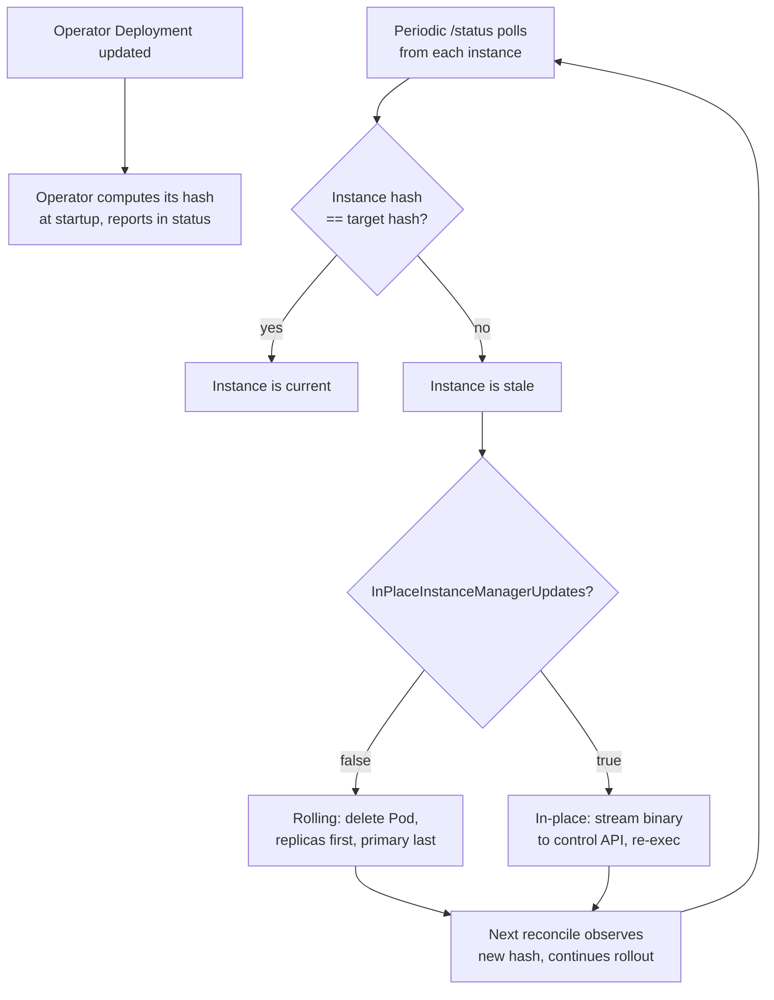

# Operator upgrades

The operator and instance manager are the same binary. The
bootstrap-controller init container copies `/manager` from the operator image
into each instance Pod, so every instance runs the same manager version as the
operator. When you upgrade the operator Deployment, the new image lands first in
the operator Pod. Instance Pods keep running their current manager until the
operator detects the mismatch and rolls the upgrade out to them.

The operator computes a SHA-256 hash of its own binary at startup and reports it
in `status.operatorExecutableHash`. Instance managers report their own hash in
the `/status` control endpoint on every health check. When the operator sees an
instance hash that differs from the target hash, it marks that instance as stale
and begins the upgrade rollout.

Two rollout modes are available: the **rolling upgrade** (default), which
deletes and recreates Pods one at a time, and the **in-place upgrade**, which
streams the new binary to each instance through its control API so the manager
re-execs without restarting mysqld.



## Rolling upgrade (default)

When `spec.inPlaceInstanceManagerUpdates` is `false` or unset, the operator
rolls the upgrade by deleting and recreating each instance Pod one at a time.

The rollout is serialized. Only one replica is ever down at a time, and the
operator waits for each recreated instance to report Ready before moving on to
the next one. Replicas are upgraded first, in ascending ordinal order. The
primary is upgraded last.

Fenced instances are skipped during the rollout. They are not deleted and their
hash mismatch is ignored until they are unfenced.

**Primary handling.** When the primary becomes stale on a multi-instance cluster
with `spec.primaryUpdateMethod` set to `switchover` (the default), the operator
triggers a planned switchover to a healthy replica first, then deletes the old
primary Pod. If no healthy replica is available to switch to, the operator falls
back to deleting the primary Pod in place. With a single-instance cluster, the
primary is always deleted in place because there is no replica to switch to.

With `spec.primaryUpdateMethod` set to `restart`, the primary Pod is deleted
without any switchover regardless of instance count.

**Supervised strategy.** When `spec.primaryUpdateStrategy` is `supervised` and
the primary is stale, the operator stops the entire rollout and waits. The
cluster enters the `WaitingForUser` phase with a status message asking for
manual intervention. No replicas are upgraded while the operator waits, not even
ones that are already stale. This gives you control over when the primary is
switched over. To proceed, trigger a manual switchover to a replica (see
[Planned switchover](./operations.md#planned-switchover)). Once a new primary is
in place, the operator resumes the rollout automatically on the next reconcile.

With `spec.primaryUpdateStrategy` set to `unsupervised` (the default), the
rollout proceeds without waiting.

## In-place upgrade

When `spec.inPlaceInstanceManagerUpdates` is set to `true`, the operator streams
the new manager binary to each stale instance through its control API at
`POST /instance/manager/upgrade`. The instance manager validates the binary
against the SHA-256 hash sent in the `X-CNMSQL-Manager-Hash` header, writes it
to disk atomically, and re-execs itself in place.

mysqld stays running throughout the swap. The re-exec'd manager inherits the
existing mysqld process instead of starting a new one, so the server never stops
accepting queries. The Pod's restart count stays flat and `status.uptimeSeconds`
keeps climbing.

The in-place path treats the primary the same as any replica. No switchover is
triggered, no Pod is deleted, and the `primaryUpdateMethod` and
`primaryUpdateStrategy` fields are ignored for in-place upgrades.

The rollout remains serialized: one instance per reconcile, replicas first,
primary last. Fenced instances are skipped, and so are instances whose Pod is
about to be recreated anyway (its Pod template changed, or it is already
terminating): they get the new binary from the recreated Pod. An instance
manager that has started shutting down refuses the swap and cancels one still
pending, so a Pod deletion's `SIGTERM` is never lost to a re-exec.

**Under the hood.** The operator opens its own executable and streams it over
mTLS to the instance. The instance manager writes the binary to a temp file,
verifies the hash, makes it executable, and atomically renames it over
`/controller/manager`. A 250 ms delay gives the HTTP response time to flush
before `syscall.Exec` replaces the process image. The new image reads
`CNMYSQL_ADOPT_MYSQLD_PID` from the environment (set by the old image before
the exec) and adopts the running mysqld. It also re-attaches to mysqld's stdout
FIFO through a file descriptor inherited across the exec, so structured logging
continues without interruption.

If the exec fails, the old manager continues supervising mysqld. The operator
retries on the next reconcile.

## Manual in-place restart

The `kubectl cnmsql restart-inplace` command triggers a byte-identical re-exec
of an instance manager without a version upgrade. It calls the
`POST /instance/manager/restart-inplace` endpoint, which re-execs the current
binary from `/proc/self/exe` instead of streaming a new one:

```bash
kubectl cnmsql restart-inplace cluster-sample cluster-sample-2
```

This is useful for verifying that mysqld survives a manager swap. After the
command returns, confirm the Pod's restart count did not change and that
`status.uptimeSeconds` has not reset.

## Status fields

During an upgrade, the cluster `status.phase` reports `Upgrading` with a reason
like `Upgrading instance manager on cluster-sample-2 (2/3 remaining)`. When the
supervised strategy blocks the rollout, the phase is `WaitingForUser`.

Two new status fields track hash state:

- `status.operatorExecutableHash` is the SHA-256 of the running operator binary,
  reported at startup and used as the target hash for all instances.
- `status.executableHashByInstance` maps each instance name to the hash
  reported by its manager on the last `/status` poll.

Compare these two fields to see which instances are current and which are stale:

```bash
kubectl get cluster cluster-sample -o json | \
  jq '{operator: .status.operatorExecutableHash, instances: .status.executableHashByInstance}'
```

## Configuring in-place upgrades

Enable in-place upgrades on an existing cluster:

```bash
kubectl patch cluster cluster-sample --type merge \
  -p '{"spec":{"inPlaceInstanceManagerUpdates":true}}'
```

Or set it at creation time in the Cluster spec:

```yaml
spec:
  inPlaceInstanceManagerUpdates: true
```

When you then update the operator Deployment to a new image, the operator
streams the new binary to each instance with no Pod restarts and no switchover
of the primary.

The setting has no effect until the operator executable hash changes, meaning
the operator Deployment has been updated to a new image.

## Version-specific upgrade notes

Newest release first. Each section says what changes when you upgrade the
operator to that release, and what to do.

### Upgrading from 0.8.x to 0.9.0

Upgrading to 0.9.0 restarts every instance once. Clusters on MySQL 8.0 and 8.4
need nothing else. Clusters on MySQL 9.x need a change before you upgrade; see
[Clusters on MySQL 9.x](#clusters-on-mysql-9x).

#### What changes

The operator now reads the server version from the image itself, not from the
image tag. The first time a cluster uses an image, the operator runs it in a
short-lived probe Pod named `<cluster>-image-<hash>` and records the version it
reports (see [How the operator learns the server
version](./instance-images.md#how-the-operator-learns-the-server-version)).
After the upgrade:

- Each cluster runs one probe Pod. It pulls the image the cluster already
  uses, exits within seconds, and is deleted once the image is accepted. It
  requests 10m CPU and 32Mi of memory (limits: 200m and 128Mi) and uses the
  cluster's pull secrets, node selector, affinity and tolerations. If a
  `ResourceQuota` or an admission policy restricts Pods in the namespace, make
  sure it allows this one.
- Until its probe finishes, a cluster shows `Provisioning` with no ready
  instances. The instances keep serving, but the operator does not manage the
  cluster in the meantime: no failover, switchover or rolling update. This
  takes a few seconds, or as long as the image pull on a slow registry (up to
  five minutes).
- The probed version must belong to the series the cluster names: the series
  of its catalog entry, or the version at the start of its image tag (`:8.4`,
  `:8.4.11-…`). If it doesn't, the cluster is `Blocked` and the operator stops
  managing it until you fix the spec. 0.8.x never checked this.
- Every instance restarts once, because the Pods no longer carry the
  `MYSQL_VERSION` variable. Replicas restart first. Then the operator switches
  over, so writes fail for about a second, and restarts the old primary. A
  single-instance cluster is down while it restarts. This happens even with
  `inPlaceInstanceManagerUpdates` enabled.
- my.cnf is rendered for the exact server version. 0.8.x assumed 8.4.0 for
  every 8.4 image, so settings that depend on a later patch release may now
  appear.
- `kubectl get mysql` has a `VERSION` column.
- The `kubectl cnmsql` plugin opens root sessions through the instance manager
  instead of a shell, so it works on distroless images. The new plugin fails
  with `unknown command "client"` on instances that still run the old instance
  manager, so upgrade it after the operator. The 0.8.x plugin keeps working
  with the new operator, except on distroless images.

#### Clusters on MySQL 9.x

0.8.x ran MySQL 9.x under the catalog series `9.0` and the `:9.x` image tags,
which ended at 9.6. 0.9.0 replaces them with 9.7 LTS. Under 0.9.0, a 9.6
cluster cannot upgrade to 9.7 in place, and a cluster that uses a catalog entry
named `9.0` is blocked, because 9.6 is not series 9.0. Before you upgrade the
operator, pick one of the options below for each 9.x cluster.

##### Option 1: move to 9.7 first (recommended)

0.8.x can roll a 9.6 cluster onto 9.7 in place, and MySQL supports that
upgrade. Do this while the operator is still on 0.8.x:

1. Add a `9.7` entry to the cluster's image catalog:

   ```yaml
   spec:
     images:
       - series: "9.0"
         image: ghcr.io/cnmsql/cnmsql-instance:9.x
       - series: "9.7"
         image: ghcr.io/cnmsql/cnmsql-instance:9.7
   ```

   Use a tag that contains the version, not a digest, because 0.8.x reads the
   version from the tag. Use the default images, not the distroless ones,
   because the 0.8.x plugin needs a shell. Don't point the `9.0` entry at the
   9.7 image instead: 0.9.0 would block the cluster, because the image runs
   9.7, not 9.0.

2. Change the cluster's series to `9.7`:

   ```yaml
   spec:
     imageCatalogRef:
       apiGroup: mysql.cnmsql.co
       kind: ImageCatalog
       name: <catalog>
       series: "9.7"   # was "9.0"
   ```

3. Wait for the cluster to be `Ready` again. The operator takes a backup first
   (unless `spec.upgrade.backupBeforeUpgrade` is `false`), then restarts the
   replicas on 9.7, switches over, and restarts the old primary. Each instance
   upgrades its data when it first starts on 9.7, and its log shows `Server
   upgrade from '90600' to '907xx' completed`. Until the roll is over, don't
   scale up, rebuild a replica or take a physical backup: XtraBackup 9.7
   cannot copy a 9.6 server.

4. Take a new backup. Backups taken before the roll can only be restored onto
   9.6.

You can then upgrade the operator.

##### Option 2: stay on 9.6

Replace the cluster's `imageCatalogRef` with an `imageName` set to the image of
its `9.0` entry:

```yaml
spec:
  imageName: ghcr.io/cnmsql/cnmsql-instance:9.x
```

The image stays the same, so nothing restarts. After the operator upgrade, the
cluster keeps running 9.6 and the operator manages it as before. To move it to
9.7 later, load a logical backup into a new 9.7 cluster; see [Moving to another
server series](./logical-backups.md#moving-to-another-server-series).

##### If you already upgraded the operator

A cluster still on the `9.0` catalog entry is `Blocked`, with a message like
`Image ghcr.io/cnmsql/cnmsql-instance:9.x runs 9.6.0, which is not series 9.0
named by the ImageCatalog "9.0" entry`. Its instances keep serving, but the
operator doesn't manage it, not even to fail over. Switch it to `imageName` as
in option 2. The operator accepts the image right away and restarts the
instances once. From there, only a logical backup takes it to 9.7.

#### Before upgrading {#before-upgrading-to-090}

1. If you apply CRDs yourself rather than through `helm upgrade`, apply the
   0.9.0 CRDs first.

2. Check that every cluster is `Ready`:

   ```bash
   kubectl get clusters -A
   ```

3. Handle each 9.x cluster (see [above](#clusters-on-mysql-9x)).

4. Check that each cluster runs the series it names. List the clusters, then
   check the version on each primary:

   ```bash
   kubectl get clusters -A -o custom-columns=NAMESPACE:.metadata.namespace,NAME:.metadata.name,SERIES:.spec.imageCatalogRef.series,IMAGE:.spec.imageName,PRIMARY:.status.currentPrimary
   kubectl exec -n <namespace> <primary> -c mysql -- mysqld --version
   ```

   A cluster on catalog series `8.4`, or on an image tagged `:8.4`, must run
   8.4.x. If it doesn't, fix the catalog entry or the tag. Clusters whose image
   tag has no version (`:latest`, a digest) are not checked.

#### Upgrading {#upgrading-to-090}

```bash
helm upgrade cnmsql cnmsql/cnmsql -n <operator-namespace> --version 0.9.0
```

Watch `kubectl get clusters -A`. Each cluster shows `Provisioning`, then
`Upgrading` while its instances restart, then `Ready` with a `VERSION`.

#### After upgrading {#after-upgrading-to-090}

1. If a cluster is `Blocked`, read the reason:

   ```bash
   kubectl get cluster <name> -n <namespace> \
     -o jsonpath='{.status.conditions[?(@.type=="ImageReady")].message}'
   ```

2. Upgrade the `kubectl cnmsql` plugin.

3. You can now use the
   [published catalogs](./instance-images.md#published-catalogs), digest
   references and the distroless images.

#### Downgrading to 0.8.x {#downgrading-to-08x}

A downgrade restarts every instance again. 0.8.x reads the version from the
image tag, so first move any cluster whose tag has no version (a digest,
`:latest`) back to a tag like `:8.4`. The 0.8.x plugin cannot open root
sessions on distroless images.

### Upgrading from 0.7.x to 0.8.0

The upgrade keeps your data: checksums, archived binlogs and point-in-time
recovery from backups taken before the upgrade are unaffected. What it costs is
one restart of every instance, and a few settings behave differently afterwards.
Read the notes below, then follow the steps from
[Before upgrading](#before-upgrading-to-080) in order.

#### Instances roll once: passwords move from env vars to the API

Instance managers now read their MySQL account passwords from the cluster's
credential Secrets through the Kubernetes API, instead of from `MYSQL_*_PASSWORD`
environment variables. The instance Pods no longer carry those variables, so the
Pod template changes once: after upgrading the operator, every instance restarts
once through the normal rolling update (replicas first, then a switchover, then
the primary), even with `inPlaceInstanceManagerUpdates` enabled.

The same roll removes the `bootstrap` and `import` init containers from the Pod
template: an instance's data volume is now bootstrapped by a one-shot Job
(`<instance>-initdb`, `<instance>-restore`, `<instance>-join`,
`<instance>-import`) that runs before the Pod exists (see
[Cluster lifecycle](./cluster-lifecycle.md#instance-bootstrap)). Both changes
land in the same single restart per instance.

Each instance's ServiceAccount can `get` and `watch` only its own cluster's
credential Secrets, by name, and cannot `list` Secrets.

A changed credential Secret is now picked up within minutes, without a restart.
That includes a Secret regenerated wholesale by a GitOps or External Secrets
tool: replacing the Secret is a change, and the instance managers follow it.
Changing the Secret does not change the MySQL account, and no rotation path
runs `ALTER USER` for you (only the dump account is re-applied from its
Secret): run `ALTER USER` to the new password first, then update the Secret. A
Secret that no longer matches its MySQL account now fails every instance at
once instead of waiting for the next restart, and the instances report a
credential mismatch rather than looking unreachable; see [Upgrade procedure:
0.7.x to 0.8.0](#upgrading-from-07x-to-080) for the check to run before
upgrading.

A credential Secret that is deleted on a cluster with bootstrapped instances is
no longer regenerated, because a fresh random password would match no account.
The running instances keep the password they last read and the operator keeps
reconciling (failover included), but the Cluster reports `Degraded` with a
`CredentialSecretMissing` warning event until the Secret is restored with its
previous password: until then no instance can bootstrap, and an instance that
restarts cannot start. Clusters that have not bootstrapped any instance yet
still get their Secrets generated.

**Upgrade when no instance is initialising.** An instance whose old Pod is
still running its `bootstrap` init container when the operator upgrades keeps a
volume without the bootstrap annotation, which counts as bootstrapped. If the
roll recreates that Pod before the init container has finished, the new Pod
starts mysqld on an unfinished data directory. On an established cluster
auto-reinit re-clones a replica that ends up there; a primary must be
re-initialised by hand.

**Recovered clusters no longer need their source Backup.** A recovery source is
resolved only until the bootstrap primary's volume is bootstrapped. Clusters
that were blocked on every reconcile because their source Backup was deleted
recover by themselves after the upgrade, and the Backup, its object store and
its Secrets can go.

**`spec.backup.jobTemplate` now reaches the bootstrap Jobs.** Its
`priorityClassName` (over the instance's) and `tolerations` (added to the
instance's) also apply to bootstrap Jobs; `resources` keep sizing the restore
only; the template's `nodeSelector` and `affinity` are not applied, because
bootstrap Jobs follow the instance's scheduling so the data volume binds where
the instance Pod can run.

**Alerts on `Init:CrashLoopBackOff` must move.** A failing bootstrap no longer
shows as `Init:CrashLoopBackOff` on the instance Pod. Alert on the
`BootstrapFailed` condition or the `BootstrapJobFailed` event instead (see
[Troubleshooting](./troubleshooting.md#a-bootstrap-job-failed)).

**Never downgrade below 0.8.0 while a bootstrap Job is active.** The old
operator ignores the bootstrap Jobs and the volume annotation: it would create
the instance Pod while the Job still mounts the volume, and on an RWO volume
both can land on the same node, so two processes would write one data
directory. Before downgrading, this must show no active Job:

```bash
kubectl get jobs -A -l mysql.cnmsql.co/bootstrap-instance
```

Logical backups whose source instance has not rolled yet fail during the
rollout, because the backup worker no longer sends the dump account's password.
Avoid taking logical backups until every instance has restarted. Scheduled ones
simply run again at their next slot.

The replication account is now X.509-only: the unused replication password code
path is gone. Clusters managed by the operator already replicate over mTLS, so
this needs no action.

#### Before upgrading {#before-upgrading-to-080}

1. **Use a chart that ships the 0.8.0 CRDs.** 0.8.0 adds the `LogicalRestore`
   CRD and new fields on `Backup` and `ScheduledBackup`. `helm upgrade` applies
   them, because the chart ships its CRDs as templates. If you manage CRDs
   separately (GitOps, `kubectl apply`), apply the 0.8.0 CRDs before you move the
   operator image.

2. **Check that every cluster is `Ready` and no instance is initialising.** An
   instance still in its `bootstrap` init container must finish first (see
   [above](#instances-roll-once-passwords-move-from-env-vars-to-the-api)):

   ```bash
   kubectl get clusters -A
   kubectl get pods -A -l mysql.cnmsql.co/cluster | grep -E 'Init:|PodInitializing'
   ```

   The second command must print nothing.

3. **Check that the credential Secrets match their MySQL accounts.** 0.7.x read
   the passwords once, when a Pod started, so a Secret that was changed without
   `ALTER USER` (or regenerated by a GitOps or External Secrets controller) had
   no effect until the next restart. From 0.8.0 the instance managers use the
   Secret's current value: a mismatched `control` Secret makes every instance
   unready within minutes, and the `-rw`, `-ro` and `-r` Services go empty. Run
   this for each cluster:

   ```bash
   NS=<namespace> CLUSTER=<cluster>
   POD=$(kubectl -n $NS get cluster $CLUSTER -o jsonpath='{.status.currentPrimary}')
   for s in root control backup; do
     u=$(kubectl -n $NS get secret $CLUSTER-$s -o jsonpath='{.data.username}' | base64 -d)
     p=$(kubectl -n $NS get secret $CLUSTER-$s -o jsonpath='{.data.password}' | base64 -d)
     if kubectl -n $NS exec $POD -c mysql -- mysql -u"$u" -p"$p" -Ne 'select 1' >/dev/null 2>&1; then
       echo "$CLUSTER-$s: ok"
     else
       echo "$CLUSTER-$s: MISMATCH"
     fi
   done
   ```

   Fix any `MISMATCH` before upgrading, with `ALTER USER` to the Secret's value
   or by restoring the Secret to the account's password. If a controller
   regenerates these Secrets, stop it from doing so: the operator does not run
   `ALTER USER` for `root`, `control` or `backup`. From this release a deleted
   credential Secret is no longer regenerated either — on a cluster with
   bootstrapped instances the Cluster reports `Degraded` with a
   `CredentialSecretMissing` event until the Secret is restored with its
   previous password.

4. **Plan for the restarts.** Multi-instance clusters restart their replicas,
   switch over, then restart the old primary; writes fail for about a second
   during the switchover, which the Cluster reports as the `Switchover` phase.
   Single-instance clusters are down for as long as their instance takes to
   restart. You don't need to turn off `inPlaceInstanceManagerUpdates`: the
   operator never streams an in-place update to a Pod it is about to recreate,
   and every Pod is recreated by this roll.

#### Upgrading {#upgrading-to-080}

```bash
helm upgrade cnmsql cnmsql/cnmsql -n <operator-namespace> --version 0.8.0
```

Follow the roll with `kubectl get clusters -A`: each cluster goes through
`Upgrading` and returns to `Ready`. While it runs:

- Don't take logical backups; they fail on instances that have not restarted
  yet.
- Don't scale clusters or create new ones until the roll is over.

#### After upgrading {#after-upgrading-to-080}

1. Check that the roll finished everywhere: every cluster `Ready`, and no
   instance Pod carries a password variable any more:

   ```bash
   kubectl get pods -A -l mysql.cnmsql.co/cluster \
     -o jsonpath='{range .items[*]}{.metadata.name}{" "}{.spec.containers[0].env[*].name}{"\n"}{end}' \
     | grep PASSWORD
   ```

   This must print nothing.

2. Move alerts from `Init:CrashLoopBackOff` to the `BootstrapFailed` condition
   (see above).

3. Each cluster now has a `<cluster>-dump` Secret and a `cnmsql_dump` account,
   which [logical backups](./logical-backups.md) use.

#### Downgrading to 0.7.x {#downgrading-to-07x}

A downgrade restarts every instance once more, back to password environment
variables. Data is not affected. Before you run `helm rollback`:

1. Check that no bootstrap Job is active (see above).
2. Suspend or delete every `ScheduledBackup` with `method: logical`. 0.7.x
   rejects that method, so its scheduler fails on every slot and retries in a
   loop:

   ```bash
   kubectl patch scheduledbackup <name> --type merge -p '{"spec":{"suspend":true}}'
   ```

3. Expect logical Backups and `LogicalRestore` objects to stay as they are.
   0.7.x does not process them, and the chart keeps the `LogicalRestore` CRD on
   rollback, so they are still there when you upgrade again.

After upgrading to 0.8.0 again, delete any `Backup` whose `Progressing`
condition has reason `UnsupportedMethod`: the 0.7.x operator created it during
the upgrade, and it never runs.

### Changes in earlier releases

#### Binlogs are retained locally after archiving

Since 0.7.3, clusters with `spec.backup.continuousArchiving.enabled: true`
change their disk profile on upgrade. Previously the archiver purged each binary log from the data
volume as soon as it reached the object store, so local binlogs stayed near
zero. They are now kept until `binlogExpireSeconds` (default 604800, seven days)
so a lagged or returning replica can catch up from the primary instead of being
re-cloned from a backup.

**Action required.** The data volume must now hold the dataset plus roughly
`write throughput × binlogExpireSeconds` of binlogs. Before upgrading, check the
headroom on your archiving clusters:

```bash
kubectl exec <instance> -c mysql -- df -h /var/lib/mysql
kubectl exec <instance> -c mysql -- \
  sh -c 'du -sh /var/lib/mysql/binlog.* 2>/dev/null | tail -1'
```

Distroless instance images have no shell or `df`. Run the same commands from a
debug container that shares the instance's processes, through
`/proc/1/root/var/lib/mysql`:

```bash
kubectl debug -it <instance> --image=busybox --target=mysql -- sh
```

Then pick one:

- **Grow the volume.** Raise `spec.storage.size`; see
  [Storage](./storage.md). This is the option that preserves the new
  catch-up behaviour.
- **Shorten the window.** Lower
  `spec.backup.continuousArchiving.binlogExpireSeconds` to fit the disk you
  have. A shorter window still beats purge-on-archive for replica catch-up.
- **Keep the old behaviour.** Set
  `spec.backup.continuousArchiving.purgeAfterArchive: true` to restore
  purge-on-archive exactly as it worked before.

```yaml
spec:
  backup:
    continuousArchiving:
      enabled: true
      purgeAfterArchive: true # pre-upgrade behaviour
```

PITR is unaffected either way: recovery replays from the object store, not from
local binlogs. See [Local binlog
retention](./pitr.md#local-binlog-retention) for the sizing model and the
trade-off in full.

#### Single-instance clusters restart once

Since 0.7.6, instance Pods carry the switchover-on-drain `preStop` hook
whatever the instance count. Previously a single-instance cluster's Pod had no hook, so its
Pod template changed whenever the cluster was scaled to or from one instance.
That rolled the primary without a handoff and, on a scale-up, failed it over
instead of switching over. The hook now returns immediately when no replica is
streaming from the primary, so a single-instance teardown is not delayed.

**Expect one restart.** Each single-instance cluster with switchover-on-drain
enabled (the default) gets a new Pod template, so its only instance is restarted
once during the operator upgrade. Multi-instance clusters already carry the hook
and are not rolled for this change. Plan the operator upgrade for a window in
which a brief outage of your single-instance clusters is acceptable.

## Troubleshooting

**The rollout is stuck in `WaitingForUser`.** The primary is stale and
`spec.primaryUpdateStrategy` is `supervised`. Trigger a planned switchover to a
healthy replica (see [Planned
switchover](./operations.md#planned-switchover)), or set the strategy to
`unsupervised` if you prefer automatic handling.

**An in-place upgrade fails with a hash mismatch.** The binary streamed from the
operator did not match the expected hash declared in the `X-CNMSQL-Manager-Hash`
header. The stale binary on the instance is not replaced. This is a 400 error.
Check that the operator and instance images are compatible: the operator binary
must be the same architecture and build as the one in the bootstrap-controller
init container. If you are running a multi-architecture cluster, the operator
schedules its Deployment on a node whose architecture matches the instance
images.

**A replicated instance is stuck unready after a rolling upgrade.** The
recreated Pod may be unable to join replication. Check its logs with
`kubectl cnmsql logs` and verify the bootstrap-controller init container
completed. If the instance diverged during the upgrade, re-initialise it (see
[Re-initialise an
instance](./operations.md#re-initialise-an-instance-from-scratch)).

**The rollout skips a stale instance.** The instance may be fenced. Unfence it
first (see [Fence an instance](./operations.md#fence-an-instance)).

## Verification coverage

The upgrade controller has unit coverage for candidate ordering (replicas before
primary, fenced instances excluded), the single-instance and multi-instance
rollout paths, supervised and unsupervised primary strategies, switchover
fallback when no healthy replica exists, in-place binary streaming and hash
validation, FIFO log re-adoption across re-exec, and the restart-inplace command.

E2E tests validate end-to-end in-place upgrades (operator image update, hash
propagation, serialized rollout, mysqld uptime continuity) and in-place operator
upgrades (operator Deployment update, streaming, re-exec, status verification).
