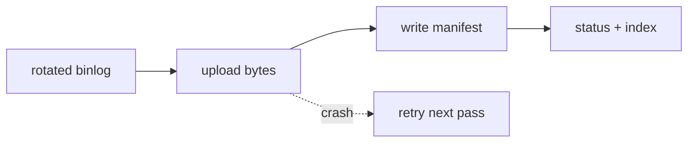
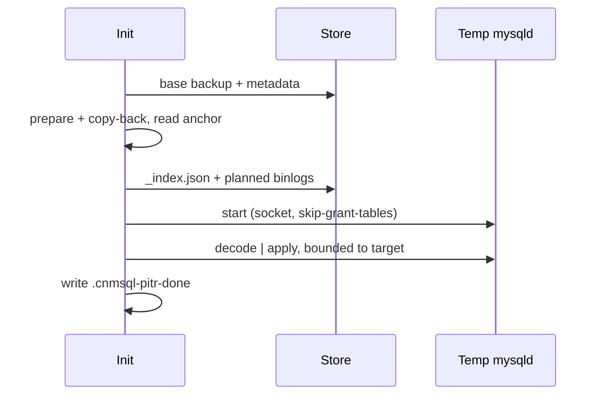

# Binlog archiving and PITR internals

This page documents the internals of continuous binlog archiving and
point-in-time recovery (PITR): what is stored, in what format, the archiving and
restore processes step by step, and the guarantees each step upholds. It is the
mechanism-level companion to the operator-facing [Point-In-Time
Recovery](pitr.md) page.

PITR has two independent halves that meet only through the object store:

- **Archiving** runs in every instance pod but ships only from the primary. It
  continuously copies rotated binary logs to S3, GTID-addressable.
- **Restore** runs once, in a recovering cluster's init container. It restores a
  physical base backup, then replays archived binlogs from the backup's anchor up
  to a recovery target.

The design is GTID-first: object names and binlog file numbers are operational
details, and correctness is defined by whether the archived GTID set covers the
target. MariaDB drives most of the special-casing below. A GTID target still
selects what to recover, but `mariadb-binlog` has no `--include-gtids` /
`--exclude-gtids`, so cnmsql translates that target into the byte-offset bounds
(`--start-position` / `--stop-position`) the tool actually accepts.

## What is shared and what is flavor-specific

Most of the machinery is identical on both flavors. The object-store layout and
every JSON schema are the same; the differences are concentrated in the GTID
string format and in how replay is bounded. Sections below that apply to only one
flavor say so in their heading.

| Aspect | MySQL | MariaDB |
|---|---|---|
| Object-store layout and JSON schemas | same | same |
| Archiving loop, commit order, collision detection | same | same |
| Partition key (`<server-uuid>`) | `server_uuid` from `auto.cnf` | `.cnmsql-archive-id` token |
| GTID string syntax inside the manifests | `uuid:interval` | `domain-server-seq` |
| `anchorGTID` / `anchorServerUUID` in `metadata.json` | empty (binlog-info already has the GTID) | populated |
| Replay bounding | `--include-gtids` / `--exclude-gtids` | byte offsets derived from a resolved sequence |

## Object store layout

Everything for one source cluster lives under its cluster prefix. Archiving
writes four kinds of object; the base backup writes two more.

```text
<path>/<cluster>/
├── backup.xbstream                 # physical base backup payload
├── metadata.json                   # base backup manifest (recovery anchor)
└── binlogs/
    ├── _index.json                 # cluster-level timeline (discovery + order)
    └── <server-uuid>/
        ├── _archive_status.json    # this segment's archive frontier
        ├── binlog.000004           # raw binlog bytes
        └── binlog.000004.json      # per-file manifest
```

The `<server-uuid>` partition is what keeps timelines apart. Every incarnation
numbers its binlogs from `000001`, so without it two primaries (or a re-cloned
instance) would both write `binlogs/.../binlog.000004` and clobber each other.
Keys come from `BuildBinlogKeys`, which rejects a server UUID or binlog name
containing a path separator.

:::note What `<server-uuid>` actually is
For MySQL it is the server's `server_uuid` (from `auto.cnf`). MariaDB has no
stable server UUID, so cnmsql persists its own per-incarnation token in
`.cnmsql-archive-id` and uses that instead. A re-init clone resets the token,
which is what keeps the new incarnation's `binlog.000001` from colliding with the
old one's. See [MariaDB Flavor](mariadb.md).
:::

## File formats

Four JSON documents carry all the recovery metadata. Raw binlog objects are
opaque bytes; every fact recovery needs is in the manifests.

The schemas here are the same Go structs on both flavors, so the file format is
identical for MySQL and MariaDB. What differs is the content: any GTID-valued
field uses the flavor's own syntax (`uuid:interval` for MySQL,
`domain-server-seq` for MariaDB), and the two anchor fields in `metadata.json`
are populated only for MariaDB (see each field below).

### Per-file manifest (`<binlog>.json`)

Written next to each raw binlog. It lets recovery order and verify the stream by
GTID without parsing every file. Source: `BinlogMetadata`.

| Field | Purpose |
|---|---|
| `serverUUID`, `binlogName`, `sequence` | identity and ordering within the segment |
| `firstGTID`, `lastGTID`, `gtidSet` | the file's GTID contribution; de-dups and bounds replay |
| `firstEventTime`, `lastEventTime` | wall-clock bounds, for `targetTime` |
| `sizeBytes`, `sha256` | integrity of the uploaded bytes |
| `archivedAt` | when it landed in the store |

### Per-segment status (`_archive_status.json`)

One per server UUID: the cheap "how far has this segment gotten" record. Source:
`ArchiveStatus`. Its key fields are `lastArchivedBinlog`, `lastArchivedGTID`,
`firstGTID` (set once, the segment's range start), and `coveredGTIDSet` (the
cumulative set this segment has archived).

### Cluster index (`_index.json`)

The recovery discovery document, and the MySQL-GTID analog of a PostgreSQL
timeline-history file. It records the ordered list of timeline segments across
every server UUID the cluster has produced over its failover history, so recovery
reads one object instead of listing and inferring the whole archive. Source:
`ArchiveIndex` and `ArchiveSegment`.

Each segment carries its file list plus a per-domain range: `startGTIDSet` (first
archived position) and `gtidSet` (last, or covered, position). Together they let
recovery stitch a gap-free timeline out of segments that individually have gaps,
which is what a re-init clone leaves behind. `coveredGTIDSet` is the cumulative
set across all segments.

### Base backup manifest (`metadata.json`)

The recovery anchor. Source: `BackupMetadata`. Beyond archive key, SHA256, and
timing, two fields exist specifically for PITR:

- `anchorGTID` is the base backup's consistent point as a fully-specified GTID,
  resolved on the source at backup time. It exists because a MariaDB 10.11
  backup's in-archive binlog-info file carries only file and position; this
  recovers the GTID. It is empty for MySQL (whose binlog-info already has it) and
  for legacy backups.
- `anchorServerUUID` is the archive-partition identity of the incarnation the
  backup was taken from. It disambiguates the anchor binlog when a re-clone left
  several incarnations all numbering from `000001` (see [Anchor
  disambiguation](#anchor-disambiguation-mariadb)).

## Archiving process

The archiver is an in-pod loop (`startArchiver`) that every instance runs but
only the writable primary acts on. It checks writability before each pass, so a
replica stays idle and a promoted primary takes over after failover. It reads
local binlog files straight from the data directory rather than a replication
stream, which preserves the exact bytes.

Rotation bounds the RPO. The active (currently-written) log is never shipped, only
rotated inactive files. The loop forces `FLUSH BINARY LOGS` on the `FlushInterval`
(`targetRPOSeconds`) to bound time-based RPO, and `max_binlog_size`
(`maxBinlogSizeMB`) bounds it by size. So the expected RPO under health is roughly
the rotation cadence, and the active tail is the exposure window.

The per-file commit order (`archiveFile`) is what keeps the archive gapless:

```text
scan (GTID/time/sha) → upload raw bytes → write manifest → advance status → update index
```

The manifest is written after the bytes. A crash between the two leaves a body
with no manifest, which cnmsql treats as an incomplete archive and the next pass
re-uploads. A present manifest therefore always means a complete file.



### Archiving guarantees

- **Idempotent and resumable.** Before uploading, the archiver checks for an
  existing manifest. If one is present and its SHA256 matches, the file is already
  archived and is skipped; the pass still folds its coverage into the frontier so a
  resumed pass converges to the same status.
- **Collision detection, fail loud.** If a manifest exists but its SHA256 differs
  from the local file's, the archiver returns `ErrCollision` instead of
  overwriting. That means a server-UUID uniqueness invariant broke (a cloned
  `auto.cnf`, a `RESET MASTER` reusing a name), and it must surface rather than
  silently corrupt the archive.
- **Frontier never skips ahead.** On error the per-segment status is not advanced
  past the file that failed, so `pendingFiles` reflects real lag and the next pass
  resumes at the gap.
- **Integrity is cnmsql's, not the provider's.** The SHA256 in the manifest is the
  source of truth, not the S3 ETag.
- **Purge is archive-gated.** The optional purge gate only lets MySQL recycle logs
  already shipped, so unarchived logs are not lost unless an operator bypasses the
  guard.

## Restore process

Restore is a bootstrap operation. A recovering cluster starts from an empty PVC,
restores the first primary in an init container, and replicas later clone from that
recovered primary through the normal join path. Replay itself lives in
`replayBinlogs`.

The steps:

1. **Restore the base backup.** Download `backup.xbstream`, run `xtrabackup
   prepare`, and copy-back. This lands the data directory plus a binlog-info file.
2. **Read the anchor.** Parse the binlog-info file (preferring the durable copy in
   the data dir over the scratch backup dir) for file, position, and GTID. When
   `metadata.json` is present it supplies the fully-specified `anchorGTID` (used
   when the in-archive anchor has none) and `anchorServerUUID`.
3. **Load `_index.json`** and plan the segments and files to replay from the
   anchor up to the target.
4. **Download** the planned files into a scratch dir, named
   `<serverUUID>_<binlogName>` so like-named files from different segments never
   collide on disk.
5. **Replay** into a temporary socket-only `mysqld` started with
   `--skip-networking --skip-grant-tables`, then write the `.cnmsql-pitr-done`
   sentinel.



The replay itself is `mysqlbinlog <bounded args> | mysql --socket=<temp>`. The
binlog stream is data and is never logged, while both child processes' stderr is
captured as structured logs.

### Recovery targets

One of: `targetGTID` (replay up to an inclusive GTID set), `targetTime` (stop at a
wall-clock instant), `targetImmediate` or an empty `recoveryTarget: {}` (replay to
the latest archived point), or no target at all (restore the base backup only).

### The MySQL GTID path

`PlanReplay` walks the index maintaining a GTID *frontier* seeded from the anchor.
A segment already contained by the frontier is skipped; otherwise its files are
added and its set unioned in. The plan hands `mysqlbinlog`:

- `--exclude-gtids=<anchor>` so transactions already in the base backup (or
  re-emitted by a successor after failover) are not applied twice;
- `--include-gtids=<target>` for `targetGTID`, or `--stop-datetime` for
  `targetTime`.

Because GTID de-duplicates, the planner is free to over-download and the server
drops what it already has. The plan fails closed rather than guess:
`ErrTargetBeforeBackup` (target older than the anchor), `ErrTargetBeyondArchive`
(target not covered), and `ErrForkedTimeline` (the index's declared coverage
cannot be reconstructed from its segments, meaning a missing segment or a real
fork).

### The MariaDB positional path

`mariadb-binlog` has no `--include-gtids`, so a MariaDB `targetGTID` recovery
cannot be bounded by GTID. It is bounded by byte offsets instead. This is only
supported for a single replication domain: `SingleDomainMariaGTID` rejects a
multi-domain target, which would need per-domain offsets in one interleaved
stream.

The mechanism (`replayMariadbPositional`, `PlanMariadbPositional`):

1. Resolve the target to a `(domain, targetSeq)` pair, and the anchor to
   `anchorSeq`.
2. Scan each downloaded binlog for its transaction boundaries (`domain`, `seq`,
   byte `startPos`).
3. Plan ordered, positionally-bounded chunks that replay exactly the domain's
   transactions with sequence in `(anchorSeq, targetSeq]`. The chunk carrying the
   target stops at `--stop-position` (a stop offset requires a single file).

Failover is the wrinkle. With `log_slave_updates` the promoted server re-logs the
transactions it replicated under their original server_id before appending its
own, so two segments carry overlapping sequence ranges. Concatenating whole
segments would feed `mariadb-binlog` a non-monotonic stream ("Found out of order
GTID"). To avoid that, the planner walks files tracking the highest sequence
applied, skips already-applied prefixes, starts a fresh start-position-bounded
chunk on overlap, and coalesces clean runs. `SelectMariadbSegments` prunes the
download to the minimal set of segments whose per-domain ranges cover
`(anchorSeq, targetSeq]` (a greedy interval cover), failing closed on a gap.

#### GTID-less anchor recovery

A MariaDB 10.11 backup's binlog-info carries only file and position, so
`anchorSeq` would be `0` and replay would rewind to genesis, re-applying
transactions already in the backup. `AnchorSeqFromBoundaries` recovers the real
anchor sequence by scanning the anchor file's boundaries for the highest sequence
whose transaction *starts before* the recorded byte position; that transaction
committed before the backup, so the physical copy already has it. It also folds in
earlier same-server files, for the case where the backup was taken just after a log
rotation.

#### Anchor disambiguation (MariaDB)

When the base backup was taken at genesis, its anchor GTID is empty and its anchor
file is a bare `binlog.000001`. After a re-clone or failover the download set
contains a `binlog.000001` under several `<serverUUID>_` prefixes, the same bare
name pointing at different files. `findAnchorIndex` cannot pick one from the name
alone:

- If the backup recorded `anchorServerUUID`, the match is pinned to that
  incarnation's file directly. If that file was purged or rotated before archiving,
  the anchor is reported absent and the caller falls back to replaying from the
  start of the stream.
- If it is empty (legacy backups) and the name matches more than one server, it
  returns `ErrAmbiguousAnchor` rather than guessing. Replaying from the wrong
  `000001` would skip or duplicate transactions.

`anchorServerUUID` is the same per-incarnation `.cnmsql-archive-id` token the
archiver partitions object keys under, so it matches a segment's `serverUUID`
exactly. It travels from backup to restore this way: read at backup time, shipped
as the `X-Cnmsql-Anchor-Server` response trailer, persisted into `metadata.json`
as `anchorServerUUID`, loaded onto `ReplayPlan.AnchorServerUUID`, and read by
`findAnchorIndex`.

### Restore guarantees

- **Reentrant.** After a successful replay cnmsql writes `.cnmsql-pitr-done` on the
  data directory. A retried init container sees the sentinel and skips replay
  instead of re-applying GTIDs (which `mysqld` would reject).
- **Anchor persistence across retries.** The backup's binlog-info is copied into
  the durable data directory, not just the scratch backup dir, so a retry that lost
  the scratch dir still replays from the correct anchor instead of from genesis.
- **Fail closed, never guess.** Every ambiguity (target out of range, forked
  timeline, ambiguous anchor, an unbridgeable sequence gap) is a hard error rather
  than a best-effort replay that could silently skip or duplicate transactions.
- **On-disk isolation.** Downloaded files are prefixed by server UUID so
  cross-incarnation like-named binlogs do not overwrite one another in the scratch
  dir.

## Where to look in the code

| Concern | File |
|---|---|
| Object keys and JSON formats | `objectstore/binlog.go`, `objectstore/metadata.go` |
| Archiving loop and commit order | `instance/archiving.go`, `binlog/archiver.go` |
| Replay planning (both flavors) | `binlog/replay.go` |
| Restore and replay execution | `instance/restore_pitr.go` |
| MariaDB archive identity | `instance/archiveid.go` |
