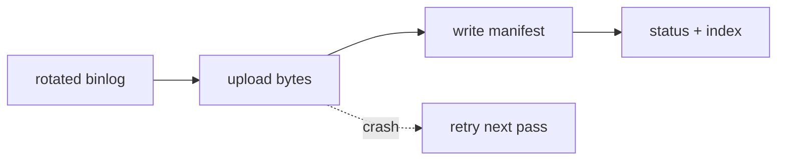
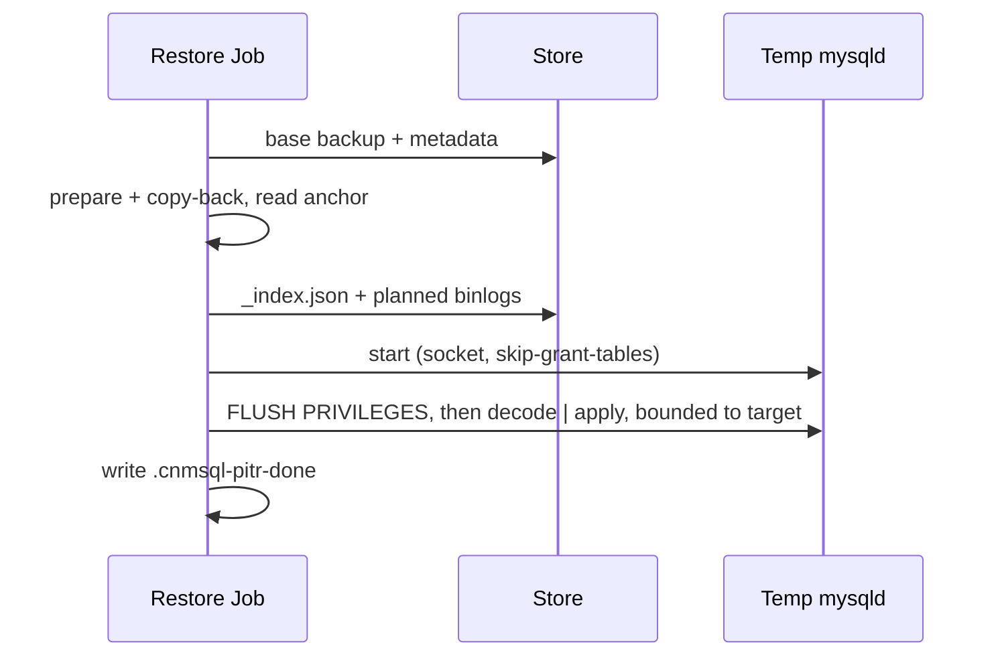

# Binlog archiving and PITR internals

This page documents the internals of continuous binlog archiving and
point-in-time recovery (PITR): what is stored, in what format, the archiving and
restore processes step by step, and the guarantees each step upholds. It is the
mechanism-level companion to the operator-facing [Point-In-Time
Recovery](pitr.md) page.

PITR has two independent halves that meet only through the object store:

- **Archiving** runs in every instance pod but ships only from the primary. It
  continuously copies rotated binary logs to S3, GTID-addressable.
- **Restore** runs once, in a recovering cluster's `<instance>-restore`
  bootstrap Job. It restores a physical base backup, then replays archived
  binlogs from the backup's anchor up to a recovery target.

The design is GTID-first: object names and binlog file numbers are operational
details, and correctness is defined by whether the archived GTID set covers the
target. MariaDB drives most of the special-casing below. A GTID target still
selects what to recover, but `mariadb-binlog` has no `--include-gtids` /
`--exclude-gtids`, so cnmsql translates that target into the byte-offset bounds
(`--start-position` / `--stop-position`) the tool actually accepts.

## What is shared and what is flavor-specific

Most of the machinery is identical on both flavors. The object-store layout and
every JSON schema are the same; the differences are concentrated in the GTID
string format and in how replay is bounded. Sections below that apply to only one
flavor say so in their heading.

| Aspect | MySQL | MariaDB |
|---|---|---|
| Object-store layout and JSON schemas | same | same |
| Archiving loop, commit order, collision detection | same | same |
| Partition key (`<server-uuid>`) | `server_uuid` from `auto.cnf` | `.cnmsql-archive-id` token |
| GTID string syntax inside the manifests | `uuid:interval` | `domain-server-seq` |
| `anchorGTID` / `anchorServerUUID` in `metadata.json` | empty (binlog-info already has the GTID) | populated |
| Replay bounding | `--include-gtids` / `--exclude-gtids` | byte offsets derived from a resolved sequence |

## Object store layout

Everything for one source cluster lives under its cluster prefix. Archiving
writes four kinds of object; the base backup writes two more.

```text
<path>/<cluster>/
├── backup.xbstream                 # physical base backup payload
├── metadata.json                   # base backup manifest (recovery anchor)
└── binlogs/
    ├── _index.json                 # cluster-level timeline (discovery + order)
    └── <server-uuid>/
        ├── _archive_status.json    # this segment's archive frontier
        ├── binlog.000004           # raw binlog bytes
        └── binlog.000004.json      # per-file manifest
```

The `<server-uuid>` partition is what keeps timelines apart. Every incarnation
numbers its binlogs from `000001`, so without it two primaries (or a re-cloned
instance) would both write `binlogs/.../binlog.000004` and clobber each other.
Keys come from `BuildBinlogKeys`, which rejects a server UUID or binlog name
containing a path separator.

:::note What `<server-uuid>` actually is
For MySQL it is the server's `server_uuid` (from `auto.cnf`). MariaDB has no
stable server UUID, so cnmsql persists its own per-incarnation token in
`.cnmsql-archive-id` and uses that instead. A re-init clone resets the token,
which is what keeps the new incarnation's `binlog.000001` from colliding with the
old one's. See [MariaDB Flavor](mariadb.md).
:::

## File formats

Four JSON documents carry all the recovery metadata. Raw binlog objects are
opaque bytes; every fact recovery needs is in the manifests.

The schemas here are the same Go structs on both flavors, so the file format is
identical for MySQL and MariaDB. What differs is the content: any GTID-valued
field uses the flavor's own syntax (`uuid:interval` for MySQL,
`domain-server-seq` for MariaDB), and the two anchor fields in `metadata.json`
are populated only for MariaDB (see each field below).

### Per-file manifest (`<binlog>.json`)

Written next to each raw binlog. It lets recovery order and verify the stream by
GTID without parsing every file. Source: `BinlogMetadata`.

| Field | Purpose |
|---|---|
| `serverUUID`, `binlogName`, `sequence` | identity and ordering within the segment |
| `firstGTID`, `lastGTID`, `gtidSet` | the file's GTID contribution; de-dups and bounds replay |
| `firstEventTime`, `lastEventTime` | wall-clock bounds, for `targetTime` |
| `sizeBytes`, `sha256` | integrity of the uploaded bytes |
| `archivedAt` | when it landed in the store |

### Per-segment status (`_archive_status.json`)

One per server UUID: the cheap "how far has this segment gotten" record. Source:
`ArchiveStatus`. Its key fields are `lastArchivedBinlog`, `lastArchivedGTID`,
`firstGTID` (set once, the segment's range start), and `coveredGTIDSet` (the
cumulative set this segment has archived).

### Cluster index (`_index.json`)

The recovery discovery document, and the MySQL-GTID analog of a PostgreSQL
timeline-history file. It records the ordered list of timeline segments across
every server UUID the cluster has produced over its failover history, so recovery
reads one object instead of listing and inferring the whole archive. Source:
`ArchiveIndex` and `ArchiveSegment`.

Each segment carries its file list plus a per-domain range: `startGTIDSet` (first
archived position) and `gtidSet` (last, or covered, position). Together they let
recovery stitch a gap-free timeline out of segments that individually have gaps,
which is what a re-init clone leaves behind. `coveredGTIDSet` is the cumulative
set across all segments.

A segment can also carry a `fork` record: the transactions it archived that the
surviving timeline never executed (see [Forks and dead
branches](#forks-and-dead-branches)). The record sits on the segment that holds
the dead transactions, so retention drops it together with the files. The index
itself carries:

- `forkCheck`, the time and author of the last fork check a primary ran over
  it; it is absent on an index no primary has checked since fork checks
  shipped.
- `generation`, the highest `status.currentPrimaryGeneration` of a primary that
  wrote it (see [Fencing](#fencing)).
- `disowned`, every transaction ever recorded as disowned (a MySQL `gtidSet`, or
  MariaDB `ranges`), whether by a fork record or by a base backup found on a
  dead branch. Unlike fork records it is not attached to a segment, so it
  outlives retention.
- `archivedThrough`, the time before which every transaction the primary
  committed is archived.
- `mariadbTimeline`, the MariaDB primary timeline (see [Replication and
  failover](./replication-failover.md#mariadb-the-primary-timeline)), so
  restore can judge the archive without the Cluster.

### Base backup manifest (`metadata.json`)

The recovery anchor. Source: `BackupMetadata`. Beyond archive key, SHA256, and
timing, two fields exist specifically for PITR:

- `anchorGTID` is the base backup's consistent point as a fully-specified GTID,
  resolved on the source at backup time. It exists because a MariaDB 10.11
  backup's in-archive binlog-info file carries only file and position; this
  recovers the GTID. On MySQL it is the set xtrabackup reports, recorded so the
  operator can choose and judge backups without restoring them. It is empty
  for legacy backups. On completion the operator copies it into the Backup's
  `status.endGTID`.
- `anchorServerUUID` is the archive-partition identity of the incarnation the
  backup was taken from. It disambiguates the anchor binlog when a re-clone left
  several incarnations all numbering from `000001` (see [Anchor
  disambiguation](#anchor-disambiguation-mariadb)).

## Archiving process

The archiver is an in-pod loop (`startArchiver`) that every instance runs but
only the writable primary acts on. It checks writability before each pass, so a
replica stays idle and a promoted primary takes over after failover. It reads
local binlog files straight from the data directory rather than a replication
stream, which preserves the exact bytes.

Rotation bounds the RPO. The active (currently-written) log is never shipped, only
rotated inactive files. The loop forces `FLUSH BINARY LOGS` on the `FlushInterval`
(`targetRPOSeconds`) to bound time-based RPO, and `max_binlog_size`
(`maxBinlogSizeMB`) bounds it by size. So the expected RPO under health is roughly
the rotation cadence, and the active tail is the exposure window.

The per-file commit order (`archiveFile`) is what keeps the archive gapless:

```text
scan (GTID/time/sha) → upload raw bytes → write manifest → advance status → update index
```

The manifest is written after the bytes. A crash between the two leaves a body
with no manifest, which cnmsql treats as an incomplete archive and the next pass
re-uploads. A present manifest therefore always means a complete file.


```mermaid
flowchart LR
    A["rotated binlog"] --> B["upload bytes"]
    B --> C["write manifest"]
    C --> D["status + index"]
    B -. crash .-> R["retry next pass"]
```

### Archiving guarantees

- **Idempotent and resumable.** Before uploading, the archiver checks for an
  existing manifest. If one is present and its SHA256 matches, the file is already
  archived and is skipped; the pass still folds its coverage into the frontier so a
  resumed pass converges to the same status.
- **Collision detection, fail loud.** If a manifest exists but its SHA256 differs
  from the local file's, the archiver returns `ErrCollision` instead of
  overwriting. That means a server-UUID uniqueness invariant broke (a cloned
  `auto.cnf`, a `RESET MASTER` reusing a name), and it must surface rather than
  silently corrupt the archive.
- **Frontier never skips ahead.** On error the per-segment status is not advanced
  past the file that failed, so `pendingFiles` reflects real lag and the next pass
  resumes at the gap.
- **Integrity is cnmsql's, not the provider's.** The SHA256 in the manifest is the
  source of truth, not the S3 ETag.
- **Purge is archive-gated.** The optional purge gate only lets MySQL recycle logs
  already shipped, so unarchived logs are not lost unless an operator bypasses the
  guard.
- **The index self-repairs.** Each file's status is written before the index.
  A failed index write (a crash, an exhausted compare-and-swap, a store error)
  leaves the file archived but unindexed; the archiver remembers which of its
  files the index lists, re-reads the index after any failed write and on start,
  and folds back every archived file it finds missing.
- **Archived through.** Once every rotated log is shipped, everything committed
  before the archiver's last forced rotation is archived, and while the active
  log has not grown since, everything committed at all. The primary stamps that
  time into the index's `archivedThrough`, at most once a minute. A primary
  that starts with transactions already in its active log rotates once after
  the first flush interval, even idle, so they are not stranded.

## Forks and dead branches

The archive keeps one segment per server UUID and stitches them by GTID. A
lagged promotion can leave a dead branch in it: the old primary rotated and
uploaded a file holding transaction `1:219`, then crashed, and the successor was
promoted at `1:218`. That file stays in the old segment. Replayed naively, the
recovered cluster would end at `{1:1-219, 2:1-300}`, a state the live cluster
never served. On MariaDB it is worse: the successor reuses the sequence numbers
(`0-1-219` is dead, `0-2-219` is live), and a planner ordering by sequence alone
could splice the two branches.

### The fork check

The writable primary checks every segment but its own against what the
surviving timeline holds. It runs on every pass that writes the index, on the
first writable pass of its process even with nothing to ship, and again every
flush interval, so a promotion, failback or restart checks the archive without
waiting for the next rotation, and an idle primary still catches a late upload.
Whatever a segment holds that the timeline does not is merged into the
segment's `fork` record and into the index's `disowned` set. The authority is
read for every index write, after the index, and only while the server is
writable.

- **MySQL** compares against the primary's `@@GLOBAL.gtid_executed`:
  `fork.gtidSet` is `segment.gtidSet \ gtid_executed`. Executed sets only grow,
  and a disowned transaction is held only by the instance that diverged, which
  is never promoted, so the check can run at any time, any number of times, and
  never records a transaction the cluster actually kept. Should the surviving
  timeline hold a recorded transaction again (an instance that held it was
  promoted after all), the check narrows the record, on every segment including
  its own, and the `disowned` set: excluding a transaction the cluster serves
  would replay later writes over a state that never existed, and refuse every
  backup taken since. Divergence detection marks any instance holding a
  `disowned` transaction, even with no primary to compare it with, so failover
  never promotes one.
- **MariaDB** positions say only how far each domain got and who wrote the last
  transaction, so the check reads the operator's primary timeline
  (`status.mariadbTimeline`, see [Replication and
  failover](./replication-failover.md#mariadb-the-primary-timeline)). A segment
  whose last GTID in a domain is off the timeline gets `fork.afterSeq[domain]`,
  the sequence the surviving timeline inherited from that author: everything
  the segment holds past it is disowned. History the timeline has no verdict on
  records nothing.

The primary, a draining former primary and retention all write the index, so
every index write is a compare-and-swap: an S3 conditional PUT (`If-Match` on
the ETag it read, `If-None-Match: *` to create it). A writer that loses the race
re-reads the index and re-applies its change on top of the winner's, so neither
change is lost, and a primary holding a stale copy cannot bring back a segment
retention just dropped. A store that does not implement conditional PUTs
answers 501 and gets unconditional writes from then on; there a lost write only
delays a fork record by one pass, because the transactions are still disowned
and the next check finds them again.

The primary reports the records it read in its archiving status, and the
operator mirrors them into `status.continuousArchiving.forkGTIDs` and
`forkDetectedAt`, and sets the `ArchiveForked` condition (with a Warning event)
while any segment carries one. It turns False once retention drops the last
forked segment.

### Fencing

A primary that is demoted while an archive pass is in flight (a large file, a
slow store, a backlog) can finish that pass after its successor started
archiving. Judging the successor's segment against its own executed set would
record the successor's transactions as a dead branch. Each promotion therefore
raises `status.currentPrimaryGeneration` by one, in the same status update that
names the new `currentPrimary` (the status webhook enforces both). The archiver
of a writable instance does nothing until its Cluster view names it primary,
then stamps its generation into the index on every write. A writer whose
generation is below the index's never judges the segments.

### Gaps

A gap is a stretch the archive is missing between transactions it holds: the
holes of the covered set on MySQL, the gaps between segments' sequence ranges on
MariaDB. The typical one is a replica cloned after the primary's last archived
file and promoted after that primary died: its clone point is in no binary log
the archive will ever receive. A binary log expired before it was archived
(`binlogExpireSeconds` applies to unarchived logs too) leaves one as well. The
primary reports gaps in its archiving status; the operator mirrors them into
`status.continuousArchiving.gaps` and `gapsSince`. A former primary's drain
usually fills the clone-point gap within a recorded-position refresh, so a gap
counts after seven minutes. The `ArchiveGap` condition is then True while the
newest completed base backup does not hold it, with a Warning event, and the
operator takes a base backup on the primary (`<cluster>-archive-gap-<hash>`,
owned by the Cluster), which clears the condition once it completes.

Failover prefers, among equally advanced candidates, one whose `gtid_purged`
the archive covers (`status.continuousArchiving.coveredGTIDSet`). It never
refuses a candidate for it.

### Dead-branch backups

A base backup taken on the losing side of a lagged failover holds transactions
the surviving timeline disowned, even when they never reached the archive (the
old primary died before rotating them). The operator judges every completed
physical Backup's anchor against the writable primary (on MySQL, the anchor
less `gtid_executed`; on MariaDB, the timeline verdict), only for backups that
completed before it read the primary's position. A backup on a dead branch gets the
`DeadBranch` condition and a Warning event, and what it holds is folded into
the index's `disowned` set, where recovery from raw S3 sees it too.

### The drain gate

A former primary may still hold closed binlogs it never shipped. The drain ships
them once it rejoins, which fills canonical holes: transactions the surviving
timeline executed but never logged, for example the stretch between the old
primary's last rotation and a successor's clone point. Four gates authorise an
upload, all required: the instance owns a segment, its replication is streaming,
it is not listed in `status.divergedInstances`, and each file is on the
surviving timeline. The last one means the file's GTIDs are in the current
primary's recorded position, and on MariaDB that every domain's last GTID is
also on the primary timeline.

That last gate is what makes it impossible for the drain to add a disowned
transaction, even in the window before the operator marks a returning primary
diverged (MySQL's `AUTO_POSITION` accepts errant transactions, so streaming
proves nothing there). A file that fails is deferred, not shipped, and the pass
stops at it. A canonical tail passes within one refresh of the recorded
positions. The deferred file shows up in the instance's archiving status.

## Restore process

Restore is a bootstrap operation. A recovering cluster starts from an empty PVC,
restores the first primary with its one-shot `<instance>-restore` bootstrap Job,
and replicas later clone from that recovered primary through the normal join
path. Replay itself lives in `replayBinlogs`.

The steps:

1. **Restore the base backup.** Download `backup.xbstream`, run `xtrabackup
   prepare`, and copy-back. This lands the data directory plus a binlog-info file.
2. **Read the anchor.** Parse the binlog-info file (preferring the durable copy in
   the data dir over the scratch backup dir) for file, position, and GTID. When
   `metadata.json` is present it supplies the fully-specified `anchorGTID` (used
   when the in-archive anchor has none) and `anchorServerUUID`.
3. **Load `_index.json`** and plan the segments and files to replay from the
   anchor up to the target.
4. **Download** the planned files into a scratch dir, named
   `<serverUUID>_<binlogName>` so like-named files from different segments never
   collide on disk.
5. **Replay** into a temporary socket-only `mysqld` started with
   `--skip-networking --skip-grant-tables`, then write the `.cnmsql-pitr-done`
   sentinel. The replay stream opens with `FLUSH PRIVILEGES` (kept off the
   binary log): under `--skip-grant-tables` the grant tables are unloaded, so
   every account-management statement in the replayed binlogs — a user
   created or granted during the backup-to-target window — would otherwise
   fail with ERROR 1290.


```mermaid
sequenceDiagram
    participant Restore as Restore Job
    participant Store
    participant Temp as Temp mysqld
    Restore->>Store: base backup + metadata
    Restore->>Restore: prepare + copy-back, read anchor
    Restore->>Store: _index.json + planned binlogs
    Restore->>Temp: start (socket, skip-grant-tables)
    Restore->>Temp: FLUSH PRIVILEGES, then decode | apply, bounded to target
    Restore->>Restore: write .cnmsql-pitr-done
```

The replay itself is `mysqlbinlog <bounded args> | mysql --socket=<temp>`, with
the stream opening with `SET SQL_LOG_BIN=0; FLUSH PRIVILEGES; SET
SQL_LOG_BIN=1`. Two properties of that opening are load-bearing:

- **The grant tables must be loaded.** Under `--skip-grant-tables` the server
  never reads them, and account-management statements (CREATE USER, GRANT,
  ALTER USER, DROP USER, SET PASSWORD) are rejected with ERROR 1290. FLUSH
  PRIVILEGES loads them, on the connection that was established while grant
  checking was still disabled.
- **All chunks share that one connection.** Once the grant tables are loaded,
  any *new* connection authenticates normally against the restored data's own
  accounts — whose passwords the recovery flow does not control (a replayed
  root password change among them). The connection predates the FLUSH, keeps
  its skip-grants authority for the whole replay, and both the MySQL
  single-chunk path and the MariaDB positional chunks stream through it.

The FLUSH itself runs with the session's binary logging disabled: MySQL writes
`FLUSH PRIVILEGES` to the binary log as a GTID transaction, and the recovered
server's timeline must contain only the replayed history, not recovery
artifacts (reconcileRestoredServer guards the same way with `--skip-log-bin`).
The binlog stream is data and is never logged, while both child processes'
stderr is captured as structured logs.

### Recovery targets

One of: `targetGTID` (replay up to an inclusive GTID set), `targetTime` (stop at a
wall-clock instant), `targetImmediate` or an empty `recoveryTarget: {}` (replay to
the latest archived point), or no target at all (restore the base backup only).

A `targetTime` after the index's `archivedThrough` fails with
`ErrTargetBeyondArchive`: transactions committed before it may sit in a binary
log the archive never received. A named Backup that completed after
`targetTime` is refused (the cluster is Blocked): it already holds later
transactions. Without a named backup (raw-S3 recovery) the operator chooses the
newest backup that completed at or before `targetTime`, whose recorded anchor a
`targetGTID` contains, and, for a target that replays, that holds nothing the
archive records as disowned.

### The MySQL GTID path

`PlanReplay` walks the index maintaining a GTID *frontier* seeded from the anchor.
A segment already contained by the frontier is skipped; otherwise its files are
added and its set unioned in. The plan hands `mysqlbinlog`:

- `--exclude-gtids=<anchor>` so transactions already in the base backup (or
  re-emitted by a successor after failover) are not applied twice;
- `--include-gtids=<target>` for `targetGTID`, or `--stop-datetime` for
  `targetTime`.

For `targetTime` and latest recoveries the planned segments' fork records join
`--exclude-gtids`, so a forked archive recovers the state the cluster actually
served (`{1:1-218, 2:1-300}` in the example above). A `targetGTID` is applied as
given: a target that names disowned transactions recovers that branch, and the
restore logs a warning, since together with the successor's later writes it
describes a state that never existed. A base backup whose anchor already holds a
disowned transaction was taken on the dead branch, and replay cannot remove what
it contains: `targetTime` and latest fail with `ErrBackupOnDeadBranch`, while a
`targetGTID` that contains the anchor proceeds. The restore log names the fork
records it applied, and says so when the archive was never fork-checked.

Because GTID de-duplicates, the planner is free to over-download and the server
drops what it already has. The plan fails closed rather than guess:
`ErrTargetBeforeBackup` (target older than the anchor), `ErrTargetBeyondArchive`
(target not covered), and `ErrForkedTimeline` (the index's declared coverage
cannot be reconstructed from its segments, meaning a missing segment or a real
fork).

MySQL applies a later transaction over a missing one without complaint, so gaps
are checked twice. A latest recovery fails with `ErrArchiveGap` at plan time
when `anchor ∪ planned segments` has a hole the anchor and the disowned set do
not explain. After every replay the temporary server's `gtid_executed` must
have no such hole, a UUID the anchor does not hold must start at its first
transaction, and a `targetGTID` must be fully present; otherwise the restore
fails with `ErrArchiveGap`. A time target that stops before a gap passes.

For time and latest recoveries a backstop catches forks no primary recorded: a
segment is keyed by the server_uuid that authored its own transactions, so when
a later segment re-logged some of an earlier one's and authored its own after,
the earlier segment's own transactions past the last re-logged one are a dead
branch. Unless recorded, recovery fails with `ErrForkedTimeline`. An earlier
segment holding the later one's transactions came back after it (a failback)
and gives no verdict.

### The MariaDB positional path

`mariadb-binlog` has no `--include-gtids`, so a MariaDB recovery cannot be
bounded by GTID. It is bounded by byte offsets instead. A `targetGTID` always
takes this path; `SingleDomainMariaGTID` rejects a multi-domain target, which
would need per-domain offsets in one interleaved stream. `targetTime` and latest
take it too when the archive is single-domain (`gtid_domain_id` is a denied
parameter, so it is); that is what lets them leave out a fork at all. A
`targetTime` becomes a sequence bound, the sequence before the first
transaction stamped at or after it, so chunked replay stays a prefix of the
timeline even where primaries' clocks disagree. A multi-domain archive
keeps the old concatenation path when no segment carries a fork, and fails
closed with `ErrForkedTimeline` when one does.

The mechanism (`replayMariadbPositional`, `PlanMariadbPositional`):

1. Resolve the target to a `(domain, targetSeq)` pair, and the anchor to
   `anchorSeq`.
2. Scan each downloaded binlog for its transaction boundaries (`domain`, `seq`,
   byte `startPos`).
3. Plan ordered, positionally-bounded chunks that replay exactly the domain's
   transactions with sequence in `(anchorSeq, targetSeq]`. The chunk carrying the
   target stops at `--stop-position` (a stop offset requires a single file).

Failover is the wrinkle. With `log_slave_updates` the promoted server re-logs the
transactions it replicated under their original server_id before appending its
own, so two segments carry overlapping sequence ranges. Concatenating whole
segments would feed `mariadb-binlog` a non-monotonic stream ("Found out of order
GTID"). To avoid that, the planner walks files tracking the highest sequence
applied, skips already-applied prefixes, starts a fresh start-position-bounded
chunk on overlap, and coalesces clean runs. `SelectMariadbSegments` prunes the
download to the minimal set of segments whose per-domain ranges cover
`(anchorSeq, targetSeq]` (a greedy interval cover), failing closed on a gap.
A time target selects towards the highest sequence but may stop before a gap,
which only the transactions' stamps tell, so on a gap it downloads every
segment instead. It then stops at the last archived transaction before the
first one stamped at or after the target: short of a gap there, the way MySQL's
`--stop-datetime` stops, while a gap below that point is crossed and refused.

#### Forks on the positional path

Transaction boundaries carry the server id as well as the sequence, so a
boundary names a transaction. A fork record marks the end of its segment in the
domain: the file holding the first disowned transaction becomes its own chunk,
stopped at that transaction, and the segment's later files are dropped. Skipping
disowned boundaries like already-applied ones would not do, because files replay
whole. A time or latest target then replays to the highest sequence the cut
leaves.

A `targetGTID` whose `(server, seq)` falls in a fork selects that branch: the
segment holding it is used up to the target and every other segment is cut at
the fork. A target on the surviving branch is unaffected. This is how a MariaDB
`targetGTID` stays un-rewritten: its server id already names the branch.

Restore runs without the source cluster's status, but the index carries the
timeline: before planning, every segment is judged against it and what it
disowns is cut like a recorded fork. As a backstop for history the timeline has
no verdict on, if the files about to replay carry two different servers at the
same `(domain, seq)` past the anchor and no fork record explains it, recovery
fails with `ErrForkedTimeline` instead of splicing them. A backup
whose anchor falls in a fork fails `targetTime` and latest with
`ErrBackupOnDeadBranch`, as on MySQL.

#### GTID-less anchor recovery

A MariaDB 10.11 backup's binlog-info carries only file and position, so
`anchorSeq` would be `0` and replay would rewind to genesis, re-applying
transactions already in the backup. `AnchorSeqFromBoundaries` recovers the real
anchor sequence by scanning the anchor file's boundaries for the highest sequence
whose transaction *starts before* the recorded byte position; that transaction
committed before the backup, so the physical copy already has it. It also folds in
earlier same-server files, for the case where the backup was taken just after a log
rotation.

#### Anchor disambiguation (MariaDB)

When the base backup was taken at genesis, its anchor GTID is empty and its anchor
file is a bare `binlog.000001`. After a re-clone or failover the download set
contains a `binlog.000001` under several `<serverUUID>_` prefixes, the same bare
name pointing at different files. `findAnchorIndex` cannot pick one from the name
alone:

- If the backup recorded `anchorServerUUID`, the match is pinned to that
  incarnation's file directly. If that file was purged or rotated before archiving,
  the anchor is reported absent and the caller falls back to replaying from the
  start of the stream.
- If it is empty (legacy backups) and the name matches more than one server, it
  returns `ErrAmbiguousAnchor` rather than guessing. Replaying from the wrong
  `000001` would skip or duplicate transactions.

`anchorServerUUID` is the same per-incarnation `.cnmsql-archive-id` token the
archiver partitions object keys under, so it matches a segment's `serverUUID`
exactly. It travels from backup to restore this way: read at backup time, shipped
as the `X-Cnmsql-Anchor-Server` response trailer, persisted into `metadata.json`
as `anchorServerUUID`, loaded onto `ReplayPlan.AnchorServerUUID`, and read by
`findAnchorIndex`.

### Restore guarantees

- **Reentrant.** After a successful replay cnmsql writes `.cnmsql-pitr-done` on the
  data directory. A retried restore Job sees the sentinel and skips replay
  instead of re-applying GTIDs (which `mysqld` would reject).
- **Anchor persistence across retries.** The backup's binlog-info is copied into
  the durable data directory, not just the scratch backup dir, so a retry that lost
  the scratch dir still replays from the correct anchor instead of from genesis.
- **Dead branches stay dead.** A `targetTime` or latest recovery never replays a
  transaction the archive records as disowned, and never starts from a backup
  that holds one.
- **Fail closed, never guess.** Every ambiguity (target out of range, forked
  timeline, ambiguous anchor, an unbridgeable sequence gap, a hole in the
  recovered GTID set) is a hard error rather than a best-effort replay that
  could silently skip or duplicate transactions.
- **On-disk isolation.** Downloaded files are prefixed by server UUID so
  cross-incarnation like-named binlogs do not overwrite one another in the scratch
  dir.

## Where to look in the code

| Concern | File |
|---|---|
| Object keys and JSON formats | `objectstore/binlog.go`, `objectstore/metadata.go` |
| Archiving loop and commit order | `instance/archiving.go`, `binlog/archiver.go` |
| Replay planning (both flavors) | `binlog/replay.go`, `binlog/replay_mariadb_forks.go` |
| Fork check and judges | `binlog/forks.go`, `binlog/archiver.go` |
| Drain gate | `binlog/loop.go` |
| MariaDB primary timeline | `engine/mariadb_timeline.go`, `controller/cluster_timeline.go` |
| Restore and replay execution | `instance/restore_pitr.go` |
| MariaDB archive identity | `instance/archiveid.go` |
