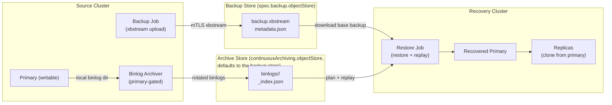
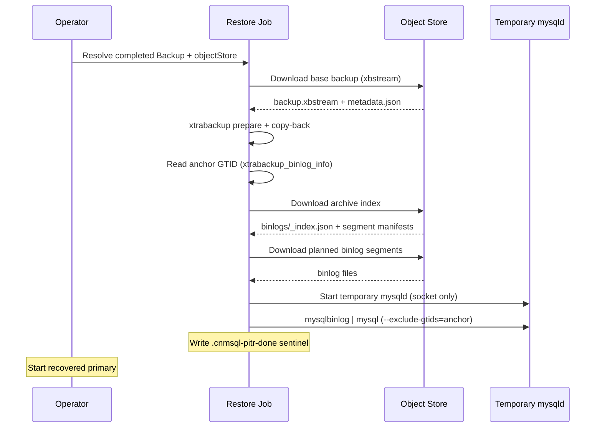

# Point-In-Time Recovery architecture

This document explains how cnmsql implements point-in-time recovery (PITR) for
integrators. PITR combines a physical base backup with continuously archived
MySQL binary logs, then restores the base backup and replays the archived logs
to a requested recovery target.

The design is GTID first: object names and binlog file numbers are operational
details, while recovery correctness is measured by whether the archived GTID set
covers the target.

:::note MariaDB
This page uses MySQL GTID syntax. On a MariaDB cluster, a `targetGTID` uses the
`domain-server-seq` form (for example `0-1-16`), and recovery to a GTID is
supported for a single replication domain. See [MariaDB Flavor](mariadb.md#point-in-time-recovery-to-a-gtid).
:::



## Scope

PITR supports recovery of a new `Cluster` from a completed `Backup`
plus the source cluster's continuous binlog archive. The same targets also apply
to [raw object-store recovery](backup-recovery#restore-from-raw-object-store-no-backup-cr)
(`bootstrap.recovery.source`), which resolves the base backup and binlog archive
straight from S3 without a `Backup` CR. The recovery bootstrap can target:

- `targetGTID`: replay up to an inclusive GTID set.
- `targetTime`: replay until a wall-clock timestamp.
- `targetImmediate`: stop as soon as the base backup is consistent.
- An empty `recoveryTarget: {}` object: replay to the latest archived point.
- No `recoveryTarget`: restore the physical base backup only.

PITR is a bootstrap operation. A recovering cluster starts from an empty PVC,
restores the first primary with its one-shot `<instance>-restore` bootstrap Job,
and then replicas clone from that recovered primary through the normal join
path.

## Components

### Base backup

A `Backup` object creates a worker Job that streams an XtraBackup archive from a
selected source instance over the instance-manager mTLS endpoint and uploads it
to an S3-compatible object store. The upload writes:

- `backup.xbstream`, the physical backup payload.
- `metadata.json`, the recovery manifest containing the archive key, SHA256,
  compression flag, backup identity, and timing metadata.

The backup archive is the recovery anchor. After copy-back, XtraBackup leaves
`xtrabackup_binlog_info` in the restored data directory. cnmsql reads the GTID
set in that file to know which transactions the base backup already contains.

### Continuous binlog archiver

When `spec.backup.continuousArchiving.enabled` is true, every instance pod starts
an archiver loop in the instance manager, but only the writable primary archives.
The loop checks writability before every pass, so a replica stays idle and a newly
promoted primary takes over after failover.

The archiver reads local binlog files from the data directory. It ships only
rotated, inactive files, never the currently written active log. It forces
periodic rotation with `FLUSH BINARY LOGS` to bound time-based RPO, and MySQL's
`max_binlog_size` bounds size-based rotation.

The commit order for every binlog segment is:

1. Upload raw binlog bytes.
2. Write the per-file JSON manifest.
3. Advance the per-server archive status.
4. Update the cluster-level archive index.

A crash between the raw upload and manifest write leaves the file uncommitted
from cnmsql's perspective; the next archive pass retries it.

### Local binlog retention

Archiving a binlog to the object store does not remove it from the instance's
data volume. Local retention is governed by `binlogExpireSeconds`, which cnmsql
renders as mysqld's own `binlog_expire_logs_seconds` (or `expire_logs_days` on
servers older than 8.0). It defaults to 604800, seven days.

Keeping the logs locally is what lets a replica rejoin without a full re-clone.
A replica that was down for maintenance, fell behind, or is returning after a
node failure catches up by reading the primary's binlogs. If the primary has
already discarded the segments that replica needs, replication cannot resume and
the instance must be re-initialised from a backup instead — much slower, and it
consumes object-store bandwidth. The retention window is therefore also the
window in which a replica can be absent and still catch up cheaply.

The cost is disk. The data volume must hold the dataset plus the binlogs written
during the retention window:

```
binlog headroom ≈ write throughput (bytes/sec) × binlogExpireSeconds
```

A cluster writing 1 MiB/s of binlog needs roughly 600 GiB of headroom at the
seven-day default. Size `spec.storage.size` accordingly, or shorten
`binlogExpireSeconds` to trade catch-up window for disk.

For clusters where that headroom is not available, the **active purge gate**
reclaims space earlier:

```yaml
spec:
  backup:
    continuousArchiving:
      enabled: true
      purgeAfterArchive: true
```

With `purgeAfterArchive: true` the primary runs `PURGE BINARY LOGS` on every
archiving pass. A binlog is purged only when both of these are true:

- it is in the object store;
- every other instance of the cluster has applied every transaction in it.

The second condition is what keeps replicas able to catch up. A replica that is
down, fenced, restarting or behind keeps the files it still needs on the
primary, and reads them from there when it returns instead of being re-cloned.
PITR is unaffected either way: recovery replays from the archive, not from
local logs.

The primary reads the other instances' positions from
`status.gtidExecutedByInstance`, which the operator refreshes at least every
five minutes, so purging trails writes by about that much. Which instances
count:

| Instance | Holds the purge |
|----------|-----------------|
| Replica or Group Replication member | Until it has applied the file |
| Fenced | Yes: it catches up when unfenced |
| Position not reported yet (joining, never answered) | Yes, every file |
| Diverged | No: it must be re-cloned anyway |
| Removed by a scale-down | No, from the moment it leaves `spec.instances` |

`binlogExpireSeconds` still applies on its own and stays the hard limit: a
replica that is down for longer than that has to be re-cloned, as before. So
does an instance whose volume was kept by a scale-down and that a later
scale-up brings back, if the primary purged what it was missing in the
meantime. Delete that volume before scaling up again to get a fresh copy.

The primary reports what holds the purge back in
`status.continuousArchiving`:

```yaml
status:
  continuousArchiving:
    purgeHeldBy: ["demo-3"]
    purgeHeldSince: "2026-09-30T10:00:00Z"
```

A few of the newest files are always held while the operator's next snapshot
of the replicas' positions is pending, so this is normal for short periods.
When the same file stays held for 15 minutes, the `BinlogPurgeHeld` condition
turns `True`, names the instances, and the operator emits a `BinlogPurgeHeld`
warning event. Bring those instances back, or remove them, before their binlogs
reach `binlogExpireSeconds`:

```bash
kubectl get cluster <name> \
  -o jsonpath='{.status.conditions[?(@.type=="BinlogPurgeHeld")].message}'
```

### Object store layout

Continuous archives live under the cluster prefix of the archive store. That is
`spec.backup.continuousArchiving.objectStore` when it is set, and
`spec.backup.objectStore` otherwise. The layout is the same in both cases:

```text
<path>/<cluster>/binlogs/<server-uuid>/<binlog-file>
<path>/<cluster>/binlogs/<server-uuid>/<binlog-file>.json
<path>/<cluster>/binlogs/<server-uuid>/_archive_status.json
<path>/<cluster>/binlogs/_index.json
```

The `server_uuid` partition prevents normal filename collisions such as two
different primaries both producing `binlog.000004`. The per-file manifest records
the file's GTID set, first/last GTID, timestamps, SHA256, size, server UUID, and
source instance.

`_index.json` is the recovery discovery document. It records the ordered timeline
segments across server UUIDs and the cumulative `coveredGTIDSet`. Recovery reads
this index instead of listing and inferring the full archive.

### Recovery planner

During restore, cnmsql loads `_index.json` and plans replay from the base backup
anchor to the requested target.

The planner:

- Skips archive segments already covered by the base backup anchor.
- Passes the anchor as `mysqlbinlog --exclude-gtids`, so transactions already in
  the base backup or re-emitted after failover are not replayed twice.
- Uses `--include-gtids` for `targetGTID`.
- Uses `--stop-datetime` for `targetTime`.
- Rejects targets before the base backup, targets beyond archive coverage, and
  incoherent or forked archive indexes.

The restore Job then downloads the planned binlog files, starts a
temporary socket-only `mysqld` over the restored data directory, and pipes:

```text
mysqlbinlog <bounded replay args> | mysql --socket=<temp socket>
```

The binlog stream itself is treated as data and is not logged. Child process
stderr is captured as structured logs.



## Operator flow

For a source cluster, integrators enable archiving by configuring an object store
and continuous archiving:

```yaml
spec:
  backup:
    objectStore:
      bucket: cnmsql-backups
      path: production
      endpoint: http://seaweedfs.objectstore.svc:8333
      credentials:
        accessKeyId:
          name: objectstore-creds
          key: accessKey
        secretAccessKey:
          name: objectstore-creds
          key: secretKey
    continuousArchiving:
      enabled: true
      targetRPOSeconds: 300
      maxBinlogSizeMB: 16
      binlogExpireSeconds: 604800
```

A recovery cluster references a completed `Backup` and supplies one target:

```yaml
spec:
  bootstrap:
    recovery:
      backup:
        name: source-backup
      recoveryTarget:
        targetGTID: "aaaaaaaa-bbbb-cccc-dddd-eeeeeeeeeeee:1-500"
  backup:
    objectStore:
      bucket: cnmsql-backups
      path: production
      endpoint: http://seaweedfs.objectstore.svc:8333
      credentials:
        accessKeyId:
          name: objectstore-creds
          key: accessKey
        secretAccessKey:
          name: objectstore-creds
          key: secretKey
```

The recovery object store is resolved from the `Backup` override when present,
otherwise from the recovering cluster's `spec.backup.objectStore`. The source
cluster name comes from `Backup.spec.cluster.name`; binlogs are replayed from
that source cluster's archive prefix, in the archive store the `Backup` recorded
in `status.binlogObjectStore` when it ran. A `Backup` without that field (taken
without archiving, or before the field existed) is replayed from the base
backup's store.

### Keeping the archive in its own store

The archive can go to a different bucket, path or provider from the base
backups, with its own credentials, storage class and lifecycle rules:

```yaml
spec:
  backup:
    objectStore:
      bucket: cnmsql-backups
      path: production
      endpoint: http://seaweedfs.objectstore.svc:8333
      credentials:
        accessKeyId:
          name: objectstore-creds
          key: accessKey
        secretAccessKey:
          name: objectstore-creds
          key: secretKey
    continuousArchiving:
      enabled: true
      objectStore:
        bucket: cnmsql-binlogs
        path: production
        endpoint: http://seaweedfs.objectstore.svc:8333
        credentials:
          accessKeyId:
            name: binlog-store-creds
            key: accessKey
          secretAccessKey:
            name: binlog-store-creds
            key: secretKey
```

Base backups and logical dumps stay in `spec.backup.objectStore`. Only
`binlogs/` goes to the archive store. The instance Pods carry the archive
store's credentials, so setting the field (or changing its Secret references)
rolls the instances once. `status.continuousArchiving.destination` shows the
archive location in use.

Moving the archive is allowed, and the operator emits an `ArchiveMoved` Warning
event when it notices. The archiver ships every binary log still on the
primary's disk to the new store, so the new archive starts at the oldest local
binary log. Take a new base backup right after a move.

`Backup` objects taken before the move recorded the old store in
`status.binlogObjectStore` and keep replaying from it, so keep the old store's
bucket and credentials for as long as those backups matter. If the `Backup`
objects are gone, use raw object-store recovery with `binlogObjectStore`
pointing at the old store. Retention and the `Delete` reclaim policy only act on
the current archive store: binlogs left in the old store are not expired or
removed, so clean them up by hand once you no longer need them.

The archive store is used only while `continuousArchiving.enabled` is true. With
archiving off, `continuousArchiving.objectStore` is ignored, and retention and
reclaim act on `spec.backup.objectStore` alone.

A restore without a `recoveryTarget` reads no binlog, so it does not need the
archive store or its credentials.

## RPO model

cnmsql's PITR RPO is bounded by the archived GTID frontier, not by the base
backup time.

Under healthy conditions, the expected RPO is approximately the configured
rotation cadence:

- `targetRPOSeconds` bounds low-write clusters by forcing binlog rotation.
- `maxBinlogSizeMB` bounds high-write clusters by rotating when the active
  binlog grows.
- The active binlog is not archived until it rotates.

With the defaults, a cluster with new writes rotates at least every 300 seconds
and a busy cluster rotates around 16 MiB. Idle clusters do not churn empty
binlogs. Lowering `targetRPOSeconds` tightens RPO at the cost of more, smaller
objects and more object-store requests.

Crash behavior depends on replication durability:

- `sync_binlog=1` is rendered when archiving is enabled so committed
  transactions are flushed to the local binlog.
- `log_replica_updates=ON` is mandatory so a promoted replica has its own binlog
  history for transactions it received before promotion.
- With semi-sync configured so acknowledged commits reach a replica, a failover
  can preserve acknowledged transactions even if the old primary dies before its
  active tail was archived; the new primary re-archives the GTID history under
  its own server UUID.
- Without semi-sync guarantees, acknowledged writes that existed only on a lost
  primary can be lost before archiving. In that case PITR cannot recover data
  that never reached either the object store or the promoted replica.

## RTO model

PITR RTO is the time to create the recovery primary plus any replicas:

- Schedule the restore Job and attach the PVC.
- Download and extract the XtraBackup archive.
- Run XtraBackup prepare and copy-back.
- Reconcile restored internal account passwords to the recovery cluster secrets.
- Download and replay archived binlogs from the base backup anchor to the target.
- Start the recovered primary and let replicas clone from it.

The largest variables are base backup size, object-store throughput, PVC
performance, and the amount of binlog data between the base backup and target.
Choosing more frequent base backups reduces replay length and therefore improves
RTO.

## Safety decisions

- The archiver is colocated with the database pod. It uses local binlog files
  instead of a remote replication stream, avoiding an extra replication client
  and preserving exact bytes.
- Only the current writable primary archives. Failover changes the active
  writer through the existing role/fencing flow.
- Archive progress is manifest driven. A raw object without a manifest is not
  considered complete.
- SHA256 in cnmsql metadata is the integrity source of truth, not S3 ETag.
- Object keys include `server_uuid` to isolate timeline segments.
- Existing manifests are never blindly overwritten with different bytes; a
  mismatch is treated as an archive collision.
- The purge gate purges only files already shipped, so MySQL should not recycle
  unarchived logs unless an operator explicitly bypasses the guard.
- Recovery replay is reentrant. After successful replay, cnmsql writes
  `.cnmsql-pitr-done` in the data directory. If the restore Job retries, it
  skips replay instead of reapplying GTIDs.

## Status and failure surfaces

The source cluster reports continuous archiving in
`status.continuousArchiving`:

- `enabled`
- `lastArchivedBinlog`
- `lastArchivedGTID`
- `lastArchivedTime`
- `pendingFiles`
- `lastFailureReason`
- `lastFailureTime`

The `ContinuousArchiving` condition is healthy when the primary reports no
archiver failure. `pendingFiles` is visible archive lag; a growing value means
the object-store path, network, or archiver throughput should be inspected.

### Forked archives

A lagged failover can leave transactions in the archive that the surviving
cluster never executed: the old primary shipped them, then crashed before its
successor received them. The new primary detects them and records them on the
archive segment that holds them. The cluster then reports:

- `status.continuousArchiving.forkGTIDs`: one entry per forked segment, the
  MySQL GTID set or a MariaDB range such as `0-1-219..0-1-225`;
- `status.continuousArchiving.forkDetectedAt`;
- the `ArchiveForked` condition, True with a Warning event when the first fork
  is recorded, and False once retention removes the last forked segment.

```bash
kubectl get cluster <name> \
  -o jsonpath='{.status.conditions[?(@.type=="ArchiveForked")].message}'
```

Recovery treats those transactions as a dead branch:

- `targetTime` and latest (`recoveryTarget: {}` or `targetImmediate`) leave them
  out, so the recovered data matches what the cluster actually served.
- A base backup that already contains one was taken on the dead branch: those
  targets fail with `ErrBackupOnDeadBranch`. Recover from another backup.
- `targetGTID` is applied as written. Name the dead transactions (on MariaDB,
  the dead server id and sequence) to recover that branch deliberately, for
  example to inspect what the failover lost.

Nothing else is needed: archiving keeps working, and the condition clears on
its own when the forked segment ages out of the retention window. The dead
transactions stay recorded in the archive index after that, so a backup that
holds them is still refused, and an instance that holds them is marked
diverged and never promoted.

### Dead-branch backups

A base backup taken on the losing side of a lagged failover holds transactions
the surviving cluster never executed, even when they never reached the archive.
The operator checks every completed physical Backup against the primary and
sets its `DeadBranch` condition (True with a Warning event on the Cluster when
it holds disowned transactions). Such a backup cannot recover a time or the
latest point; recover from another backup, or name its branch with
`targetGTID`.

```bash
kubectl get backup <name> \
  -o jsonpath='{.status.conditions[?(@.type=="DeadBranch")].message}'
```

### Archive gaps

The archive can miss a stretch of the timeline between transactions it holds:
typically a replica cloned after the primary's last archived file, promoted
after that primary died with the stretch only in its unarchived binary log, or a
binary log `binlogExpireSeconds` removed before it was archived. Recovery cannot
cross a gap: it fails with `ErrArchiveGap` (MySQL) or `ErrForkedTimeline`
(MariaDB) instead of building a state that never existed. The cluster reports
`status.continuousArchiving.gaps`, and once a gap has stood for seven minutes
(a returning former primary usually ships the missing stretch before that), the
`ArchiveGap` condition turns True with a Warning event and the operator takes a
base backup on the primary (`<cluster>-archive-gap-<hash>`). Once it completes,
recovery to any point after it works again; points inside the gap stay out of
reach.

### Choosing a base backup

When recovery names no Backup (`externalClusters` recovery from raw S3), the
operator picks the newest base backup that can reach the target: completed at
or before `targetTime`, with an anchor `targetGTID` contains, and, when the
recovery replays the archive, not on a dead branch. A named Backup that
completed after `targetTime` is refused, since it already holds later
transactions. A `targetTime` later than the archive's `archivedThrough` (the
time before which everything the primary committed is archived) fails with
`ErrTargetBeyondArchive` instead of recovering less than asked.

The operator performs an up-front PITR satisfiability check before provisioning a
recovery primary. It can block obvious failures, such as a `targetGTID` beyond
`_index.json` coverage. Checks that require the base backup anchor, such as
"target is older than this backup", run inside the restore Job.

## Integrator responsibilities

- Keep the referenced `Backup` object until recovery clusters no longer need it;
  its status carries the backup ID used to construct archive keys.
- Preserve the base-backup store and the archive store (the same one unless
  `continuousArchiving.objectStore` is set) for the required recovery window.
- Enable continuous archiving before relying on PITR. A physical backup alone can
  restore only to the backup's consistency point.
- Configure credentials or IAM so instance pods can write the source archive and
  recovery Jobs can read it.
- Monitor the `ContinuousArchiving`, `ArchiveForked` and `ArchiveGap`
  conditions, the `DeadBranch` condition on Backups,
  `pendingFiles`, object-store errors, and failover events.
- Choose base-backup frequency and `targetRPOSeconds` together. The former
  mostly controls replay length/RTO; the latter controls how much recent work can
  remain in the active, not-yet-archived binlog.
- Treat changing `server_uuid`, running `RESET MASTER`, or manually deleting
  archived objects as data-loss operations unless planned with operator support.

## Known risks and limits

- PITR cannot recover transactions that were neither archived nor present on the
  post-failover primary.
- `targetTime` depends on binlog event timestamps and the server clock. Replay
  stops at the first transaction stamped at or after the target, so skewed
  clocks between primaries recover an earlier point, never a mix. Prefer
  `targetGTID` when an exact boundary is available.
- `gtid_domain_id` is reserved on MariaDB: a multi-domain archive cannot leave a
  dead branch out of a recovery.
- The operator's up-front target check is intentionally conservative and
  coverage-based. Some invalid targets are detected later by the restore Job.
- Recovery uses the archive index. If `_index.json` is missing, stale, or forked,
  recovery fails loudly rather than inferring a possibly unsafe order.
- Object-store versioning, retention, and immutability are outside the operator.
  Accidental deletion or lifecycle expiry of base backups or binlogs reduces the
  recovery window.
- Multi-failover archive planning is covered by unit tests; operators should
  still validate their own failover-heavy recovery runbooks against their object
  store and MySQL versions.
- Replica clusters, which keep following another cluster's archive or a live
  source, remain future work; see design 036.

## Verification coverage

The implementation is covered by unit tests for archive key construction,
archiver idempotency, collision detection, replay planning, recovery target
validation, and controller wiring. Integration tests exercise real Percona
`mysqlbinlog | mysql` replay to a target GTID. The Kind + SeaweedFS e2e suite covers
gapless archiving, failover continuity, object-store outage surfacing, and PITR
to `targetGTID` with exact data assertions.
