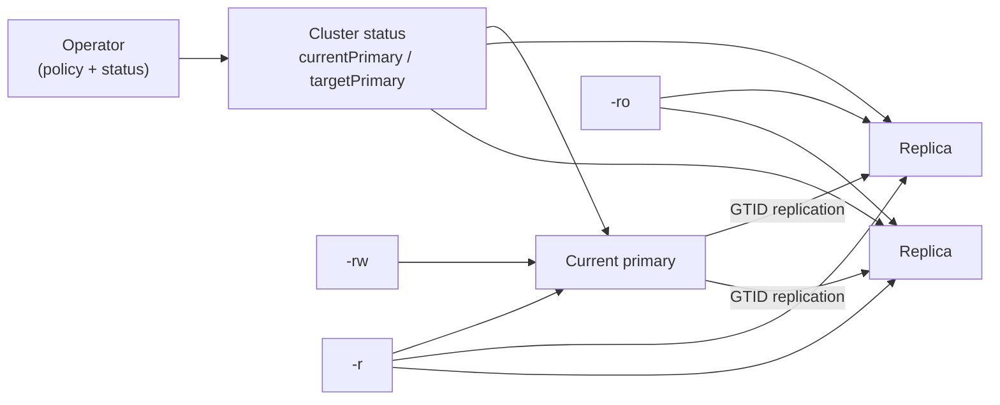

# Replication and failover architecture

cnmsql builds a primary-replica topology with Percona Server for MySQL GTID
replication. The operator owns topology policy, while each instance manager
owns local mysqld role changes. This split keeps primary changes declarative:
the operator writes the intended primary in Cluster status, and the pods
converge themselves toward that target.

An alternative [Group Replication](./group-replication.md) topology is also
available. When `spec.replication.mode: groupReplication`, the group itself owns
membership, write certification, and primary election. The operator becomes an
observer of the group's decisions. This page documents the default async
replication mode.



## Replication model

Replicas are created from a physical XtraBackup stream taken from the current
primary. After prepare and copy-back, the instance manager configures MySQL with
GTID auto-positioning so it follows the primary from the restored GTID point.

MySQL transport TLS is rendered for every instance. Replication uses the
per-instance certificate material and a dedicated replication account requiring
X509. The application-facing `require_secure_transport` setting remains a user
choice through `spec.mysql.parameters`.

Semi-synchronous replication can be enabled with:

```yaml
spec:
  instances: 3
  minSyncReplicas: 1
  maxSyncReplicas: 1
  mysql:
    semiSync:
      enabled: true
      timeoutMillis: 1000
```

Semi-sync improves failover durability when configured so acknowledged commits
reach at least one replica. Without that guarantee, an acknowledged write that
only existed on a lost primary can be lost before a replica or the object store
sees it.

### Semi-sync self-healing (data durability)

With semi-sync on, the primary blocks each commit until `minSyncReplicas`
replicas acknowledge it. If a synchronous replica becomes unhealthy, that floor
can stall writes. `spec.mysql.semiSync.dataDurability` decides how the operator
responds:

```yaml
spec:
  minSyncReplicas: 2
  mysql:
    semiSync:
      enabled: true
      dataDurability: preferred # or "required"
```

With `preferred` (the default), the operator keeps lowering the primary's
required acknowledgement count
(`rpl_semi_sync_source_wait_for_replica_count`) to the number of healthy
replicas, never below one, so writes keep flowing during a replica outage. It
raises the count back to `minSyncReplicas` as replicas recover. This favours
availability over strict durability.

With `required`, the count stays pinned to `minSyncReplicas`. When fewer healthy
replicas can acknowledge, writes block until `timeoutMillis` elapses and
replication falls back to async. This favours durability over availability.

The operator applies the change on the primary over the mTLS control API during
its steady-state reconcile. It is a runtime adjustment only; the static
`my.cnf` floor does not change.

### Probes

The liveness probe (`/livez`) does not depend on mysqld being up. The manager
answering the probe is itself the liveness signal, so a deliberately stopped
mysqld (for example while the instance is fenced) does not trigger a kubelet
restart. The only failure mode that restarts a container is a primary that has
lost contact with the Kubernetes API server: each cluster-managed primary keeps
probing the API server, and if it cannot reach it for 30 seconds it treats
itself as network-isolated and fails liveness. This is a last-resort guard
against a partitioned primary the operator can no longer coordinate, which is a
split-brain risk. The check runs locally inside the instance, so a genuinely
isolated primary still restarts itself even while it is unreachable from the
control plane. A replica never restarts itself on isolation; there is nothing to
protect against.

The startup probe (`/startupz`) gates on mysqld first accepting connections, so
the container is considered started only once the server is up. The readiness
probe (`/readyz`) additionally requires healthy replication on a replica, so a
replica that is up but not replicating is held out of routing.

## Fencing an instance

Fencing takes a single instance out of service without deleting it or its data.
Use the plugin:

```bash
kubectl cnmsql fence on <cluster> <cluster>-2
kubectl cnmsql fence off <cluster> <cluster>-2
```

The operator drops the Pod from every routing Service (rw, ro, r, and any
user-defined ones) by clearing its `routable` label, and records it under
`status.fencedInstances`. The instance's in-Pod reconciler reads that list and
stops mysqld. The manager stays alive as PID 1 so the Pod keeps running and keeps
answering its control and liveness endpoints; only the database is down. The
continuous archiver stands down with it, and a fenced instance is skipped as a
failover candidate, so the operator never promotes it. Because mysqld is
stopped, the Pod reports NotReady and shows as `0/1 Running`. Unfencing restarts
mysqld and the instance rejoins normal routing and role reconciliation.

Fencing the primary stops writes for the whole cluster, because the rw Service
loses its only endpoint. That is deliberate: use it to freeze an instance for
inspection or maintenance rather than as a failover trigger.

## Primary lease fencing

Each cluster creates a standard `coordination.k8s.io/v1` Lease named
`{cluster}-primary`. Before an instance promotes itself to primary, it must
acquire this lease. While it is primary, it renews the lease every 30 seconds.
When it demotes or shuts down, it releases (deletes) the lease.

During automatic failover, the operator checks whether the old primary's lease is
still held before promoting a candidate. If the lease is still active, failover
waits for the lease TTL (15 seconds) before proceeding. This prevents the
operator from promoting a new primary while the old one might still be accepting
writes on a network-partitioned node.

Combined with Pod deletion, this gives two independent timeouts before the old
primary can be replaced: the lease TTL and the kubelet Pod termination grace
period. The split-brain window narrows to whichever expires first.

### Feature gate

```yaml
spec:
  enablePrimaryLease: false
```

The feature is on by default. Set it to `false` to skip all lease management.
This is safe for single-instance or test clusters where the extra API call is
unnecessary.

### Lifecycle

| Event | Lease action |
|-------|-------------|
| Instance promotes itself | Acquire (create or take over the lease, set `holderIdentity`) |
| Instance is already primary | Renew `renewTime` |
| Instance demotes or is fenced | Delete the lease |
| Instance shuts down | Delete the lease (graceful shutdown handler) |
| Lease acquisition fails | Instance does not promote; retries on next reconcile |
| API server unreachable | Lease cannot be renewed. The instance's liveness probe eventually fails (isolation detector) and kubelet restarts the container. |

### Failover interaction

The lease adds a 15-second wait to failover when the old primary is still
renewing. The operator sequence becomes:

1. Detect primary failure, wait for `failoverDelay`.
2. Select a candidate.
3. Check the old primary's lease: if still held, requeue for 15 seconds.
4. Fence the old primary Pod.
5. Set `targetPrimary` and let the candidate promote.

If the old primary's Pod is deleted quickly (step 4), the lease is also released
because the in-Pod shutdown handler fires. In that case the wait in step 3 is
negligible. The lease guard is a backstop for when the Pod takes longer than 15
seconds to terminate.

### Monitoring

The lease exists in the same namespace as the Cluster. Inspect it:

```bash
kubectl get lease <cluster>-primary -o yaml
```

The `holderIdentity`, `renewTime`, and `leaseTransitions` fields show which
instance holds the lease and when it last renewed. An expired lease (renewTime
older than 15 seconds with a different holderIdentity) means the holder stopped
renewing and the lease is safe to take.

## Deleting a cluster

Deleting a Cluster tears down its instances. Like CloudNativePG, the operator
does not hold a finalizer to block the delete: `kubectl delete cluster <cluster>`
removes the Pods immediately, and owned resources are garbage-collected via owner
references.

To protect the data, rely on the standard Kubernetes mechanisms — set a
`Retain` reclaim policy on the StorageClass (or retain the PVCs) so the volumes
survive the Cluster deletion, and use RBAC to restrict who can delete Clusters.

## Role services

cnmsql creates three default Services:

- `<cluster>-rw`: selects the current primary.
- `<cluster>-ro`: selects ready replicas.
- `<cluster>-r`: selects any ready instance.

Default Services can be disabled by name (the `rw` service cannot be disabled):

```yaml
spec:
  managed:
    services:
      disabledDefaultServices:
        - ro
```

### Customising default services

A shared `template` is merged onto the three default Services, letting you change
their `type` and add labels and annotations. The operator always owns the
selector and the `mysql:3306` port.

```yaml
spec:
  managed:
    services:
      template:
        metadata:
          labels:
            app.kubernetes.io/part-of: my-app
          annotations:
            service.beta.kubernetes.io/aws-load-balancer-scheme: internal
        spec:
          type: LoadBalancer
```

### Additional services

You can declare extra Services routed to a role (`rw`, `ro`, or `r`). Each entry
is rendered as `<cluster>-<name>` and carries its own template. `updateStrategy:
patch` (default) merges your template onto the role defaults; `replace` swaps
them entirely, keeping only the operator-owned selector, ports, and owner-tracking
labels. Additional service names must be unique and must not collide with the
default `rw`/`ro`/`r` names.

```yaml
spec:
  managed:
    services:
      additional:
        - name: mysql-lb
          selectorType: rw
          serviceTemplate:
            spec:
              type: LoadBalancer
        - name: mysql-internal-read
          selectorType: ro
          updateStrategy: replace
          serviceTemplate:
            metadata:
              labels:
                pool: reporting
            spec:
              type: ClusterIP
```

The user-customisable spec fields are `type`, `externalTrafficPolicy`,
`sessionAffinity`, `loadBalancerSourceRanges`, `externalName`, and
`healthCheckNodePort`. The selector, ports, and `clusterIP` are operator-managed
and cannot be overridden. Per-instance headless Services remain internal
`ClusterIP: None` and are not user-configurable.

Service routing is driven by Pod labels. The operator updates labels only after
the database role change is considered safe, so client traffic follows the
observed MySQL topology.

## Dynamic role reconciliation

Every instance starts read only. The in-pod role reconciler watches the owning
`Cluster` and compares its own name with `status.targetPrimary` and
`status.currentPrimary`.

If the pod is the target primary, it drains replication state, promotes itself,
clears read-only mode, and writes `status.currentPrimary`.

If the pod is not the target primary, it stays or becomes read only and follows
the current primary. A diverged instance is kept read only and is not silently
re-cloned over its retained PVC.

## Planned switchover

A planned switchover promotes a named healthy replica. cnmsql models this like
CloudNativePG: the request is a status transition rather than a spec change.
The normal trigger is to set `status.targetPrimary` to a replica name.

The operator then:

1. validates that the target exists, is ready, is a replica, and has healthy
   replication threads;
2. checks that the target GTID set contains the old primary's observed GTID set;
3. demotes the old primary while it is still reachable;
4. lets the target promote itself;
5. reconfigures remaining replicas to follow the new primary;
6. updates role labels, Services, `currentPrimary`, and conditions.

`spec.maxSwitchoverDelay` bounds how long the target may take to catch up before
the switchover is aborted and surfaced as blocked.

## Automatic failover

Automatic failover begins when the established primary is unreachable or not
healthy. The operator records when the primary first started failing and waits
for `spec.failoverDelay`. A value of `0` means immediate failover.

After the delay, the operator selects a candidate only if it can prove the move
is safe enough:

- the candidate must be ready and a replica;
- replication SQL state must be healthy and free of a last error;
- the candidate must not be a known-diverged instance;
- GTID sets must be comparable;
- the chosen candidate must contain the best known GTID history among
  candidates.

If the GTID sets are divergent or no safe candidate exists, failover is blocked
instead of risking data loss.

During failover, the old primary is fenced by removing its primary role and
deleting its Pod while retaining the PVC. The promoted replica becomes
`currentPrimary`, and surviving replicas follow it.

### Excluding diverged candidates

A diverged replica carries errant transactions, so its GTID set is a *superset*
of the clean replicas'. The "contains the best known GTID history" rule would
therefore pick it, and promoting it makes those errant transactions canonical and
strands the clean replicas. To prevent this, the operator filters known-diverged
instances out of the candidate pool *before* the GTID comparison.

The subtlety is that divergence is detected by comparing each replica against the
primary's GTID set, but during a failover the primary is unreachable, so there is
no live baseline. The operator therefore consults `status.divergedInstances` as
it was recorded on an earlier reconcile, while the primary was still reachable.
That persisted signal survives the outage.

If every surviving candidate is known-diverged, failover blocks with "every
replica candidate has diverged from the failed primary (errant transactions);
manual recovery required". Re-initialise a survivor (see below) to recover. One
case it cannot catch is a replica that diverged during the same outage, with no
earlier reconcile to record it. That is the fundamental limit of MySQL
replication once the old primary is gone to compare against.

## Former primary rejoin

When a fenced or crashed primary returns, it does not automatically become
primary again. It boots read only, observes Cluster status, and attempts to
follow the promoted primary.

If its GTID set is contained in the new primary's GTID set, it can safely rejoin
as a replica. If it contains errant transactions that the promoted primary never
saw, cnmsql marks it diverged and keeps it out of service. The retained PVC is
left for deliberate human recovery instead of being destroyed.

## Detecting a silently broken replica

Divergence is detected by comparing GTID sets, but a replica can also stop
replicating at the SQL layer without diverging. A duplicate-key conflict (error
1062), for example, halts the SQL thread with a recorded last error. Such a
replica may still report Running, so it would otherwise sit unnoticed while
falling further behind.

The operator polls the control API of every reachable instance, including pods
that are Running but not yet Ready, and surfaces any replica with a stopped IO or
SQL thread and a recorded error under `status.replicationBrokenInstances`. That
marks the cluster `Degraded` with a reason naming the instance and its
replication error, rather than leaving it to look like an instance still
finishing provisioning. Re-initialise the instance to recover.

## Re-initialising an instance

MySQL has no `pg_rewind`, so a diverged or irrecoverably broken replica cannot be
surgically realigned. The remediation, which mirrors CloudNativePG's
destroy-and-rebootstrap fallback, is to re-initialise the instance. The operator
deletes its Pod and PVC and recreates them empty, so the bootstrap re-clones a
fresh copy from a backup and rejoins replication. The instance keeps its name and
ordinal, so it keeps its `server_id`; only its data is discarded.

This is always human-triggered. The operator never re-clones an instance over its
retained PVC on its own, so errant data is preserved for diagnosis until you
decide to discard it. Trigger it with the plugin:

```bash
kubectl cnmsql reinit <cluster> <cluster>-2
```

The current primary is refused, because it is the replication source, so switch over first if
you need to rebuild a former primary. See the
[operations runbook](./operations.md#re-initialise-an-instance-from-scratch) for
the full procedure.

## Status and events

Useful status fields during topology changes:

- `currentPrimary`: the instance currently accepted as primary.
- `targetPrimary`: the desired primary.
- `currentPrimaryTimestamp`: when the current primary became primary.
- `targetPrimaryTimestamp`: when a primary change was requested.
- `primaryFailingSince`: when the current primary became unhealthy.
- `divergedInstances`: instances excluded because their GTID set is unsafe.
- `replicationBrokenInstances`: reachable replicas whose replication aborted with
  a recorded SQL/IO error.
- `fencedInstances`: instances fenced out of routing, with mysqld stopped.
- `gtidExecutedByInstance`: last observed GTID state per instance.

Watch Events for phase transitions such as switchover, failover, fencing, and
blocked operations. The operator also reports `Ready`, `Progressing`, and
`Degraded` conditions on the Cluster.

## Operational notes

- Use three instances for meaningful automatic failover.
- Prefer semi-sync when the recovery objective requires acknowledged writes to
  survive primary loss.
- Keep failover delay low for availability, but high enough to avoid promoting
  during transient node or network blips.
- Do not manually write to a replica or recovered former primary. Errant GTIDs
  intentionally block automatic rejoin.
- Do not delete retained PVCs until you have decided the data is no longer
  needed for diagnosis or manual recovery.

## Verification coverage

Unit tests cover GTID parsing and containment, candidate selection, switchover
validation, failover delay, blocked failover, role-label updates, and divergence
detection. Kind e2e coverage validates planned switchover, automatic failover by
primary Pod deletion, service rerouting, writes after promotion, and compatible
former-primary rejoin.
