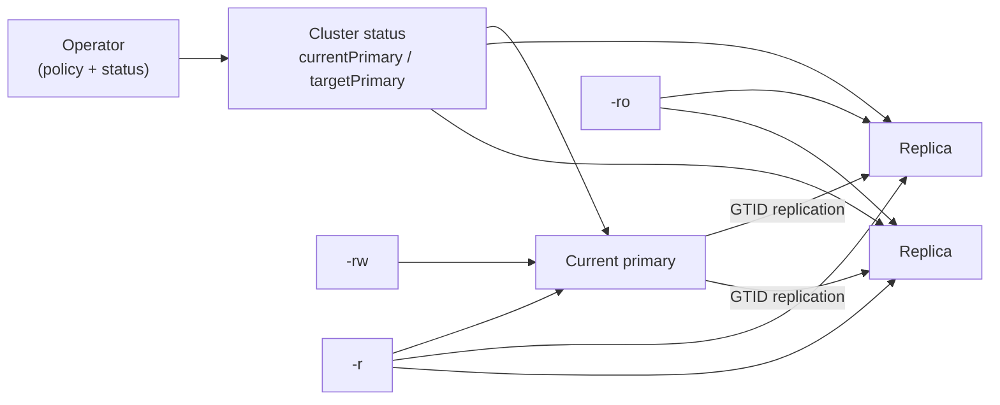

# Replication and failover architecture

cnmsql builds a primary-replica topology with Percona Server for MySQL GTID
replication. The operator owns topology policy, while each instance manager
owns local mysqld role changes. This split keeps primary changes declarative:
the operator writes the intended primary in Cluster status, and the pods
converge themselves toward that target.

An alternative [Group Replication](./group-replication.md) topology is also
available. When `spec.replication.mode: groupReplication`, the group itself owns
membership, write certification, and primary election. The operator becomes an
observer of the group's decisions. This page documents the default async
replication mode.


```mermaid
flowchart LR
    Operator["Operator\n(policy + status)"]
    ClusterStatus["Cluster status\ncurrentPrimary / targetPrimary"]
    Primary["Current primary"]
    ReplicaA["Replica"]
    ReplicaB["Replica"]
    RW["<cluster>-rw"]
    RO["<cluster>-ro"]
    R["<cluster>-r"]

    Operator --> ClusterStatus
    ClusterStatus --> Primary
    ClusterStatus --> ReplicaA
    ClusterStatus --> ReplicaB
    Primary -->|"GTID replication"| ReplicaA
    Primary -->|"GTID replication"| ReplicaB
    RW --> Primary
    RO --> ReplicaA
    RO --> ReplicaB
    R --> Primary
    R --> ReplicaA
    R --> ReplicaB
```

## Replication model

Replicas are created from a physical XtraBackup stream taken from the current
primary. After prepare and copy-back, the instance manager configures MySQL with
GTID auto-positioning so it follows the primary from the restored GTID point.

MySQL transport TLS is rendered for every instance. Replication uses the
per-instance certificate material and a dedicated replication account requiring
X509. The application-facing `require_secure_transport` setting remains a user
choice through `spec.mysql.parameters`.

Semi-synchronous replication can be enabled with:

```yaml
spec:
  instances: 3
  minSyncReplicas: 1
  maxSyncReplicas: 1
  mysql:
    semiSync:
      enabled: true
      timeoutMillis: 1000
```

Semi-sync improves failover durability when configured so acknowledged commits
reach at least one replica. Without that guarantee, an acknowledged write that
only existed on a lost primary can be lost before a replica or the object store
sees it.

### Semi-sync self-healing (data durability)

With semi-sync on, the primary blocks each commit until `minSyncReplicas`
replicas acknowledge it. If a synchronous replica becomes unhealthy, that floor
can stall writes. `spec.mysql.semiSync.dataDurability` decides how the operator
responds:

```yaml
spec:
  minSyncReplicas: 2
  mysql:
    semiSync:
      enabled: true
      dataDurability: preferred # or "required"
```

With `preferred` (the default), the operator keeps lowering the primary's
required acknowledgement count
(`rpl_semi_sync_source_wait_for_replica_count`) to the number of healthy
replicas, never below one, so writes keep flowing during a replica outage. It
raises the count back to `minSyncReplicas` as replicas recover. This favours
availability over strict durability.

With `required`, the count stays pinned to `minSyncReplicas`. When fewer healthy
replicas can acknowledge, writes block until `timeoutMillis` elapses and
replication falls back to async. This favours durability over availability.

MariaDB always waits for exactly one acknowledgement, so on a MariaDB cluster
`dataDurability`, and `minSyncReplicas` above 1, have no effect. See
[MariaDB flavor](mariadb.md#semi-synchronous-replication).

The operator applies the change on the primary over the mTLS control API during
its steady-state reconcile. It is a runtime adjustment only; the static
`my.cnf` floor does not change.

### Probes

The liveness probe (`/livez`) does not depend on mysqld being up. The manager
answering the probe is itself the liveness signal, so a deliberately stopped
mysqld (for example while the instance is fenced) does not trigger a kubelet
restart. The only failure mode that restarts a container is a primary that has
lost contact with the Kubernetes API server: each cluster-managed primary keeps
probing the API server, and if it cannot reach it for 30 seconds it treats
itself as network-isolated and fails liveness. This is a last-resort guard
against a partitioned primary the operator can no longer coordinate, which is a
split-brain risk. The check runs locally inside the instance, so a genuinely
isolated primary still restarts itself even while it is unreachable from the
control plane. A replica never restarts itself on isolation; there is nothing to
protect against.

The startup probe (`/startupz`) gates on mysqld first accepting connections, so
the container is considered started only once the server is up. The readiness
probe (`/readyz`) additionally requires healthy replication on a replica, so a
replica that is up but not replicating is held out of routing.

### The readiness lag gate

Running replication threads are not the same as being caught up. A replica
scaled up from a volume cloned hours earlier, or restarted after a long outage,
starts its IO and SQL threads within seconds and passes readiness immediately —
while still hours behind, and while the read Services would happily route
freshness-sensitive reads to it.

`spec.replication.maxReadyLag` turns the heartbeat lag (the same measurement
[failoverPolicy.maxReplicationLag](#bounding-data-loss-with-maxreplicationlag)
reads) into part of the answer. A replica whose lag exceeds the bound keeps
failing `/readyz` until it has caught up:

```yaml
spec:
  replication:
    maxReadyLag: 30s
```

While a replica is over the bound, its Pod is not Ready and the Cluster reports
Degraded, naming the replica in `status.phaseReason` (`behind maxReadyLag:
<instance>`). `status.replicationLagByInstance` shows how far behind the
instance is and how fast it is closing the gap. The `/readyz` response body
also names the current lag (for example
`replication lag 8h0m0s exceeds maxReadyLag 30s`), but the kubelet does not
copy an HTTP probe's body into the Pod's events, so `kubectl describe pod` only
shows the 503.

Two consequences worth knowing:

- The read Services follow readiness once the bound is set. Without a bound, the
  async `-ro` and `-r` Services publish not-ready endpoints so a replica stays
  discoverable while it catches up. With a bound set, a lagging replica must fail
  readiness to be held back at all, so the read Services stop publishing
  not-ready addresses and Kubernetes endpoint readiness governs membership.
- A replica that cannot produce a heartbeat reading at all — before its first
  stamp arrives, or while the heartbeat read is failing — is treated as over the
  bound rather than assumed caught up. The gate therefore requires the heartbeat,
  which is on by default; setting a bound while explicitly disabling the
  heartbeat is rejected at admission.
- The bound must be at least three heartbeat intervals (3s with the default 1s
  interval). The reading is the age of the newest applied stamp, so it grows by
  up to one interval between stamps even on a replica that is not behind.
- The reading compares the primary's clock with the replica's, so clock skew
  between their nodes counts as lag. Keep the bound well above the skew your
  NTP setup allows.
- While the primary is down or cannot stamp the heartbeat (during a failover, or
  a primary that cannot write), every replica's reading grows. Once it passes
  the bound, every replica leaves `-ro` and `-r` until a primary stamps again,
  so read traffic stops too. Pick a bound longer than a failover takes if reads
  must survive one.

A replica held back by the gate still replicates: the Cluster lists it as
"behind maxReadyLag" in its Degraded reason, and with semi-synchronous
replication it still counts towards the acknowledgement count, since it keeps
acknowledging transactions.

The gate shapes read traffic only. It never gates the primary (a promoted
instance is Ready as soon as it accepts writes), it does not apply under Group
Replication (readiness there already means the member is ONLINE), and it is not
a failover bound: what a promotion may lose is governed by
`failoverPolicy.maxReplicationLag` and `failoverPolicy.maxTransactionsBehind`.

## Fencing an instance

Fencing takes a single instance out of service without deleting it or its data.
Use the plugin:

```bash
kubectl cnmsql fence on <cluster> <cluster>-2
kubectl cnmsql fence off <cluster> <cluster>-2
```

The operator drops the Pod from every routing Service (rw, ro, r, and any
user-defined ones) by clearing its `routable` label, and records it under
`status.fencedInstances`. The instance's in-Pod reconciler reads that list and
stops mysqld. The manager stays alive as PID 1 so the Pod keeps running and keeps
answering its control and liveness endpoints; only the database is down. The
continuous archiver stands down with it, and a fenced instance is skipped as a
failover candidate, so the operator never promotes it. Because mysqld is
stopped, the Pod reports NotReady and shows as `0/1 Running`. Unfencing restarts
mysqld and the instance rejoins normal routing and role reconciliation.

Fencing the primary stops writes for the whole cluster, because the rw Service
loses its only endpoint. Once the fence has stopped mysqld the primary counts as
failed, and automatic failover promotes a safe replica after `failoverDelay`.
The operator leaves the fenced Pod in place rather than deleting it as it does a
failed primary's, so the fence holds until you clear it; the instance then
rejoins as a replica. Use fencing to freeze an instance for inspection or
maintenance, and a switchover to move the primary role deliberately.

## Primary lease fencing

Each cluster creates a standard `coordination.k8s.io/v1` Lease named
`{cluster}-primary`. Before an instance promotes itself to primary, it must
acquire this lease. While it is primary, it renews the lease every 30 seconds.
When it demotes or shuts down, it releases (deletes) the lease.

During automatic failover, the operator checks whether the old primary's lease is
still held before promoting a candidate. If the lease is still active, failover
waits for the lease TTL (15 seconds) before proceeding. This prevents the
operator from promoting a new primary while the old one might still be accepting
writes on a network-partitioned node.

Combined with Pod deletion, this gives two independent timeouts before the old
primary can be replaced: the lease TTL and the kubelet Pod termination grace
period. The split-brain window narrows to whichever expires first.

### Feature gate

```yaml
spec:
  enablePrimaryLease: false
```

The feature is on by default. Set it to `false` to skip all lease management.
This is safe for single-instance or test clusters where the extra API call is
unnecessary.

### Lifecycle

| Event | Lease action |
|-------|-------------|
| Instance promotes itself | Acquire (create or take over the lease, set `holderIdentity`) |
| Instance is already primary | Renew `renewTime` |
| Instance demotes or is fenced | Delete the lease |
| Instance shuts down | Delete the lease (graceful shutdown handler) |
| Lease acquisition fails | Instance does not promote; retries on next reconcile |
| API server unreachable | Lease cannot be renewed. The instance's liveness probe eventually fails (isolation detector) and kubelet restarts the container. |

### Failover interaction

The lease adds a 15-second wait to failover when the old primary is still
renewing. The operator sequence becomes:

1. Detect primary failure, wait for `failoverDelay`.
2. Select a candidate.
3. Check the old primary's lease: if still held, requeue for 15 seconds.
4. Fence the old primary Pod.
5. Set `targetPrimary` and let the candidate promote.

If the old primary's Pod is deleted quickly (step 4), the lease is also released
because the in-Pod shutdown handler fires. In that case the wait in step 3 is
negligible. The lease guard is a backstop for when the Pod takes longer than 15
seconds to terminate.

### Monitoring

The lease exists in the same namespace as the Cluster. Inspect it:

```bash
kubectl get lease <cluster>-primary -o yaml
```

The `holderIdentity`, `renewTime`, and `leaseTransitions` fields show which
instance holds the lease and when it last renewed. An expired lease (renewTime
older than 15 seconds with a different holderIdentity) means the holder stopped
renewing and the lease is safe to take.

## Deleting a cluster

Deleting a Cluster tears down its instances. Like CloudNativePG, the operator
does not hold a finalizer to block the delete: `kubectl delete cluster <cluster>`
removes the Pods immediately, and owned resources are garbage-collected via owner
references.

To protect the data, rely on the standard Kubernetes mechanisms — set a
`Retain` reclaim policy on the StorageClass (or retain the PVCs) so the volumes
survive the Cluster deletion, and use RBAC to restrict who can delete Clusters.

## Role services

cnmsql creates three default Services:

- `<cluster>-rw`: selects the current primary.
- `<cluster>-ro`: selects ready replicas.
- `<cluster>-r`: selects any ready instance.

By default the read Services publish not-ready addresses, so a replica that is
still catching up remains discoverable while it works through its backlog. Set
[spec.replication.maxReadyLag](#the-readiness-lag-gate) to flip that: with a lag
bound configured, a replica over the bound fails readiness and leaves `-ro`/`-r`
until it has caught up, and the Services stop publishing not-ready addresses so
readiness alone decides membership.

Default Services can be disabled by name (the `rw` service cannot be disabled):

```yaml
spec:
  managed:
    services:
      disabledDefaultServices:
        - ro
```

### Customising default services

A shared `template` is merged onto the three default Services, letting you change
their `type` and add labels and annotations. The operator always owns the
selector and the `mysql:3306` port.

```yaml
spec:
  managed:
    services:
      template:
        metadata:
          labels:
            app.kubernetes.io/part-of: my-app
          annotations:
            service.beta.kubernetes.io/aws-load-balancer-scheme: internal
        spec:
          type: LoadBalancer
```

### Additional services

You can declare extra Services routed to a role (`rw`, `ro`, or `r`). Each entry
is rendered as `<cluster>-<name>` and carries its own template. `updateStrategy:
patch` (default) merges your template onto the role defaults; `replace` swaps
them entirely, keeping only the operator-owned selector, ports, and owner-tracking
labels. Additional service names must be unique and must not collide with the
default `rw`/`ro`/`r` names.

```yaml
spec:
  managed:
    services:
      additional:
        - name: mysql-lb
          selectorType: rw
          serviceTemplate:
            spec:
              type: LoadBalancer
        - name: mysql-internal-read
          selectorType: ro
          updateStrategy: replace
          serviceTemplate:
            metadata:
              labels:
                pool: reporting
            spec:
              type: ClusterIP
```

The user-customisable spec fields are `type`, `externalTrafficPolicy`,
`sessionAffinity`, `loadBalancerSourceRanges`, `externalName`, and
`healthCheckNodePort`. The selector, ports, and `clusterIP` are operator-managed
and cannot be overridden. Per-instance headless Services remain internal
`ClusterIP: None` and are not user-configurable.

Service routing is driven by Pod labels. The operator updates labels only after
the database role change is considered safe, so client traffic follows the
observed MySQL topology.

## Dynamic role reconciliation

Every instance starts read only. The in-pod role reconciler watches the owning
`Cluster` and compares its own name with `status.targetPrimary` and
`status.currentPrimary`.

If the pod is the target primary, it drains replication state, promotes itself,
clears read-only mode, and writes `status.currentPrimary`.

If the pod is not the target primary, it stays or becomes read only and follows
the current primary. A diverged instance is kept read only and is not silently
re-cloned over its retained PVC.

## Planned switchover

A planned switchover promotes a named healthy replica. cnmsql models this like
CloudNativePG: the request is a status transition rather than a spec change.
The normal trigger is to set `status.targetPrimary` to a replica name.

The operator then:

1. validates that the target exists, is ready, is a replica, and has healthy
   replication threads;
2. checks that the target GTID set contains the old primary's observed GTID set;
3. demotes the old primary while it is still reachable;
4. lets the target promote itself;
5. reconfigures remaining replicas to follow the new primary;
6. updates role labels, Services, `currentPrimary`, and conditions.

`spec.maxSwitchoverDelay` bounds how long the target may take to catch up before
the switchover is aborted and surfaced as blocked.

While the target promotes itself (step 4), it briefly reports not ready with its
replication stopped. The operator recognizes this window by the primary Lease,
which the target acquires right before it promotes. As long as the target holds
the Lease, the switchover reports `Switchover` and automatic failover waits
instead of electing another replica. `spec.maxSwitchoverDelay` bounds this wait
too. Once the delay has passed, failover elects another replica if the old
primary has already stepped down; otherwise the target is fenced and the
switchover is aborted. Clusters with the primary Lease disabled have no
such signal, so failover may still fire during the promotion.

## Automatic failover

Automatic failover begins when the established primary is unreachable or not
healthy. The operator records when the primary first started failing and waits
for `spec.failoverDelay`. A value of `0` means immediate failover.

After the delay, the operator selects a candidate only if it can prove the move
is safe enough:

- the candidate must be ready and a replica;
- replication SQL state must be healthy and free of a last error;
- the candidate must not be a known-diverged instance;
- GTID sets must be comparable;
- the chosen candidate must contain the best known GTID history among
  candidates.

If the GTID sets are divergent or no safe candidate exists, failover is blocked
instead of risking data loss.

During failover, the old primary is fenced by removing its primary role and
deleting its Pod while retaining the PVC. The promoted replica becomes
`currentPrimary`, and surviving replicas follow it.

### Bounding data loss with `maxTransactionsBehind`

The rules above pick the *best surviving* replica. They say nothing about how good
that replica is in absolute terms. If every replica has fallen behind by the time
the primary dies, the best of them is still promoted, and every transaction it
never received is lost without a trace.

`spec.failoverPolicy.maxTransactionsBehind` puts a limit on that loss:

```yaml
spec:
  failoverPolicy:
    maxTransactionsBehind: 100
```

The operator drops any replica missing more than that many transactions from the
candidate pool. If this leaves no candidate at all, it refuses the failover: the
cluster moves to `Blocked`, the `phaseReason` names the closest replica and the
size of its gap, and nothing is promoted. Writes stay down until the old primary
comes back with its data, or until you accept the loss by raising or removing the
bound, which lets the election run normally.

The operator takes the same position on a
[diverged candidate](#excluding-diverged-candidates). When the only way to restore
writes is to destroy committed transactions, it stops and asks you first.

If you leave `maxTransactionsBehind` unset there is no bound, and the best
surviving replica is promoted however far behind it is. The operator still
measures the gap and reports it on the failover event.

#### How the gap is measured

The operator measures the gap in transactions, by GTID. It compares against the
last position it recorded for the primary in `status.gtidExecutedByInstance`,
since the primary itself cannot be asked once it is down. What a candidate holds
includes both its executed GTIDs *and* its retrieved but unapplied relay log:
those transactions are already on the replica and get applied before it is
promoted, so they are applier delay rather than data loss.

One caveat. The operator refreshes that GTID snapshot periodically rather than on
every write, so the snapshot can trail the primary's true final position. The gap
it computes is therefore a *lower* bound. The real loss may be larger, never
smaller.

### Bounding data loss with `maxReplicationLag`

A count of transactions is an awkward thing to write a recovery objective
against. A hundred transactions might be a millisecond of writes on a busy
cluster or an hour of them on a quiet one, and it is the seconds, not the count,
that anyone has actually promised.

`spec.failoverPolicy.maxReplicationLag` states the same bound in time:

```yaml
spec:
  failoverPolicy:
    maxReplicationLag: 5s
```

It behaves exactly like `maxTransactionsBehind`: replicas that would lose more
than that much are dropped from the candidate pool, and if that leaves nobody the
cluster moves to `Blocked` with the refused loss named in `phaseReason`. The two
can be set together, in which case a candidate has to satisfy both.

It is checked only against replicas that actually missed transactions. A replica
that holds everything the primary committed loses nothing by being promoted, no
matter how far its applier has fallen behind: waiting for it to drain its relay
log costs time, not data.

#### Where the seconds come from

Not from `Seconds_Behind_Source`. That column cannot do this job, for two
reasons.

It is `NULL` whenever the IO thread is disconnected. A failover happens precisely
because the primary is gone, so every candidate has lost its connection and
reports no lag at all at the exact moment the bound would need to fire.

It also measures the applier rather than the data. `Seconds_Behind_Source` is the
delay between the source committing a transaction and the replica *applying* it.
Once a replica drains its relay log it reports `0`, no matter how many
transactions it never received in the first place. A replica whose IO thread
stalled ten minutes ago, and which has since applied everything it holds, reports
zero lag while missing ten minutes of writes.

The number comes from a heartbeat instead. The writable primary's instance
manager stamps the current UTC time into a small replicated table once a second.
Every instance reads the table back and subtracts the newest stamp it has applied
from its own clock, and the difference is how old the most recent write it has
caught up to is. When replication stops, the stamps stop arriving and the
measured age grows on its own, which is exactly the blind spot
`Seconds_Behind_Source` has.

This is what Percona's `pt-heartbeat` does, reimplemented in the instance manager
so there is no sidecar and no cron to run. The table is `heartbeat.heartbeat` and
its shape is `pt-heartbeat`'s, so the heartbeat collector already built into
`mysqld_exporter` scrapes it unchanged. The instance manager also exports the
reading directly as `cnmsql_replication_lag_seconds`, and the operator mirrors it
into `status.replicationLagByInstance` in milliseconds, stamping
`status.replicationLagUpdatedAt` with when it last refreshed them. Check that
timestamp before trusting a reading: the operator does not rewrite the map on
every pass, so on a quiet cluster the numbers are up to one resync old. The
scraped metric is always live.

Configure it under `spec.replication`:

```yaml
spec:
  replication:
    heartbeat:
      enabled: true   # the default
      interval: 1s
```

The interval sets the floor on every reading: a replica in perfect sync still
reports an age of up to one interval, simply because the next stamp has not been
written yet. Keep it well under any `maxReplicationLag` you set.

Two things are worth knowing before you rely on the number.

It is measured against the reading instance's own clock, so it is only as good as
the clocks agree. Nodes with NTP disagree by milliseconds and it does not matter;
a node with a badly wrong clock reports a badly wrong lag, exactly as
`pt-heartbeat` would.

And a raw reading climbs by one second per second once the primary stops
stamping, because nothing is refreshing the table any more. Ten seconds after a
crash every replica reads ten seconds behind whether or not it missed a single
transaction. The operator subtracts how long the primary has been failing
(`status.primaryFailingSince`) before checking the bound, which leaves the lag as
it stood when the primary died. That subtraction starts from when the operator
*noticed* the failure, which is never earlier than the failure itself, so the
result overstates the loss rather than understating it. If you alert on
`cnmsql_replication_lag_seconds` yourself, do it together with the primary's
health, or a dead primary will look like every replica falling behind at once.

If no replica reports a heartbeat at all and `maxReplicationLag` is set, the
operator blocks rather than promoting blind. A bound is a promise about how much
data a promotion may destroy, and a replica that cannot say how far behind it was
cannot keep it. In practice this means the bound needs the heartbeat left
enabled.

### Excluding diverged candidates

A diverged replica carries errant transactions, so its GTID set is a *superset*
of the clean replicas'. The "contains the best known GTID history" rule would
therefore pick it, and promoting it makes those errant transactions canonical and
strands the clean replicas. To prevent this, the operator filters known-diverged
instances out of the candidate pool *before* the GTID comparison.

The subtlety is that divergence is detected by comparing each replica against the
primary's GTID set, but during a failover the primary is unreachable, so there is
no live baseline. The operator therefore consults `status.divergedInstances` as
it was recorded on an earlier reconcile, while the primary was still reachable.
That persisted signal survives the outage.

With continuous archiving on MySQL there is a second, comparison-free signal:
every transaction the archive recorded as disowned
(`status.continuousArchiving.disownedGTIDs`). An instance holding one is marked
diverged whether or not a primary is there, which catches a former primary that
comes back exactly when its successor goes down.

Among candidates that are otherwise equal, failover prefers one whose
`gtid_purged` the binlog archive already covers. A replica cloned after the
primary's last archived file holds its clone point in no binary log, and
promoting it after the primary is lost leaves a gap in the archive (see
[PITR](./pitr.md#archive-gaps)). Failover never waits for that.

### MariaDB: the primary timeline

A MySQL GTID names its author, so comparing sets finds errant transactions. A
MariaDB position records only the highest sequence per domain and the author of
the last one, and compares by sequence alone: once a lagged successor commits
`0-2-219`, a forked former primary's dead `0-1-219` compares as contained. So
the operator records the history position comparison cannot give, in
`status.mariadbTimeline`: one entry per change of primary, with the new
primary's `server_id` and its `gtid_slave_pos` at the handoff (what it
inherited). In each domain, an entry's server authored the sequences after its
handoff up to the next entry's.

- An entry is appended when the operator first observes a writable primary whose
  name differs from the last entry's (failover, switchover, failback, or the
  first primary of the cluster), in the same reconcile and before divergence is
  judged. The first entry starts at the primary's current position rather than
  its `gtid_slave_pos`: a cluster restored from a backup, or one that ran before
  the timeline existed, holds history its first primary did not author.
- A position is **off the timeline** when the entry whose range holds its
  sequence names another server. A replica off the timeline is marked diverged
  as soon as it is reachable, before it tries to replicate, so a forked former
  primary is never a failover candidate.
- History before the oldest entry, or authored by a primary the operator never
  observed (one that died within seconds of promoting), gets **no verdict**.
  There, divergence falls back to position comparison, and a replica whose I/O
  thread the current primary refused with error 1236 is marked diverged as a
  backstop. A diverged mark clears only once the timeline proves the position
  canonical, which a re-clone does.
- The oldest entry is dropped once no instance's recorded position (diverged
  ones included) and no archive segment sits at or below the next entry's
  handoff. A hard ceiling of 256 entries drops it anyway and emits a
  `MariaDBTimelineTruncated` Warning event.
- Replica clusters do not record a timeline: their designated primary replicates
  from the source cluster, so authorship is not theirs to track.

The same timeline drives the archive's fork check on MariaDB (see [PITR
internals](./pitr-internals.md#forks-and-dead-branches)).

### Dead branches in the binlog archive

A lagged promotion can leave a dead branch in the binlog archive if the old
primary uploaded it before crashing. The new primary records it on the segment
that holds it and the cluster reports the `ArchiveForked` condition; point-in-time
recovery to a time or to the latest point leaves those transactions out. A
former primary that rejoins never adds a disowned transaction through its drain:
it ships a stranded file only once the current primary's recorded position
proves it canonical.

Each promotion raises `status.currentPrimaryGeneration` by one, in the same
update that names the new `currentPrimary`; the status webhook refuses any
other change to it. The archiver stamps its generation into the archive index,
and a demoted primary still finishing an archive pass, whose generation is now
behind, never judges the archive: otherwise it would record its successor's
transactions as a dead branch.

If every surviving candidate is known-diverged, failover blocks with "every
replica candidate has diverged from the failed primary (errant transactions);
manual recovery required". Re-initialise a survivor (see below) to recover. One
case it cannot catch is a replica that diverged during the same outage, with no
earlier reconcile to record it. That is the fundamental limit of MySQL
replication once the old primary is gone to compare against.

### Steering the primary with `preferredPrimary`

Everything above decides which replica is *safe* to promote. It says nothing
about which one you would rather have. If one node has the faster disks, or sits
in the zone your application runs in, you want writes to land there, and an
election that resolves ties on ordinal order does not know that.

`spec.failoverPolicy.preferredPrimary` names the instances that should hold the
role, most preferred first:

```yaml
spec:
  failoverPolicy:
    preferredPrimary:
      - my-cluster-2
      - my-cluster-3
```

It does two things.

In an election it orders the candidates, so the most preferred replica that is
also safe wins. It is only a tie-break. A preferred replica that has diverged,
that is missing transactions the bounds above refuse to lose, or that cannot be
proven to hold every other candidate's transactions, is passed over for one that
can. The preference cannot promote a replica the operator would otherwise have
refused, and it never widens the candidate pool.

It also brings the primary back. When the primary is not the most preferred
instance that is currently available, and that instance is a healthy replica fit
to be a switchover target, the operator performs a planned switchover to it. This
is the ordinary switchover path: the operator sets `status.targetPrimary` and the
handoff runs with the same validation and the same `maxSwitchoverDelay` bound as a
switchover you request yourself. So a failover that moves the primary onto a node
you did not want is corrected once the node you did want comes back.

Names are instance names, so `my-cluster-2`, not a Kubernetes node name. Pin the
instance to the node you care about with the usual affinity rules, and name the
instance here. An instance that does not exist is ignored, which means the list
may name instances of a cluster larger than the one you are running today.

Under Group Replication the group elects its own primary and the operator does
not run the election, so `preferredPrimary` only does the second half of the job
there: it switches the primary back to the preferred member, via
`group_replication_set_as_primary`, once that member is ONLINE again.

### Damping repeated failovers

A failover replaces a primary that has failed. It does nothing about a primary
that keeps failing. If the replacement is on the same bad node, or the cause is a
network partition that comes and goes, the operator will keep doing what it is
told to do and walk the primary role around the cluster, one promotion per
outage, until it runs out of instances. Every one of those promotions costs a
write interruption, and none of them fixes anything.

`spec.failoverPolicy.minTimeBetweenFailovers` is the brake:

```yaml
spec:
  failoverPolicy:
    minTimeBetweenFailovers: 10m
    primaryStabilityWindow: 2m
```

The operator refuses an automatic failover that comes less than
`minTimeBetweenFailovers` after the last one settled. The cluster moves to
`Blocked` and the `phaseReason` names how long is left. The refusal does not stop
the rest of the reconcile: the failed primary's Pod is still recreated. That is
the outcome the wait exists to allow. A primary that is
failing intermittently is usually better restarted in place than replaced, and a
promotion the operator declines is a promotion the primary gets a chance to make
unnecessary.

The bound applies to automatic promotions only. A switchover you request by
writing `status.targetPrimary` is honoured immediately. A human asking for the
primary to move is not the operator flapping.

`primaryStabilityWindow` decides when a promoted primary counts as *settled*, and
so when the cooldown starts running. Without it the cooldown runs from the
promotion itself, and a primary that comes up, drops out, and comes up again
burns the cooldown down while it is misbehaving. Once the cooldown expires the
operator fails away from an instance that was never really working, which is the
flapping it was set to prevent.

With it, the cooldown runs from the point the primary had been continuously
healthy for that long. Every time the primary drops out the clock restarts, so an
instance that cannot stay up never settles, and the operator keeps declining to
fail over on its behalf. The churn stops at the instance causing it, and the
failure is left for the Pod restart, or for you, to resolve.

Two things this deliberately does not do. It does not trap a cluster whose
promoted primary never came up at all: an instance that has never been observed
healthy has no healthy stretch to measure, so the cooldown falls back to running
from the promotion, and the operator is free to replace it once that expires. And
it costs nothing in the ordinary case, because a primary that has been healthy for
longer than the window settled long ago, which is every primary in a cluster that
is not flapping.

Both timers are checked after `spec.failoverDelay` has already elapsed, and both
are unset by default: an unconfigured cluster fails over as soon as the delay is
up, however recently the last one happened.

## Former primary rejoin

When a fenced or crashed primary returns, it does not automatically become
primary again. It boots read only, observes Cluster status, and attempts to
follow the promoted primary.

If its GTID set is contained in the new primary's GTID set, it can safely rejoin
as a replica. If it contains errant transactions that the promoted primary never
saw, cnmsql marks it diverged and keeps it out of service. The retained PVC is
left for deliberate human recovery instead of being destroyed.

## Detecting a silently broken replica

Divergence is detected by comparing GTID sets, but a replica can also stop
replicating at the SQL layer without diverging. A duplicate-key conflict (error
1062), for example, halts the SQL thread with a recorded last error. Such a
replica may still report Running, so it would otherwise sit unnoticed while
falling further behind.

The operator polls the control API of every reachable instance, including pods
that are Running but not yet Ready, and surfaces any replica with a stopped IO or
SQL thread and a recorded error under `status.replicationBrokenInstances`. That
marks the cluster `Degraded` with a reason naming the instance and its
replication error, rather than leaving it to look like an instance still
finishing provisioning. Re-initialise the instance to recover.

## Re-initialising an instance

MySQL has no `pg_rewind`, so a diverged or irrecoverably broken replica cannot be
surgically realigned. The remediation, which mirrors CloudNativePG's
destroy-and-rebootstrap fallback, is to re-initialise the instance. The operator
deletes its Pod and PVC and recreates them empty, so the bootstrap re-clones a
fresh copy from a backup and rejoins replication. The instance keeps its name and
ordinal, so it keeps its `server_id`; only its data is discarded.

This is always human-triggered. The operator never re-clones an instance over its
retained PVC on its own, so errant data is preserved for diagnosis until you
decide to discard it. Trigger it with the plugin:

```bash
kubectl cnmsql reinit <cluster> <cluster>-2
```

The current primary is refused, because it is the replication source, so switch over first if
you need to rebuild a former primary. See the
[operations runbook](./operations.md#re-initialise-an-instance-from-scratch) for
the full procedure.

## Status and events

Useful status fields during topology changes:

- `currentPrimary`: the instance currently accepted as primary.
- `targetPrimary`: the desired primary.
- `currentPrimaryTimestamp`: when the current primary became primary.
- `targetPrimaryTimestamp`: when a primary change was requested.
- `primaryFailingSince`: when the current primary became unhealthy.
- `divergedInstances`: instances excluded because their GTID set is unsafe.
- `replicationBrokenInstances`: reachable replicas whose replication aborted with
  a recorded SQL/IO error.
- `fencedInstances`: instances fenced out of routing, with mysqld stopped.
- `gtidExecutedByInstance`: last observed GTID state per instance.

Watch Events for phase transitions such as switchover, failover, fencing, and
blocked operations. The operator also reports `Ready`, `Progressing`, and
`Degraded` conditions on the Cluster.

## Operational notes

- Use three instances for meaningful automatic failover.
- Prefer semi-sync when the recovery objective requires acknowledged writes to
  survive primary loss.
- Keep failover delay low for availability, but high enough to avoid promoting
  during transient node or network blips.
- Do not manually write to a replica or recovered former primary. Errant GTIDs
  intentionally block automatic rejoin.
- Do not delete retained PVCs until you have decided the data is no longer
  needed for diagnosis or manual recovery.

## Verification coverage

Unit tests cover GTID parsing and containment, candidate selection, switchover
validation, failover delay, blocked failover, role-label updates, and divergence
detection. Kind e2e coverage validates planned switchover, automatic failover by
primary Pod deletion, service rerouting, writes after promotion, and compatible
former-primary rejoin. The readiness lag gate is covered by unit tests on the
instance-manager readiness path (above and below the bound, unknown heartbeat
reading, disabled by default, primary exempt) and by a Kind e2e spec asserting a
far-behind replica stays out of `-ro`/`-r` until it has caught up.
