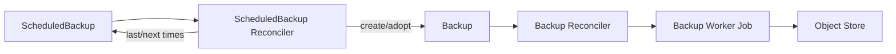

# ScheduledBackup architecture

`ScheduledBackup` is the scheduling layer for physical backups. It does not move
backup bytes itself. Instead, it creates ordinary `Backup` objects on a cron
cadence, and the existing Backup controller runs the XtraBackup-to-object-store
data path.

For one-off on-demand backups, skip the YAML and use the plugin:

```bash
kubectl cnmsql backup <cluster>
```

This page covers recurring scheduled backups.



## Schedule format

`spec.schedule` is a six-field cron expression including seconds:

```text
second minute hour day-of-month month day-of-week
```

Examples:

- `"0 0 2 * * *"`: every day at 02:00:00.
- `"0 */15 * * * *"`: every 15 minutes.
- `"30 0 */6 * * *"`: every six hours at minute 0, second 30.

Five-field Unix cron expressions are intentionally rejected because the leading
seconds field is required.

## Basic example

```yaml
apiVersion: mysql.cnmsql.co/v1alpha1
kind: ScheduledBackup
metadata:
  name: cluster-sample-daily
spec:
  schedule: "0 0 2 * * *"
  cluster:
    name: cluster-sample
  immediate: true
  backupOwnerReference: self
  method: xtrabackup
  target: prefer-standby
  online: true
  reclaimPolicy: Retain
```

The generated Backup inherits the cluster reference, method, target, and online
setting. The object store is resolved by the Backup controller, usually from
`Cluster.spec.backup.objectStore`.

## Object-store cleanup on deletion

By default, deleting a generated Backup leaves its archive (`backup.xbstream` +
`metadata.json`) in the object store. Set `spec.reclaimPolicy: Delete` on the
schedule to have every generated Backup inherit that policy; the Backup controller
then stamps the `mysql.cnmsql.co/cleanup-backup-files` finalizer and removes the
archive when a generated Backup is deleted. It defaults to `Retain`, keeping
deletion non-destructive. See
[Backup retention and deletion](backup-retention-deletion.md) for the full
reclaim-policy semantics, including reclaiming a whole Cluster's archive on
teardown.

## Immediate backup

When `spec.immediate` is true, the scheduler creates one Backup as soon as it
first reconciles the ScheduledBackup, in addition to the cron cadence.

The immediate path has an adoption guard. If the operator creates the immediate
Backup but restarts before patching status, the next reconcile finds the
existing immediate child Backup by label and adopts it instead of firing a
second one.

## Concurrency guard

cnmsql never overlaps backups for the same ScheduledBackup. Before evaluating
the next cron slot, the controller lists child Backups for that schedule. If any
child Backup is not done, meaning its phase is neither `completed` nor `failed`,
the scheduler requeues and waits.

This protects the cluster and object store from accidental backup pileups when a
backup takes longer than the schedule interval.

## Deterministic names

Scheduled backups use deterministic names:

```text
<scheduledbackup-name>-<YYYYMMDDHHMMSS>
```

The timestamp is the UTC scheduled time. Deterministic names make retries
idempotent: if a previous reconcile created the Backup but missed the status
update, the next reconcile observes and adopts the same child.

If another Backup already occupies the deterministic name and is not labelled as
owned by this ScheduledBackup, cnmsql refuses adoption, emits a warning Event,
skips that iteration, and resumes with the next schedule slot.

## Owner reference modes

`spec.backupOwnerReference` controls owner references on generated Backup
objects:

- `self`: the Backup is owned by the ScheduledBackup. Deleting the
  ScheduledBackup can garbage-collect its Backups.
- `cluster`: the Backup is owned by the referenced Cluster.
- `none`: the Backup has no owner reference and remains standalone.

Every generated Backup is labelled with:

```text
mysql.cnmsql.co/scheduled-backup=<scheduledbackup-name>
```

Immediate Backups also receive:

```text
mysql.cnmsql.co/immediate-backup=true
```

Labels are used for adoption and child lookup regardless of owner-reference
mode.

## Suspension

Set `spec.suspend: true` to pause scheduling:

```yaml
spec:
  suspend: true
```

Suspension prevents new Backup creation. It does not cancel a Backup that has
already been created. Retention GC still runs while suspended (matching Kubernetes
CronJob history-limit semantics): a paused schedule stops taking new backups but
keeps its configured history bounds on the ones it already created.

## Status fields

`ScheduledBackup.status` records scheduler progress:

- `lastCheckTime`: the last time the schedule was evaluated.
- `lastScheduleTime`: the last scheduled time that produced or adopted a Backup.
- `nextScheduleTime`: the next expected cron slot.

The generated Backups carry the actual backup phase, Job name, checksum,
destination path, and error details.

## Retention

Left unbounded, a schedule accumulates a `Backup` object for every slot forever.
Three opt-in knobs let the scheduler garbage-collect the Backups it created. All
default to off, so an existing schedule keeps every Backup until you opt in.

```yaml
spec:
  schedule: "0 0 2 * * *"
  cluster:
    name: cluster-sample
  successfulBackupsHistoryLimit: 7   # keep the 7 newest completed Backups
  failedBackupsHistoryLimit: 3       # keep the 3 newest failed Backups
  retentionPolicy: 30d               # also drop any terminal Backup older than 30d
```

- `successfulBackupsHistoryLimit` / `failedBackupsHistoryLimit` cap how many
  completed and failed Backups are kept, by count. The newest N of each phase
  survive; older ones are deleted. Unset means no count limit for that phase.
- `retentionPolicy` is a time window (`<n>d`, `<n>w`, `<n>m`; days, weeks, months,
  a month being 30 days). It uses the same syntax as a Cluster's
  `spec.backup.retentionPolicy`. A terminal Backup older than the window is
  deleted. Unset means no time limit.

A Backup is garbage-collected when it exceeds a history limit or ages past the
window. Only terminal Backups (`completed` or `failed`) are ever eligible; a
`pending` or `running` Backup is never deleted. The single newest completed Backup
is always kept, even if the window would otherwise expire it, so a schedule never
prunes its last recovery point.

Garbage collection respects each Backup's `reclaimPolicy`. Deleting the Backup
object triggers the same path as any other delete: with `reclaimPolicy: Delete`
the cleanup finalizer also reclaims the object-store archive; with the default
`Retain` the archive is left in place. To also bound object-store bytes (base
backups and the continuous binlog archive), use the Cluster's
`spec.backup.retentionPolicy`. See
[Backup retention and deletion](backup-retention-deletion.md) for how the two
layers fit together.

For PITR, base-backup retention must be considered together with binlog archive
retention. Deleting a base backup can make older binlog segments unusable, and
deleting binlogs can shorten the recovery window even when base backups remain.

## Operational notes

- Choose a schedule interval longer than the normal backup duration to avoid
  constant concurrency deferral.
- Use `target: prefer-standby` when replicas are available and can carry backup
  load.
- Keep `immediate: true` for schedules where the first backup should exist
  without waiting for the first cron slot.
- Use `backupOwnerReference: none` if backups must survive deletion of the
  schedule object.
- Monitor both the ScheduledBackup status and the generated Backup statuses.

## Verification coverage

Unit tests cover schedule parsing, defaults, deterministic names, Backup field
propagation, suspended schedules, immediate creation and adoption, first-check
status stamping, due-slot creation, owner-reference modes, concurrency guarding,
name-collision skips, and the retention GC planner (count limits, time window,
terminal-only eligibility, and the newest-completed floor). Live Kind + MinIO e2e
specs exercise retention end to end on both the MySQL and MariaDB engines: each
drives a schedule down to a single kept Backup and confirms a `Delete`-policy
Backup's archive is reclaimed when GC removes it.
