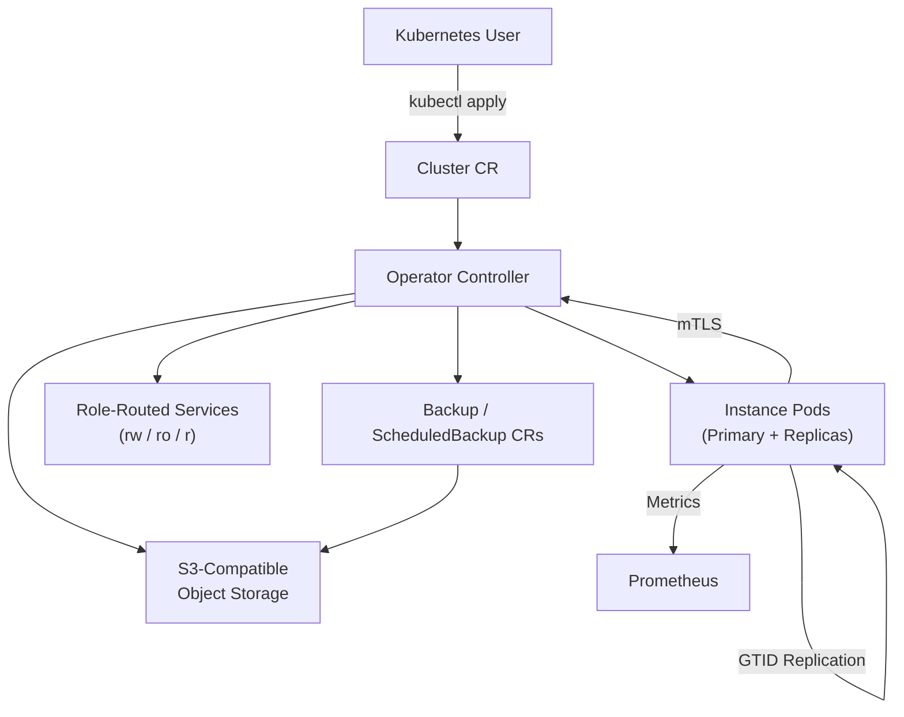

import ThemedImage from '@theme/ThemedImage';

  

# CloudNative MySQL

**CloudNative MySQL** is a Kubernetes operator for [Percona Server for MySQL](https://www.percona.com/software/mysql-database/percona-server) that borrows design patterns from [CloudNativePG](https://cloudnative-pg.io/), adapted for MySQL. Declare a `Cluster` resource and the operator provisions Pods, PVCs, credentials, TLS, and role-routed Services — then handles replication, failover, backups, and point-in-time recovery so you don't have to.

:::note No affiliation

CloudNative MySQL is an independent project. It is **not** affiliated with, endorsed by, or associated with the [CNCF](https://www.cncf.io/) or the [CloudNativePG](https://cloudnative-pg.io/) project and its maintainers.

:::

---

## Architecture at a Glance

Declare your desired state via Kubernetes custom resources. The operator continuously reconciles:
- **Cluster** — instances, storage, replication topology, TLS, Services
- **Backup** — one-shot physical snapshots via XtraBackup to S3
- **ScheduledBackup** — cron-driven backup schedules with retention
- **Database** — declarative schemas with managed roles and owners

---

## Key Features

| Category | Capabilities |
|----------|-------------|
| **MySQL versions** | Percona Server 8.0, 8.4, and 9.x |
| **Replication** | GTID-based semi-synchronous replication with planned switchover and automatic failover |
| **Traffic routing** | Three role-aware Services: read-write, read-only (replicas), and read (any ready) |
| **Backups** | Physical backups via Percona XtraBackup to S3-compatible storage |
| **PITR** | Continuous binlog archiving for point-in-time recovery to any timestamp |
| **Security** | mTLS between operator and instances, MySQL TLS, per-instance ServiceAccount identity, admission webhook for status protection |
| **Multi-tenancy** | Cluster-per-tenant or schema-per-tenant via declarative `Database` and managed role resources |
| **Upgrades** | Rolling instance upgrades with primary switchover, plus in-place instance-manager binary swaps (no pod restart) |
| **Self-healing** | PDBs, semi-sync reconciliation, primary-lease fencing, broken-replica detection and re-initialization |
| **Observability** | Prometheus metrics, PodMonitor support, `kubectl cnmysql` CLI plugin for ad-hoc inspection |
| **Slim images** | Custom Debian-based instance images (~75% smaller than upstream Percona), rootless by default |

---

## API Resources

| Resource | Purpose |
|----------|---------|
| `Cluster` | Define a MySQL cluster: instances, storage, MySQL config, bootstrap, TLS |
| `Database` | Declarative schema management with owners and privilege scoping |
| `Backup` | One-shot physical backup via XtraBackup to S3-compatible storage |
| `ScheduledBackup` | Cron-scheduled backups with deterministic naming and retention |
| `ImageCatalog` | Cluster-wide image resolution by MySQL major version |
| `ClusterImageCatalog` | Per-cluster image override catalog |

All resources live under the `mysql.cloudnative-mysql.io/v1alpha1` API group. See the [API Reference](./api-reference.md) for every field.

---

## Getting Started

1. **[Quickstart](./quickstart.md)** — build images, deploy the operator, create your first cluster, connect, scale, and take a backup.
2. **[Cluster Lifecycle](./cluster-lifecycle.md)** — understand how a `Cluster` CR becomes running MySQL instances.
3. **[Instance Images](./instance-images.md)** — choose MySQL versions and understand the slim image layout.

## Core Operations

4. **[Replication and Failover](./replication-failover.md)** — GTID replication model, planned switchover, automatic failover, and rejoin.
5. **[Security Model](./security-model.md)** — mTLS, TLS, RBAC, per-instance identity, and the threat model.
6. **[Multi-Tenancy](./multi-tenancy.md)** — isolate tenants with Cluster-per-namespace or schema-per-tenant patterns.
7. **[Operator Upgrades](./operator-upgrades.md)** — rolling and in-place operator/instance-manager upgrades.

## Backup and Recovery

8. **[Physical Backup and Recovery](./backup-recovery.md)** — one-shot XtraBackup archives and restore.
9. **[Scheduled Backups](./scheduled-backups.md)** — cron-driven backup schedules.
10. **[Point-In-Time Recovery](./pitr.md)** — continuous binlog archiving and timestamped recovery.
11. **[Backup Retention and Deletion](./backup-retention-deletion.md)** — cleanup semantics and planned GC.
12. **[Object Store Configuration](./object-store.md)** — S3-compatible providers, credentials, and TLS.

## Day-2 Operations

13. **[Operations Runbooks](./operations.md)** — scaling, switchover, fencing, restart, reload, maintenance.
14. **[Monitoring](./monitoring.md)** — Prometheus metrics, PodMonitor, kubectl plugin inspection.
15. **[Troubleshooting](./troubleshooting.md)** — symptom-driven guide for common issues.

## Reference

16. **[API Reference](./api-reference.md)** — complete field reference for every CRD.
