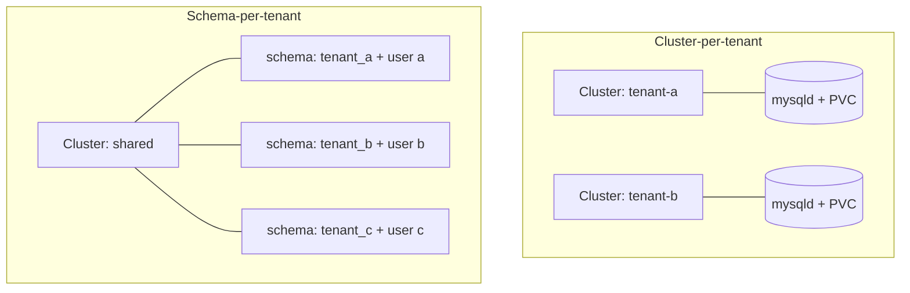

# Multi-tenancy with cloudnative-mysql

cloudnative-mysql is operator owned: the operator holds the policy and converges MySQL
toward a declared state. That property is what makes it usable as a
multi-tenancy platform. Instead of handing out root and trusting humans to keep
tenants apart, you declare the tenants and their schemas, accounts, privileges,
and connection rules as Kubernetes objects, and the operator reconciles them.

This guide covers the two tenancy models cloudnative-mysql supports, the declarative
building blocks they share, how isolation is enforced, and the safety controls
that stop one tenant (or one careless manifest) from affecting the rest.

## Two tenancy models

There is no single "multi-tenant" switch. You choose where the boundary sits.



### Cluster-per-tenant

Each tenant gets its own `Cluster`: dedicated Pods, dedicated PVCs, dedicated
credentials, and dedicated TLS material. This is the strongest isolation
cloudnative-mysql offers.

Use it when tenants need:

- hard resource isolation (a tenant's load cannot starve another's `mysqld`);
- independent MySQL versions or `spec.mysql.parameters`;
- independent backup schedules, retention, and point-in-time recovery windows;
- independent failover and maintenance windows;
- a blast radius that stops at one tenant on data corruption or restore.

The cost is overhead: every tenant carries a full server, storage, and backup
footprint. Put each `Cluster` in its own namespace and you also get Kubernetes
RBAC, ResourceQuota, and NetworkPolicy boundaries.

### Schema-per-tenant

One `Cluster` hosts many tenants, each isolated as a MySQL schema (database)
with its own account scoped to that schema. This is the dense model.

Use it when tenants are numerous, small, and trusted to the same blast radius,
and you want one connection endpoint, one backup stream, and one failover domain
to operate.

The cost is that isolation is logical, not physical: tenants share `mysqld`,
buffer pool, binary log, and a backup/restore lifecycle. A restore is
all or nothing across the shared cluster.

| Concern | Cluster-per-tenant | Schema-per-tenant |
| --- | --- | --- |
| Isolation | Physical (process, storage, network) | Logical (schema + grants) |
| Resource fault containment | Per tenant | Shared |
| MySQL version / parameters | Per tenant | Shared |
| Backup / PITR granularity | Per tenant | Whole cluster |
| Failover domain | Per tenant | Shared |
| Density / cost | Low density, high cost | High density, low cost |
| Declared with | `Cluster` (+ namespace) | `Database` CRs and/or `managed.roles` |

You can mix the two: a `Cluster` per tier or per customer-class, with
schema-per-tenant inside each.

## Declarative building blocks

Both models lean on the same two declarative primitives. Neither requires you to
hand out root or run SQL by hand.

### `spec.managed.roles`: accounts owned by the Cluster

`spec.managed.roles` lives inside the `Cluster` and declares MySQL accounts the
operator reconciles on the primary. The operator lists live users, diffs them
against the spec, and issues the minimal `CREATE USER` / `ALTER USER` /
`DROP USER`. Passwords come from a referenced Secret, or are generated and
stored in `<cluster>-<roleName>`.

This is the right home for accounts that belong to the cluster operator: the
application owner, a read-only reporting account, a migration account. See the
[Managed roles](./api-reference.md#managed-roles) reference for every field.

### `Database`: a namespaced tenant resource

The `Database` custom resource is namespace-scoped and references a `Cluster` in
the same namespace. A `Database` cannot target a `Cluster` in another
namespace, and it reads its password Secrets from its own namespace. So a
`Database`, its Secrets, and the `Cluster` they describe always live together.
A single `Database` declares:

- a schema (`spec.name`), with optional character set and collation;
- the users that should exist for that schema, each with a password Secret;
- the grants each user gets (defaulting to the managed schema);
- a reclaim policy controlling what happens to the schema on deletion.

```yaml
apiVersion: mysql.cloudnative-mysql.io/v1alpha1
kind: Database
metadata:
  name: tenant-a
  namespace: shared              # must be the Cluster's namespace
spec:
  cluster:
    name: shared
  name: tenant_a                 # the MySQL schema
  characterSet: utf8mb4
  collation: utf8mb4_0900_ai_ci
  reclaimPolicy: delete          # drop the schema when this object is deleted
  users:
    - name: tenant_a_app
      passwordSecret:
        name: tenant-a-db
        key: password
      grants:
        - privileges: [SELECT, INSERT, UPDATE, DELETE]
          # `on` defaults to the managed schema (tenant_a.*)
```

`status.applied` flips to `true` once MySQL matches the spec, and conditions
carry detail. See the [Database](./api-reference.md#database) reference for the
full field list.

### Which one for tenancy?

- **`Database` CRs are the multi-tenant primitive.** Each schema and its
  accounts are a separate object with its own `status` and reclaim policy,
  reconciled independently, so you add, change, or remove a tenant without
  touching the `Cluster` object or running SQL.
- **`managed.roles` is for cluster-level accounts** the platform owner controls
  inline on the `Cluster`: the application owner, a reporting account. Editing
  one means editing the shared `Cluster`, so it is not a self-service surface.

Mind the namespace constraint when planning delegation. Because a `Database`
must live in its `Cluster`'s namespace, the two tenancy models delegate
differently:

- **Cluster-per-tenant** delegates cleanly by namespace: the tenant's `Cluster`,
  its `Database` objects, and its Secrets all sit in the tenant's namespace, so
  ordinary namespace-scoped RBAC hands the whole tenant to its team, and they never
  see another tenant's namespace.
- **Schema-per-tenant** puts every tenant's `Database` in the *shared* cluster's
  namespace alongside everyone else's. There is no namespace boundary between
  tenants here, so a tenant cannot be given blanket write access to that
  namespace. Delegation, if any, must be per-object RBAC (named `Database` and
  `Secret` resources) within the shared namespace; otherwise keep these objects
  operator-managed.

## Isolation and how it is enforced

Logical isolation in the schema-per-tenant model rests on grants. cloudnative-mysql makes
the safe path the default.

### Privileges default to the tenant's schema

A `Database` grant whose `on` is omitted applies to the managed schema only
(`<schema>.*`), so the common case, "this account can use its own schema and
nothing else", needs no thought. Set `on` explicitly only to widen scope, and
prefer named privilege lists (`SELECT, INSERT, UPDATE, DELETE`) over `ALL`.

Avoid `*.*` targets and `superuser: true` for tenant accounts entirely; they
break the isolation the model depends on.

### Reserved and operator-owned accounts are protected

Managed-role names that collide with operator internals are rejected up front:
`root`, the `mysql.*` system accounts, and the `cloudnative-mysql_*` user-name prefix the
operator reserves for its own bootstrap, replication, instance-manager, and
backup accounts. Tenants cannot declare their way into an account that controls
the cluster.

### Per-account TLS enforcement

A managed role can require encrypted, certificate-authenticated connections with
`requireTLS: x509` (or `ssl` for encryption without client-cert auth). Combined
with `require_secure_transport` at the server level (see the
[Security Model](./security-model.md#mysql-transport-tls)), you can force every
tenant connection onto TLS.

### Connection limits as a noisy-neighbour guard

In the shared model, `maxUserConnections`, `maxQueriesPerHour`,
`maxUpdatesPerHour`, and `maxConnectionsPerHour` on a managed role cap what a
single tenant account can consume, blunting noisy-neighbour effects on the
shared server.

### Namespace boundaries

A `Database` can only target a `Cluster` in its own namespace, and it reads
password Secrets from that namespace, so it cannot reach across namespaces. In
**cluster-per-tenant** this aligns the Kubernetes blast radius with the
namespace: a team scoped to its own namespace cannot point a `Database` at
another tenant's cluster or read another tenant's Secret. In **schema-per-tenant**
the boundary is weaker, because every tenant's `Database` and Secret live in the
one shared namespace; isolation there rests on MySQL grants, not on namespaces.

## Configuration hardening as a tenancy control

In any shared model, `spec.mysql.parameters` is a privileged surface: a
parameter that relocates the data directory, disables TLS plumbing, or rewrites
log paths affects every tenant on the cluster. cloudnative-mysql guards it:

- **Operator-owned keys** (data directory, server id, TLS material, log
  positions, and the rest of the lifecycle-critical set) cannot be overridden.
  Setting one moves the `Cluster` to `Blocked` with a `phaseReason` naming the
  offending key, before any Pod is created.
- **A dangerous-key denylist** rejects keys that are not operator-set but would
  still compromise the deployment (`datadir`, `pid_file`, `port`, `tmpdir`,
  `plugin_dir`, `secure_file_priv`, `log_error`, the admin/TLS cipher knobs, and
  more) with the same `Blocked` outcome.
- **Deprecated keys** that still parse (for example `master_info_repository`,
  `slave_parallel_workers`) are accepted but raise a `DeprecatedParameter`
  warning event so they surface before a version bump removes them.

`require_secure_transport` is deliberately not denied: enforcing application
TLS is a legitimate operator choice. See
[MySQL configuration](./api-reference.md#mysql-configuration)
for the full lists.

## Credentials and rotation

- **Operator-generated passwords.** Omit `passwordSecret` on a managed role and
  the operator generates a strong password into `<cluster>-<roleName>`
  (key `password`). Good for accounts a human never types.
- **User-provided passwords.** Reference your own Secret. cloudnative-mysql does not
  overwrite Secrets you supply.
- **Rotation.** Update the referenced Secret. The operator (for managed roles)
  and the Database controller track the applied Secret `resourceVersion` and
  re-issue `ALTER USER` only when it changes, so rotation is a Secret edit with no
  manual SQL and no churn when nothing moved.

## Reclaiming tenants

A `Database` carries a reclaim policy, mirroring the PVC model:

- `reclaimPolicy: retain` (default): deleting the `Database` removes the
  Kubernetes object but leaves the MySQL schema and data intact. Safe
  default for production tenants.
- `reclaimPolicy: delete`: deleting the `Database` drops the schema. A
  finalizer guards the object so the drop runs against the primary before the
  object disappears; if no primary is available the operator waits rather than
  orphaning the object.

Choose `retain` for anything with data you would miss, and reserve `delete` for
ephemeral or preview tenants.

## Worked example: onboarding a tenant (schema-per-tenant)

Onboard `tenant-a` onto a shared `Cluster` named `shared`. The `Database` and
its Secret live in the **same namespace as the `shared` Cluster** (here,
`shared`), since a `Database` cannot cross namespaces.

```yaml
# 1. The tenant's password, in the Cluster's namespace.
apiVersion: v1
kind: Secret
metadata:
  name: tenant-a-db
  namespace: shared
type: Opaque
stringData:
  password: "CHANGE-ME-OR-GENERATE"
---
# 2. The tenant: a schema, a scoped account, and a reclaim policy.
apiVersion: mysql.cloudnative-mysql.io/v1alpha1
kind: Database
metadata:
  name: tenant-a
  namespace: shared
spec:
  cluster:
    name: shared
  name: tenant_a
  characterSet: utf8mb4
  collation: utf8mb4_0900_ai_ci
  reclaimPolicy: retain
  users:
    - name: tenant_a_app
      host: "%"
      passwordSecret:
        name: tenant-a-db
        key: password
      grants:
        - privileges: [SELECT, INSERT, UPDATE, DELETE]
```

Apply, then watch it converge:

```bash
kubectl apply -f tenant-a.yaml
kubectl -n shared get database tenant-a -w
# NAME       CLUSTER   DATABASE   APPLIED   AGE
# tenant-a   shared    tenant_a   true      20s
```

To offboard, delete the `Database`. With `retain` the schema stays for archival;
switch to `delete` first if you want the data dropped.

## Worked example: a tenant cluster (cluster-per-tenant)

For a hard boundary, give the tenant its own namespace and `Cluster`, then layer
`Database` CRs or `managed.roles` inside it exactly as above. The
[Quickstart](./quickstart.md) and [Cluster Lifecycle](./cluster-lifecycle.md)
guides cover creating a `Cluster`; everything in this guide about roles,
databases, scoping, and reclaim applies unchanged within it.

## Operational notes and limits

- **Reconcile timing.** Managed-role reconciliation runs after the cluster
  reaches `Ready`; outcomes appear in `status.managedRolesStatus`. `Database`
  reconciliation reports through `status.applied` and conditions.
- **Drop is opt-in.** Users present in MySQL but not declared are left
  untouched; removal requires `ensure: absent` (roles) or deletion under
  `reclaimPolicy: delete` (databases). Nothing is dropped implicitly.
- **Shared-model backups are shared.** In schema-per-tenant, backup, retention,
  and PITR operate on the whole cluster. Per-tenant point-in-time restore is not
  possible without cluster-per-tenant.
- **NetworkPolicy is not shipped.** Network-level tenant isolation between
  namespaces is left to your cluster's policies; cloudnative-mysql does not install them.

## See also

- [API Reference: Managed roles](./api-reference.md#managed-roles)
- [API Reference: Database](./api-reference.md#database)
- [Security Model](./security-model.md)
- [Cluster Lifecycle](./cluster-lifecycle.md)
