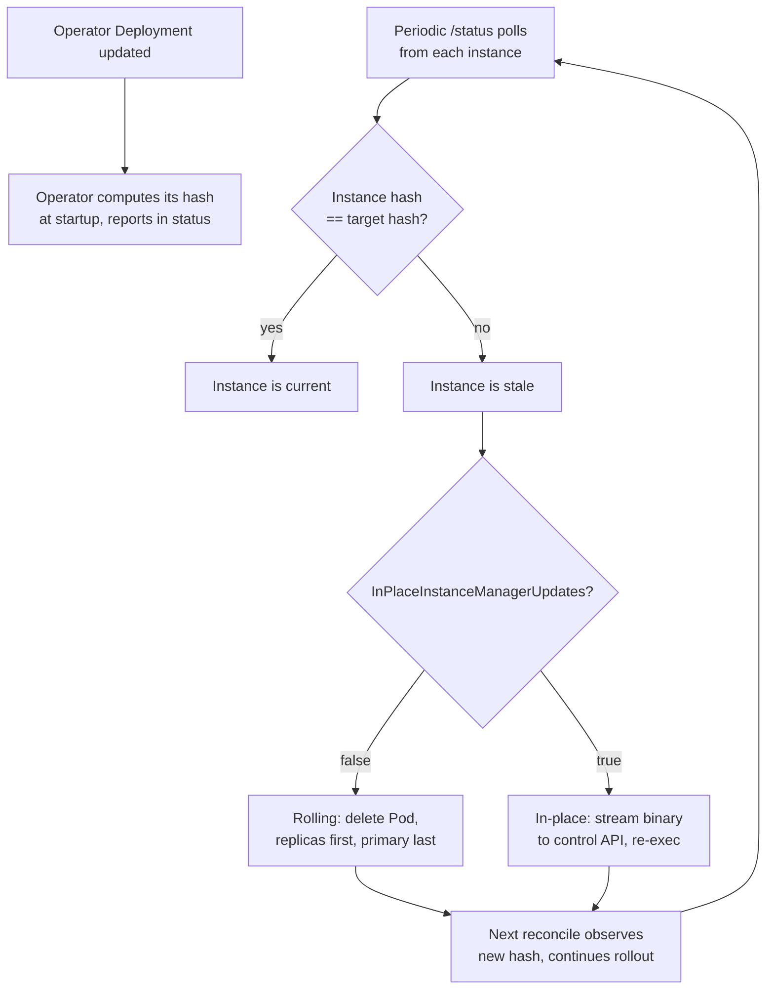

# Operator upgrades

The operator and instance manager are the same binary. The
bootstrap-controller init container copies `/manager` from the operator image
into each instance Pod, so every instance runs the same manager version as the
operator. When you upgrade the operator Deployment, the new image lands first in
the operator Pod. Instance Pods keep running their current manager until the
operator detects the mismatch and rolls the upgrade out to them.

The operator computes a SHA-256 hash of its own binary at startup and reports it
in `status.operatorExecutableHash`. Instance managers report their own hash in
the `/status` control endpoint on every health check. When the operator sees an
instance hash that differs from the target hash, it marks that instance as stale
and begins the upgrade rollout.

Two rollout modes are available: the **rolling upgrade** (default), which
deletes and recreates Pods one at a time, and the **in-place upgrade**, which
streams the new binary to each instance through its control API so the manager
re-execs without restarting mysqld.



## Rolling upgrade (default)

When `spec.inPlaceInstanceManagerUpdates` is `false` or unset, the operator
rolls the upgrade by deleting and recreating each instance Pod one at a time.

The rollout is serialized. Only one replica is ever down at a time, and the
operator waits for each recreated instance to report Ready before moving on to
the next one. Replicas are upgraded first, in ascending ordinal order. The
primary is upgraded last.

Fenced instances are skipped during the rollout. They are not deleted and their
hash mismatch is ignored until they are unfenced.

**Primary handling.** When the primary becomes stale on a multi-instance cluster
with `spec.primaryUpdateMethod` set to `switchover` (the default), the operator
triggers a planned switchover to a healthy replica first, then deletes the old
primary Pod. If no healthy replica is available to switch to, the operator falls
back to deleting the primary Pod in place. With a single-instance cluster, the
primary is always deleted in place because there is no replica to switch to.

With `spec.primaryUpdateMethod` set to `restart`, the primary Pod is deleted
without any switchover regardless of instance count.

**Supervised strategy.** When `spec.primaryUpdateStrategy` is `supervised` and
the primary is stale, the operator stops the entire rollout and waits. The
cluster enters the `WaitingForUser` phase with a status message asking for
manual intervention. No replicas are upgraded while the operator waits, not even
ones that are already stale. This gives you control over when the primary is
switched over. To proceed, trigger a manual switchover to a replica (see
[Planned switchover](./operations.md#planned-switchover)). Once a new primary is
in place, the operator resumes the rollout automatically on the next reconcile.

With `spec.primaryUpdateStrategy` set to `unsupervised` (the default), the
rollout proceeds without waiting.

## In-place upgrade

When `spec.inPlaceInstanceManagerUpdates` is set to `true`, the operator streams
the new manager binary to each stale instance through its control API at
`POST /instance/manager/upgrade`. The instance manager validates the binary
against the SHA-256 hash sent in the `X-CNMySQL-Manager-Hash` header, writes it
to disk atomically, and re-execs itself in place.

mysqld stays running throughout the swap. The re-exec'd manager inherits the
existing mysqld process instead of starting a new one, so the server never stops
accepting queries. The Pod's restart count stays flat and `status.uptimeSeconds`
keeps climbing.

The in-place path treats the primary the same as any replica. No switchover is
triggered, no Pod is deleted, and the `primaryUpdateMethod` and
`primaryUpdateStrategy` fields are ignored for in-place upgrades.

The rollout remains serialized: one instance per reconcile, replicas first,
primary last. Fenced instances are skipped.

**Under the hood.** The operator opens its own executable and streams it over
mTLS to the instance. The instance manager writes the binary to a temp file,
verifies the hash, makes it executable, and atomically renames it over
`/controller/manager`. A 250 ms delay gives the HTTP response time to flush
before `syscall.Exec` replaces the process image. The new image reads
`CNMYSQL_ADOPT_MYSQLD_PID` from the environment (set by the old image before
the exec) and adopts the running mysqld. It also re-attaches to mysqld's stdout
FIFO through a file descriptor inherited across the exec, so structured logging
continues without interruption.

If the exec fails, the old manager continues supervising mysqld. The operator
retries on the next reconcile.

## Manual in-place restart

The `kubectl cnmysql restart-inplace` command triggers a byte-identical re-exec
of an instance manager without a version upgrade. It calls the
`POST /instance/manager/restart-inplace` endpoint, which re-execs the current
binary from `/proc/self/exe` instead of streaming a new one:

```bash
kubectl cnmysql restart-inplace cluster-sample cluster-sample-2
```

This is useful for verifying that mysqld survives a manager swap. After the
command returns, confirm the Pod's restart count did not change and that
`status.uptimeSeconds` has not reset.

## Status fields

During an upgrade, the cluster `status.phase` reports `Upgrading` with a reason
like `Upgrading instance manager on cluster-sample-2 (2/3 remaining)`. When the
supervised strategy blocks the rollout, the phase is `WaitingForUser`.

Two new status fields track hash state:

- `status.operatorExecutableHash` is the SHA-256 of the running operator binary,
  reported at startup and used as the target hash for all instances.
- `status.executableHashByInstance` maps each instance name to the hash
  reported by its manager on the last `/status` poll.

Compare these two fields to see which instances are current and which are stale:

```bash
kubectl get cluster cluster-sample -o json | \
  jq '{operator: .status.operatorExecutableHash, instances: .status.executableHashByInstance}'
```

## Configuring in-place upgrades

Enable in-place upgrades on an existing cluster:

```bash
kubectl patch cluster cluster-sample --type merge \
  -p '{"spec":{"inPlaceInstanceManagerUpdates":true}}'
```

Or set it at creation time in the Cluster spec:

```yaml
spec:
  inPlaceInstanceManagerUpdates: true
```

When you then update the operator Deployment to a new image, the operator
streams the new binary to each instance with no Pod restarts and no switchover
of the primary.

The setting has no effect until the operator executable hash changes, meaning
the operator Deployment has been updated to a new image.

## Troubleshooting

**The rollout is stuck in `WaitingForUser`.** The primary is stale and
`spec.primaryUpdateStrategy` is `supervised`. Trigger a planned switchover to a
healthy replica (see [Planned
switchover](./operations.md#planned-switchover)), or set the strategy to
`unsupervised` if you prefer automatic handling.

**An in-place upgrade fails with a hash mismatch.** The binary streamed from the
operator did not match the expected hash declared in the `X-CNMySQL-Manager-Hash`
header. The stale binary on the instance is not replaced. This is a 400 error.
Check that the operator and instance images are compatible: the operator binary
must be the same architecture and build as the one in the bootstrap-controller
init container. If you are running a multi-architecture cluster, the operator
schedules its Deployment on a node whose architecture matches the instance
images.

**A replicated instance is stuck unready after a rolling upgrade.** The
recreated Pod may be unable to join replication. Check its logs with
`kubectl cnmysql logs` and verify the bootstrap-controller init container
completed. If the instance diverged during the upgrade, re-initialise it (see
[Re-initialise an
instance](./operations.md#re-initialise-an-instance-from-scratch)).

**The rollout skips a stale instance.** The instance may be fenced. Unfence it
first (see [Fence an instance](./operations.md#fence-an-instance)).

## Verification coverage

The upgrade controller has unit coverage for candidate ordering (replicas before
primary, fenced instances excluded), the single-instance and multi-instance
rollout paths, supervised and unsupervised primary strategies, switchover
fallback when no healthy replica exists, in-place binary streaming and hash
validation, FIFO log re-adoption across re-exec, and the restart-inplace command.

E2E tests validate end-to-end in-place upgrades (operator image update, hash
propagation, serialized rollout, mysqld uptime continuity) and in-place operator
upgrades (operator Deployment update, streaming, re-exec, status verification).
