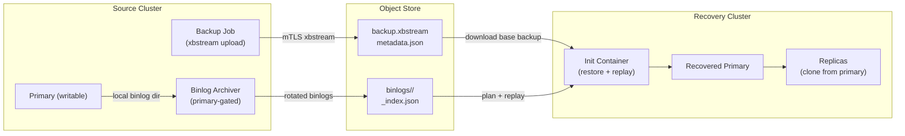
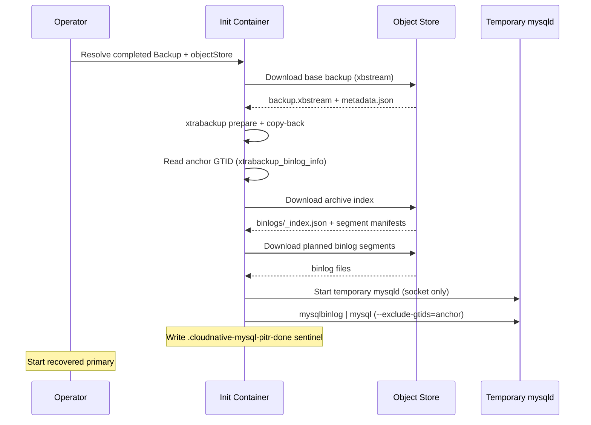

# Point-In-Time Recovery architecture

This document explains how cloudnative-mysql implements point-in-time recovery (PITR) for
integrators. PITR combines a physical base backup with continuously archived
MySQL binary logs, then restores the base backup and replays the archived logs
to a requested recovery target.

The design is GTID first: object names and binlog file numbers are operational
details, while recovery correctness is measured by whether the archived GTID set
covers the target.



## Scope

PITR supports recovery of a new `Cluster` from a completed `Backup`
plus the source cluster's continuous binlog archive. The same targets also apply
to [raw object-store recovery](backup-recovery#restore-from-raw-object-store-no-backup-cr)
(`bootstrap.recovery.source`), which resolves the base backup and binlog archive
straight from S3 without a `Backup` CR. The recovery bootstrap can target:

- `targetGTID`: replay up to an inclusive GTID set.
- `targetTime`: replay until a wall-clock timestamp.
- `targetImmediate`: stop as soon as the base backup is consistent.
- An empty `recoveryTarget: {}` object: replay to the latest archived point.
- No `recoveryTarget`: restore the physical base backup only.

PITR is a bootstrap operation. A recovering cluster starts from an empty PVC,
restores the first primary in an init container, and then replicas clone from
that recovered primary through the normal join path.

## Components

### Base backup

A `Backup` object creates a worker Job that streams an XtraBackup archive from a
selected source instance over the instance-manager mTLS endpoint and uploads it
to an S3-compatible object store. The upload writes:

- `backup.xbstream`, the physical backup payload.
- `metadata.json`, the recovery manifest containing the archive key, SHA256,
  compression flag, backup identity, and timing metadata.

The backup archive is the recovery anchor. After copy-back, XtraBackup leaves
`xtrabackup_binlog_info` in the restored data directory. cloudnative-mysql reads the GTID
set in that file to know which transactions the base backup already contains.

### Continuous binlog archiver

When `spec.backup.continuousArchiving.enabled` is true, every instance pod starts
an archiver loop in the instance manager, but only the writable primary archives.
The loop checks writability before every pass, so a replica stays idle and a newly
promoted primary takes over after failover.

The archiver reads local binlog files from the data directory. It ships only
rotated, inactive files, never the currently written active log. It forces
periodic rotation with `FLUSH BINARY LOGS` to bound time-based RPO, and MySQL's
`max_binlog_size` bounds size-based rotation.

The commit order for every binlog segment is:

1. Upload raw binlog bytes.
2. Write the per-file JSON manifest.
3. Advance the per-server archive status.
4. Update the cluster-level archive index.

A crash between the raw upload and manifest write leaves the file uncommitted
from cloudnative-mysql's perspective; the next archive pass retries it.

### Object store layout

Continuous archives live under the cluster prefix:

```text
<path>/<cluster>/binlogs/<server-uuid>/<binlog-file>
<path>/<cluster>/binlogs/<server-uuid>/<binlog-file>.json
<path>/<cluster>/binlogs/<server-uuid>/_archive_status.json
<path>/<cluster>/binlogs/_index.json
```

The `server_uuid` partition prevents normal filename collisions such as two
different primaries both producing `binlog.000004`. The per-file manifest records
the file's GTID set, first/last GTID, timestamps, SHA256, size, server UUID, and
source instance.

`_index.json` is the recovery discovery document. It records the ordered timeline
segments across server UUIDs and the cumulative `coveredGTIDSet`. Recovery reads
this index instead of listing and inferring the full archive.

### Recovery planner

During restore, cloudnative-mysql loads `_index.json` and plans replay from the base backup
anchor to the requested target.

The planner:

- Skips archive segments already covered by the base backup anchor.
- Passes the anchor as `mysqlbinlog --exclude-gtids`, so transactions already in
  the base backup or re-emitted after failover are not replayed twice.
- Uses `--include-gtids` for `targetGTID`.
- Uses `--stop-datetime` for `targetTime`.
- Rejects targets before the base backup, targets beyond archive coverage, and
  incoherent or forked archive indexes.

The restore init container then downloads the planned binlog files, starts a
temporary socket-only `mysqld` over the restored data directory, and pipes:

```text
mysqlbinlog <bounded replay args> | mysql --socket=<temp socket>
```

The binlog stream itself is treated as data and is not logged. Child process
stderr is captured as structured logs.



## Operator flow

For a source cluster, integrators enable archiving by configuring an object store
and continuous archiving:

```yaml
spec:
  backup:
    objectStore:
      bucket: cloudnative-mysql-backups
      path: production
      endpoint: http://minio.minio.svc:9000
      credentials:
        accessKeyId:
          name: minio-creds
          key: accessKey
        secretAccessKey:
          name: minio-creds
          key: secretKey
    continuousArchiving:
      enabled: true
      targetRPOSeconds: 300
      maxBinlogSizeMB: 16
      binlogExpireSeconds: 604800
```

A recovery cluster references a completed `Backup` and supplies one target:

```yaml
spec:
  bootstrap:
    recovery:
      backup:
        name: source-backup
      recoveryTarget:
        targetGTID: "aaaaaaaa-bbbb-cccc-dddd-eeeeeeeeeeee:1-500"
  backup:
    objectStore:
      bucket: cloudnative-mysql-backups
      path: production
      endpoint: http://minio.minio.svc:9000
      credentials:
        accessKeyId:
          name: minio-creds
          key: accessKey
        secretAccessKey:
          name: minio-creds
          key: secretKey
```

The recovery object store is resolved from the `Backup` override when present,
otherwise from the recovering cluster's `spec.backup.objectStore`. The source
cluster name comes from `Backup.spec.cluster.name`; binlogs are replayed from
that source cluster's archive prefix.

## RPO model

cloudnative-mysql's PITR RPO is bounded by the archived GTID frontier, not by the base
backup time.

Under healthy conditions, the expected RPO is approximately the configured
rotation cadence:

- `targetRPOSeconds` bounds low-write clusters by forcing binlog rotation.
- `maxBinlogSizeMB` bounds high-write clusters by rotating when the active
  binlog grows.
- The active binlog is not archived until it rotates.

With the defaults, a cluster with new writes rotates at least every 300 seconds
and a busy cluster rotates around 16 MiB. Idle clusters do not churn empty
binlogs. Lowering `targetRPOSeconds` tightens RPO at the cost of more, smaller
objects and more object-store requests.

Crash behavior depends on replication durability:

- `sync_binlog=1` is rendered when archiving is enabled so committed
  transactions are flushed to the local binlog.
- `log_replica_updates=ON` is mandatory so a promoted replica has its own binlog
  history for transactions it received before promotion.
- With semi-sync configured so acknowledged commits reach a replica, a failover
  can preserve acknowledged transactions even if the old primary dies before its
  active tail was archived; the new primary re-archives the GTID history under
  its own server UUID.
- Without semi-sync guarantees, acknowledged writes that existed only on a lost
  primary can be lost before archiving. In that case PITR cannot recover data
  that never reached either the object store or the promoted replica.

## RTO model

PITR RTO is the time to create the recovery primary plus any replicas:

- Schedule the Pod and attach the PVC.
- Download and extract the XtraBackup archive.
- Run XtraBackup prepare and copy-back.
- Reconcile restored internal account passwords to the recovery cluster secrets.
- Download and replay archived binlogs from the base backup anchor to the target.
- Start the recovered primary and let replicas clone from it.

The largest variables are base backup size, object-store throughput, PVC
performance, and the amount of binlog data between the base backup and target.
Choosing more frequent base backups reduces replay length and therefore improves
RTO.

## Safety decisions

- The archiver is colocated with the database pod. It uses local binlog files
  instead of a remote replication stream, avoiding an extra replication client
  and preserving exact bytes.
- Only the current writable primary archives. Failover changes the active
  writer through the existing role/fencing flow.
- Archive progress is manifest driven. A raw object without a manifest is not
  considered complete.
- SHA256 in cloudnative-mysql metadata is the integrity source of truth, not S3 ETag.
- Object keys include `server_uuid` to isolate timeline segments.
- Existing manifests are never blindly overwritten with different bytes; a
  mismatch is treated as an archive collision.
- The purge gate purges only files already shipped, so MySQL should not recycle
  unarchived logs unless an operator explicitly bypasses the guard.
- Recovery replay is reentrant. After successful replay, cloudnative-mysql writes
  `.cloudnative-mysql-pitr-done` in the data directory. If the init container retries, it
  skips replay instead of reapplying GTIDs.

## Status and failure surfaces

The source cluster reports continuous archiving in
`status.continuousArchiving`:

- `enabled`
- `lastArchivedBinlog`
- `lastArchivedGTID`
- `lastArchivedTime`
- `pendingFiles`
- `lastFailureReason`
- `lastFailureTime`

The `ContinuousArchiving` condition is healthy when the primary reports no
archiver failure. `pendingFiles` is visible archive lag; a growing value means
the object-store path, network, or archiver throughput should be inspected.

The operator performs an up-front PITR satisfiability check before provisioning a
recovery primary. It can block obvious failures, such as a `targetGTID` beyond
`_index.json` coverage. Checks that require the base backup anchor, such as
"target is older than this backup", run inside the restore init container.

## Integrator responsibilities

- Keep the referenced `Backup` object until recovery clusters no longer need it;
  its status carries the backup ID used to construct archive keys.
- Preserve the object-store bucket/path containing both the base backup and
  `binlogs/` archive for the required recovery window.
- Enable continuous archiving before relying on PITR. A physical backup alone can
  restore only to the backup's consistency point.
- Configure credentials or IAM so instance pods can write the source archive and
  recovery init containers can read it.
- Monitor the `ContinuousArchiving` condition, `pendingFiles`, object-store
  errors, and failover events.
- Choose base-backup frequency and `targetRPOSeconds` together. The former
  mostly controls replay length/RTO; the latter controls how much recent work can
  remain in the active, not-yet-archived binlog.
- Treat changing `server_uuid`, running `RESET MASTER`, or manually deleting
  archived objects as data-loss operations unless planned with operator support.

## Known risks and limits

- PITR cannot recover transactions that were neither archived nor present on the
  post-failover primary.
- `targetTime` depends on binlog event timestamps and the server clock. Prefer
  `targetGTID` when an exact boundary is available.
- The operator's up-front target check is intentionally conservative and
  coverage-based. Some invalid targets are detected later by the init container.
- Recovery uses the archive index. If `_index.json` is missing, stale, or forked,
  recovery fails loudly rather than inferring a possibly unsafe order.
- Object-store versioning, retention, and immutability are outside the operator.
  Accidental deletion or lifecycle expiry of base backups or binlogs reduces the
  recovery window.
- Multi-failover archive planning is covered by unit tests; operators should
  still validate their own failover-heavy recovery runbooks against their object
  store and MySQL versions.
- Separate binlog storage and external replica recovery remain future work in
  the current API surface.

## Verification coverage

The implementation is covered by unit tests for archive key construction,
archiver idempotency, collision detection, replay planning, recovery target
validation, and controller wiring. Integration tests exercise real Percona
`mysqlbinlog | mysql` replay to a target GTID. The Kind + MinIO e2e suite covers
gapless archiving, failover continuity, object-store outage surfacing, and PITR
to `targetGTID` with exact data assertions.
