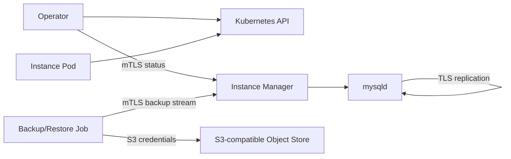

# Security model

cloudnative-mysql separates control-plane access, MySQL traffic, replication traffic, and
object-store credentials. The design goal is to keep long-lived database Pods
focused on database operation while short-lived Jobs and init containers handle
backup and restore data movement.

## Trust boundaries



## Operator to instance manager

The operator talks to the instance manager over HTTPS with mutual TLS. The
instance manager verifies the client certificate against the cluster client CA.
The operator verifies the instance manager certificate against the cluster CA.

This channel is used for:

- status collection during reconciliation/resync;
- backup streaming from an instance;
- legacy or helper control operations where still present.

The current dynamic-role design keeps primary policy in the operator and lets
the instance manager converge locally from Cluster status.

## MySQL transport TLS

cloudnative-mysql renders MySQL TLS configuration:

- `ssl_ca`
- `ssl_cert`
- `ssl_key`

Replication uses TLS material and a replication account that requires X509.

Application TLS enforcement is a user choice. cloudnative-mysql does not force
`require_secure_transport` by default. To require encrypted application
connections:

```yaml
spec:
  mysql:
    parameters:
      require_secure_transport: "ON"
```

## Certificates

By default cloudnative-mysql uses cert-manager to generate a cluster CA, per-instance
server certificates, and the operator replication/client certificate. The
operator reconciles issuers/certificates and waits for the resulting Secrets
before creating Pods that need them.

You can bring your own TLS material with `spec.certificates`. Each field is
optional and independent; cloudnative-mysql only asks cert-manager to generate the
material you did not provide:

```yaml
spec:
  certificates:
    serverCASecret: my-server-ca
    serverTLSSecret: my-server-tls
    clientCASecret: my-client-ca
    replicationTLSSecret: my-replication-tls
    serverAltDNSNames:
      - mysql.example.com
```

`serverTLSSecret` and `replicationTLSSecret` must be
`kubernetes.io/tls` Secrets with `tls.crt` and `tls.key`. CA Secrets may be
`kubernetes.io/tls` or `Opaque`, but must contain `ca.crt` with a PEM encoded CA
certificate. Invalid or missing user-provided Secrets block reconciliation with
a `Blocked` condition before Pods are created.

`serverAltDNSNames` is appended to the automatically generated service DNS names
when cloudnative-mysql generates server certificates. If you provide `serverTLSSecret`,
you own the SAN list in that certificate.

## Database accounts

cloudnative-mysql manages internal accounts for:

- root/bootstrap;
- application owner and database;
- replication;
- instance-manager control;
- backup.

The backup account is dedicated to XtraBackup and receives only the privileges
needed for physical backup on the target Percona version. On modern versions
that includes `BACKUP_ADMIN`; older versions use the compatible static grants.

Generated Secrets are not overwritten when the user provides their own
credentials. Recovery currently reconciles internal account passwords to the
recovery cluster Secrets after restore.

## Kubernetes RBAC

The operator owns the broad reconciliation permissions for Clusters, Backups,
ScheduledBackups, Jobs, Pods, Secrets, Services, PVCs, and cert-manager
resources.

### Per-instance identity

Each instance Pod runs under its own dedicated ServiceAccount named
`<cluster>-<ordinal>-instance`. The ServiceAccount name matches the Pod
name, so the admission webhook can identify the caller and authorise it
by name.

All instance ServiceAccounts in a Cluster share a single Role and
RoleBinding. The Role grants:

- `get`, `list`, `watch` on the Cluster;
- `get`, `update`, `patch` on the Cluster status;
- lease operations for the primary lease.

On scale-down, the controller prunes ServiceAccounts for removed instances
so the identity cannot be reused later.

### Status admission webhook

A validating admission webhook at
`/validate-mysql-cloudnative-mysql-io-v1alpha1-cluster-status` enforces
field-level access control for instance-originated writes to the Cluster
status:

- **Caller identification**: parses the authenticated Kubernetes user
  (`system:serviceaccount:<ns>:<cluster>-<ordinal>-instance`) and
  validates the namespace, cluster prefix, and numeric ordinal.
- **Subresource check**: only the `status` subresource may be updated by
  an instance identity.
- **Field mask**: an instance may only modify
  `status.currentPrimary` and `status.currentPrimaryTimestamp`, and only
  to set `currentPrimary` to its own Pod name **and** to the
  operator-designated `status.targetPrimary`. Any other status field
  mutation from an instance identity is denied.
- **Failure policy**: `Fail`. If the webhook is unreachable, the API
  server rejects all status writes. The webhook is served by the operator
  pod itself, so an unreachable webhook means the operator is down too.

Non-instance callers (operator ServiceAccount, human users) bypass the
webhook and are subject to normal Kubernetes RBAC only.

## Object-store credentials

One-shot backup workers receive object-store credentials as environment
variables sourced from Kubernetes Secrets. The controller-manager does not
stream backup payload bytes.

Continuous archiving is different: the primary instance manager writes binlog
segments to the object store, so instance Pods need the archive destination and
credentials when archiving is enabled.

Credentials may be static Secret references or inherited from IAM-style
workload identity depending on the object-store configuration.

## Sensitive data in logs

Operator and instance-manager logs should be structured. Child process output is
wrapped into structured log records with stream and process context.

Backup/archive payload streams are data paths, not logs. Commands that emit
backup bytes on stdout must only wrap stderr into structured logs.

Object-store credentials, signed URLs, passwords, and TLS private keys must not
be logged or copied into status.

## Threat model

### Assets

| Asset | Description | Compromise impact |
|-------|-------------|-------------------|
| Cluster status | Non-primary status fields: `phase`, `readyInstances`, `divergedInstances`, `fencedInstances`, `failedInstances`, `primaryFailingSince`, `gtidExecutedByInstance`, `conditions` | Misleading operator state; wrong routing; unsafe failover trigger |
| `status.currentPrimary` | Identity of the instance acting as primary | Traffic redirection to a replica; split-brain in async replication |
| `status.currentPrimaryTimestamp` | Wall-clock timestamp of the last primary promotion | Obscured failure timeline; replay confusion during recovery |
| MySQL data | Persistent data in PVCs | Data loss, corruption, or exfiltration |
| Credentials | Root, replication, backup, and application passwords | Unauthorized database access |
| TLS material | Server and CA certificates | Man-in-the-middle; impersonation |
| Object-store data | Physical backups and binlog archives | Data loss or exfiltration |

### Threat actors

- **Compromised instance**: an attacker who gains code execution inside a
  MySQL instance Pod and can issue Kubernetes API requests using the Pod's
  ServiceAccount credentials.
- **Compromised replica**: a replica that has been taken over or
  misconfigured by an attacker but has not yet been fenced.
- **Malicious tenant** (multi-tenancy): a tenant who creates a Cluster CR
  in their namespace and attempts to escalate privileges or access another
  tenant's data.

### Mitigated threats

The per-instance identity and validating status webhook close these attack vectors:

#### Instance cannot corrupt non-primary status fields

The webhook strips `currentPrimary` and
`currentPrimaryTimestamp` from old and new objects and deep-compares the
remainder. Any additional change from an instance identity is rejected.

#### Instance cannot claim another instance's primary role

The webhook requires the new `currentPrimary` value to match the
caller's own Pod name (`<cluster>-<ordinal>`) **and** the
operator-designated `status.targetPrimary`, plus a non-empty
`currentPrimaryTimestamp`. An instance cannot promote itself unless the
operator has explicitly designated it as the target.

#### Instance cannot write to non-status subresources

The webhook is registered only for the `status` subresource. Any
instance-originated write to the main Cluster resource or other
subresources is denied.

#### Scaled-down identities are removed

A ServiceAccount for an instance that no longer exists (cluster scaled
from 5 to 3) is deleted by the controller. Even if the credential were
leaked before deletion, the ServiceAccount no longer has RBAC bindings
and the webhook would reject it based on the missing numeric-ordinal
mapping.

### Unmitigated risks

- **Operator credential compromise**: the operator ServiceAccount holds
  `update/patch` on `clusters/status` and bypasses the webhook. An
  attacker with operator credentials can write any status field for any
  cluster.
- **Webhook bypass from in-cluster network**: a Pod that can reach the
  Kubernetes API directly (not through the webhook) still needs valid
  credentials and RBAC. Kubernetes enforces admission before persistence
  regardless of the caller's network path, so there is no network-level
  bypass.
- **Leaked storage credentials**: continuous archiving credentials are
  mounted into instance Pods. A compromised instance can read or exfiltrate
  object-store credentials and access backup data.
- **Privilege escalation through cert-manager**: the operator reconciles
  cert-manager resources (Issuers, Certificates). If a malicious tenant
  modifies their Cluster CR to reference a different Issuer, the operator
  creates a Certificate in the tenant namespace scoped to that Issuer.
  This is bounded by cert-manager's own namespace restrictions.
- **Denial of service via webhook outage**: because `failurePolicy: Fail`,
  a webhook outage blocks all `clusters/status` writes, including the
  operator's own reconciliation loop. This is an availability concern
  during operator deployment or webhook misconfiguration.

### Defense in depth

| Layer | Mechanism | Scope |
|-------|-----------|-------|
| Kubernetes RBAC | Per-instance ServiceAccounts; single Role per Cluster | API access |
| Admission webhook | Field-level status validation for instance identities | Status write integrity |
| Owner references | All RBAC resources and SAs are owned by the Cluster CR | Garbage collection on delete |
| TLS mTLS | Mutual TLS between operator and instance manager | Control-plane channel |
| MySQL TLS | Replication requires X509 | Replication channel |
| Secret separation | Root, replication, backup, app accounts use independent Secrets | Credential compartmentalization |
| NetworkPolicy | (Not shipped yet) | Network-level isolation |

## Current limits and follow-ups

- A CNPG-parity audit is planned for instance status collection and failover
  safety: temporary manager status failures must not trigger unsafe failover by
  themselves.
- Backup object deletion through a finalizer is not implemented and should be
  opt-in or guarded.
- NetworkPolicy examples are not shipped yet.
