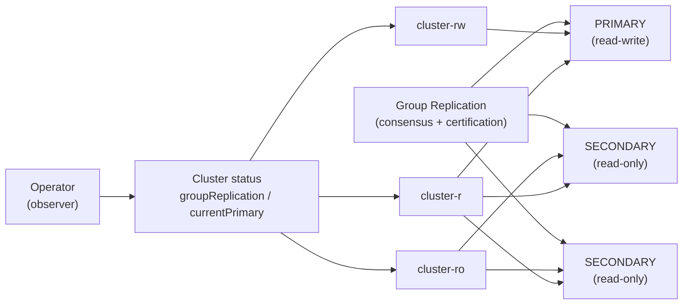

# Group Replication

cloudnative-mysql supports MySQL Group Replication as an alternative to the default
GTID-based async/semi-sync replication. Group Replication is a Paxos-based,
quorum-driven, virtually synchronous replication layer built into MySQL. Unlike
async replication, where the operator elects primaries and orchestrates failover,
the group itself owns membership, write certification, and primary election. The
operator declares which instances belong in the group and observes the group's
decisions.



## Enabling Group Replication

Group Replication is selected by setting `spec.replication.mode` at cluster
creation time. The mode is immutable once set, so an async cluster cannot be
converted to Group Replication later, and vice versa.

```yaml
apiVersion: mysql.cloudnative-mysql.io/v1alpha1
kind: Cluster
metadata:
  name: cluster-gr
spec:
  instances: 3
  replication:
    mode: groupReplication
    groupReplication:
      consistency: BEFORE_ON_PRIMARY_FAILOVER
      exitStateAction: READ_ONLY
      autoRejoinTries: 3
```

The default replication mode is `async`, which keeps the existing
primary-replica topology unchanged. Every existing cluster that omits
`spec.replication` continues to use async replication.

### Configuration fields

| Field | Values | Default | Meaning |
|---|---|---|---|
| `consistency` | `EVENTUAL`, `BEFORE_ON_PRIMARY_FAILOVER`, `BEFORE`, `AFTER`, `BEFORE_AND_AFTER` | `BEFORE_ON_PRIMARY_FAILOVER` | Transaction consistency guarantee enforced by the group. `BEFORE_ON_PRIMARY_FAILOVER` guarantees read-your-writes after a failover with low overhead. |
| `exitStateAction` | `READ_ONLY`, `OFFLINE_MODE`, `ABORT_SERVER` | `READ_ONLY` | What a member does when it involuntarily leaves the group, for example on unrecoverable error or quorum loss. |
| `autoRejoinTries` | 0..N | `3` | How many times a member tries to automatically rejoin after being expelled before giving up. |
| `groupName` | UUID string | auto-generated | Pins `group_replication_group_name`. When unset, the operator generates a UUID on first bootstrap and persists it to status. Immutable once the group exists. |

### Version requirement

Group Replication requires MySQL 8.0.22 or later. The validating webhook rejects
clusters that request `groupReplication` with an older server version. MySQL 8.0,
8.4, and 9.x are supported.

## How Group Replication changes the operator's role

Under async replication the operator makes HA decisions: it detects primary
failure, selects a candidate by GTID dominance, fences the old primary, and
writes `targetPrimary` to trigger promotion. Under Group Replication, those
decisions move into the group. The operator declares desired membership through
`spec.instances` and observes what the group reports:

| Concern | Async | Group Replication |
|---|---|---|
| Primary election on failure | Operator selects candidate, fences, repoints `targetPrimary` | Group auto-elects; operator mirrors into `currentPrimary` |
| Switchover | Operator and in-pod stop/promote/demote dance | `group_replication_set_as_primary` UDF; operator observes result |
| Split-brain guard | Primary Lease and GTID divergence checks | Quorum (majority consensus); Lease disabled |
| Fencing | Stop mysqld, `routable=false` | `STOP GROUP_REPLICATION` (graceful leave), quorum-guarded |
| Sync durability | Semi-sync ack count self-healing | `group_replication_consistency` and certification; semi-sync disabled |
| Replica provisioning | XtraBackup clone and `CHANGE REPLICATION SOURCE` | Distributed recovery (Clone plugin); optional XtraBackup pre-seed |
| Replica health | `SHOW REPLICA STATUS` IO/SQL threads | `performance_schema.replication_group_members` member state |

This is implemented as a topology strategy split. The main reconcile loop calls
through a `topology.Reconciler` interface with two implementations: `async` and
`groupReplication`. Code paths that differ between topologies (failover,
switchover, fencing, semi-sync, primary lease, provisioning gating) are isolated
behind this interface. Shared code (credentials, RBAC, PKI, services, PVCs,
backups, monitoring) is unchanged.

The async implementation is byte-for-byte the existing code paths. The
Group Replication implementation never touches the async path, and async
behaviour is guarded by its existing test suite.

## Architecture: observe and reflect

Every Group Replication design choice follows one rule: the operator never makes
an HA decision the group is responsible for. The operator declares who should be
in the group (desired membership from `spec.instances`) and who should be primary
on a planned switchover (a request through the UDF). It then observes
`replication_group_members` and mirrors reality into `status.currentPrimary`,
role labels, and routing.

### Status model

The operator publishes a cross-validated group view under
`status.groupReplication`:

| Field | Description |
|---|---|
| `groupName` | The pinned `group_replication_group_name` UUID. Sticky and immutable. |
| `bootstrapped` | `true` once the group has been created at least once. Sticky: never cleared. Makes bootstrap exactly-once across restarts. |
| `primaryMember` | The pod name of the group's elected PRIMARY. Mirrored into `currentPrimary`. |
| `members` | Per-member state, role, and reachability from the quorate group view. |
| `hasQuorum` | Whether a majority of configured members is ONLINE. |
| `viewId` | The current group view identifier, which changes on every membership change. |
| `observedViewMax` | The largest group view size ever observed. Sticky: used as the quorum denominator. |

`currentPrimary` continues to exist and is set from `primaryMember`, so all
downstream consumers (services, the plugin, status conditions) work unchanged.

### Cross-validated observation

The operator does not trust a single member's self-report for who is primary.
Instead, it:

1. reads the group view from every reachable member over the mTLS control API;
2. takes the majority verdict from ONLINE members whose view is quorate;
3. cross-validates that the reported PRIMARY is agreed upon across the majority.

A single lying or stale member is outvoted by the group view. The operator is the
sole writer of `status.currentPrimary` and `status.groupReplication.*` under
Group Replication. The status-authorization webhook denies instance identities
every status write on GR clusters, so no compromised instance can forge the
primary or mask a quorum loss through the Kubernetes API.

### Change detection: event-driven, not polling

HA decisions happen inside the group. Kubernetes cannot see them. The
operator reacts to changes through three mechanisms, not a timer:

1. **Kubernetes object watches.** Pod add/update/delete, scaling, spec edits, and
   the operator's own status writes already trigger reconciles through
   `Owns(&Pod{})`. A primary Pod dying is already event-driven.

2. **GR health to Pod readiness bridge.** The in-Pod readiness probe binds to the
   member's GR state: `ONLINE` means ready; `RECOVERING`, `ERROR`, `OFFLINE`, or
   `UNREACHABLE` means not ready. The kubelet turns each transition into a Pod
   `Ready` condition change, which the operator already watches. Member up, down,
   recovery, or expulsion is event-driven with no operator polling.

3. **The `gr-observed` doorbell annotation.** Some transitions are invisible to
   readiness: a clean `set_as_primary` handover leaves both members `ONLINE` and
   Ready, yet the primary role moved. The in-Pod manager publishes a doorbell
   annotation (`mysql.cloudnative-mysql.io/gr-observed`) on its own Pod whenever
   any part of its locally observed GR snapshot changes. The annotation is a
   wake-up, never authority: on reconcile the operator still reads the
   cross-validated majority group view over mTLS before changing routing.

A timed requeue survives as a backstop for missed events. The backstop is set
longer for Group Replication than for async because the doorbell and readiness
bridges make real transitions event-driven already.

## Bootstrap and member join

Group bootstrap is the most dangerous operation: two bootstraps means two
independent groups, which is split-brain. The operator enforces exactly-once
bootstrap through several overlapping guards.

### Exactly-once bootstrap

1. The operator designates one bootstrap member (ordinal 1), recorded as
   `targetPrimary`, gated by `status.groupReplication.bootstrapped == false`.
2. The operator generates a `group_replication_group_name` UUID and pins it to
   status on first reconcile. It is sticky and immutable.
3. The bootstrap member's in-Pod reconciler runs `SET GLOBAL
   group_replication_bootstrap_group=ON; START GROUP_REPLICATION; SET GLOBAL
   group_replication_bootstrap_group=OFF;`. It then reports ONLINE PRIMARY.
4. The operator observes the member ONLINE, sets
   `status.groupReplication.bootstrapped = true` and `currentPrimary`. From this
   point, no member may ever bootstrap again. Subsequent joins always use `START
   GROUP_REPLICATION` without the bootstrap flag.
5. The status webhook enforces `bootstrapped` as monotonic (`false` to `true`
   allowed, `true` to `false` denied) for all callers, the operator included.
   This is defense-in-depth: even a bug or compromised operator token cannot
   re-arm bootstrap and create a second group.

Additional guards: `group_replication_bootstrap_group` is never written to the
config file; `group_replication_start_on_boot` is always `OFF`, so a restarting
member never re-bootstraps on its own. The bootstrap signal itself
(`targetPrimary == me` and `bootstrapped == false`) is operator-written;
`targetPrimary` is masked from instance writes, so a compromised instance cannot
nominate itself as the bootstrap member.

### Group name pinning

The group name (a UUID) is generated once and pinned to status. Every member
renders the same name. The status webhook enforces `groupName` as immutable: an
empty-to-value transition is allowed, but changing the value is denied for all
callers. A changed group name fractures the group.

### Distributed recovery (member join)

New members join the group through distributed recovery, not by cloning from a
single primary. The operator extends the existing replication user with the
privileges Group Replication recovery needs (`REPLICATION SLAVE`, `BACKUP_ADMIN`,
`CLONE_ADMIN`) and configures the `group_replication_recovery` channel with mTLS.

The default recovery method is **Clone distributed recovery**. The joining member
installs the Clone plugin and uses `group_replication_clone_threshold`. When a
new member is too far behind the donor (past the donor's purged GTIDs or the
clone threshold), it clones a full snapshot from the donor automatically and then
recovers the delta. XtraBackup pre-seed remains available as an optimization for
large datasets: seed the empty data directory from a backup, and Group
Replication recovers only the delta.

The provisioning gate keeps its one-at-a-time ramp, but the preconditions change:
instead of "primary healthy," the gate requires "the group has quorum and at
least one ONLINE donor." The readiness of the previous instance is replaced by
"the previous member is ONLINE in the group."

## Role services and routing

Group Replication uses the same three default Services but derives role labels
from the role each member reports in the group view:

- `<cluster>-rw`: selects the group's PRIMARY member only.
- `<cluster>-ro`: selects ONLINE SECONDARY members.
- `<cluster>-r`: selects any ONLINE member (PRIMARY or SECONDARY).

Members that are not `ONLINE` (`RECOVERING`, `ERROR`, `UNREACHABLE`, `OFFLINE`)
are excluded from all routing Services. This is a natural extension of the
existing `routable` gating. `PublishNotReadyAddresses` is always `false` under
Group Replication, so non-ONLINE members never appear in any Service endpoint.

Additional services with custom `selectorType` work the same way: `rw` resolves
to the PRIMARY, `ro` to ONLINE SECONDARIES, and `r` to all ONLINE members.

## Planned switchover

A planned switchover promotes a named SECONDARY to primary. The trigger is
unchanged: set `status.targetPrimary` to a member, exactly as with async
replication. The kubectl plugin and the direct status-subresource patch both
work.

```bash
kubectl cnmysql promote cluster-gr cluster-gr-2
```

The operator then:

1. validates that the target is an ONLINE SECONDARY;
2. invokes `SELECT group_replication_set_as_primary('<target-uuid>')` through the
   in-Pod control API on any ONLINE member;
3. bounds the operation by `spec.maxSwitchoverDelay`;
4. on timeout, clears `targetPrimary` back to `currentPrimary`.

The group hands over the role atomically. The operator does not do a
stop-replica, promote, or demote dance: there is nothing to promote back because
the group never left a consistent state. The operator observes the new PRIMARY
from `replication_group_members` and mirrors it into `currentPrimary`, role
labels, and services.

The primary role move is detected through the `gr-observed` doorbell annotation,
not a poll interval. Both members stay ONLINE and Ready throughout, so the
readiness bridge does not fire. The doorbell wakes a reconcile, and the operator
reads the cross-validated group view over mTLS before repointing `-rw`.

## Automatic failover

Automatic failover under Group Replication is handled entirely by the group. The
operator does not select candidates, does not fence the old primary to promote a
replica, and does not write a failover `targetPrimary`. The async failover loop,
the GTID-dominance candidate selection, the primary Lease, and
`spec.failoverDelay` are all disabled for Group Replication.

Instead, the operator's steady-state step reads the group view from every
reachable member and takes the majority verdict on who is PRIMARY. If that
cross-validated primary differs from `status.currentPrimary`, the group has
already elected a new primary. The operator mirrors it into `currentPrimary`,
repoints role labels and `-rw`, and emits a `FailoverObserved` Event.

Recovery time objective (RTO) is bounded by Group Replication's own election
(sub-second to a few seconds) plus the time it takes for the Kubernetes event to
reach the operator. That event is the Pod readiness flip (old primary NotReady,
new one Ready) or the `gr-observed` doorbell. It is not a poll interval.

### Former primary after failover

When a fenced or crashed primary returns, it does not automatically become
primary again. It boots read only and observes Cluster status. If the group has a
new primary, it can rejoin through `START GROUP_REPLICATION` and recovers through
distributed recovery. If it contains errant transactions the group never saw, it
cannot rejoin and is reported as `ERROR` in the group view. The `reinit`
annotation remains the remedy: the operator destroys its Pod and PVC and
re-clones from a backup.

## Fencing

Fencing is requested the same way (the `fencing` annotation on a Pod), but the
in-Pod action and the guards change:

- **In-Pod:** instead of stopping mysqld, fencing runs `STOP GROUP_REPLICATION`.
  The member gracefully leaves the group, becomes `super_read_only`, and drops to
  `OFFLINE`. mysqld stays up and reachable for inspection. Unfencing runs `START
  GROUP_REPLICATION` to rejoin through distributed recovery.
- **Operator:** flips `routable=false`, so the fenced member leaves all routing
  Services.
- **Quorum interaction:** fencing the primary is a graceful leave that triggers
  the group to elect a new primary, which is clean and expected. Fencing a
  secondary shrinks the group, so the operator refuses to fence a member when
  doing so would drop the group below quorum (`floor(N/2) + 1`). Fencing is never
  allowed to manufacture a quorum-loss outage.

```bash
kubectl cnmysql fence on cluster-gr cluster-gr-2
kubectl cnmysql fence off cluster-gr cluster-gr-2
```

## Quorum guards

Three layers of quorum protection prevent voluntary disruption from breaking
majority:

### PDB

The Pod Disruption Budget is replaced with a single group-aware PDB whose
`maxUnavailable` is `N - floor(N/2) - 1`, so voluntary disruptions can never
break quorum. For a 3-member group, maximum unavailable is 1; for a 5-member
group, it is 2.

### Scale-down

Scale-down never removes a member if it would drop the group below quorum. The
operator removes members from the group with `STOP GROUP_REPLICATION` before
deleting the Pod, so the group view shrinks cleanly rather than leaving ghost
`UNREACHABLE` members. Scaling to an even size produces a warning (quorum prefers
odd numbers: 3, 5, 7). Scaling below 1 is rejected.

### Fence refusal

Fencing a member that would cause quorum loss is refused. The operator surfaces
the refusal in the Cluster's phase and condition rather than allowing the fence.

## Quorum loss and recovery

### Detection

If the operator's observation finds the group has lost majority (reachable ONLINE
members < `floor(N/2) + 1`), it sets `Phase=Blocked`, emits a Warning Event, and
does nothing destructive. The operator keeps observing and waits.

The `hasQuorum` field in `status.groupReplication` reflects this. When quorum is
lost, writes are blocked inside the group itself; the operator mirrors that state
rather than fighting it.

### Guarded recovery (opt-in, never automatic)

Recovery from quorum loss is a deliberate, confirmed action. It is never
automatic because forcing a new membership overrides Paxos consensus and can
cause split-brain if a partitioned-away member is still running.

The recovery path branches on whether any ONLINE survivor remains:

- **Quorum loss with ONLINE survivors** (`group_replication_force_members`):
  the operator picks the safe survivor: a surviving PRIMARY is authoritative; a
  lone survivor is the only option; otherwise it selects the ONLINE member whose
  GTID set dominates every other survivor's. If no member can be proven most
  advanced (incomparable or missing GTID sets), the cluster stays Blocked.

- **Total outage** (no ONLINE survivor): every member is down or OFFLINE, so the
  group view is gone and `force_members` cannot help. The operator must
  re-bootstrap the group from a single member. This has a stricter safety bar:
  every configured instance must be reachable with a known `gtid_executed`, and
  the survivor's set must dominate all of them. If any instance is unreachable
  (it might hold transactions the survivor lacks), the cluster stays Blocked.

Recovery is triggered through the `force-quorum-recovery` annotation or the
`kubectl cnmysql group recover` command:

```bash
kubectl cnmysql group recover cluster-gr
```

The command prints a consequence summary (split-brain risk, data loss potential)
and requires confirmation. The operator independently verifies safety and refuses
if it cannot prove a safe survivor exists.

## Status authorization webhook

The status-authorization webhook from `design/020` is extended for Group
Replication. Under async, an instance identity may write `status.currentPrimary`
when it is the designated `targetPrimary`. Under Group Replication, there is no
self-promotion: the group elects the primary, and the operator is the sole writer
of every status field.

For GR clusters the webhook denies instance identities any status change. The old
and new status must be byte-identical with no field mask. The operator pivots the
webhook rule on `spec.replication.mode`, so async instances keep their existing
capability and GR instances get a strictly smaller blast radius.

Two invariants are enforced for all callers, operator included:

- `status.groupReplication.bootstrapped`: `false` to `true` allowed, `true` to
  `false` denied. Re-arming bootstrap is the path to a split-brain second group.
- `status.groupReplication.groupName`: empty to value allowed, value to different
  denied. A changed group name fractures the group.

These invariants are defense-in-depth against a bug or a compromised operator
token, on top of the exactly-once bootstrap logic.

## Instance RBAC

GR instances get no Cluster status or Lease access. Their only Kubernetes write
capability is a per-instance Role allowing `patch` on their own Pod, scoped by
`resourceNames`, so they can ring the `gr-observed` doorbell annotation. This is
an advisory wake-up only: the operator still reads the cross-validated group view
over mTLS before changing routing.

## Monitoring

### Operator metrics

The operator publishes GR metrics on its `/metrics` endpoint under the `cnmysql`
namespace:

| Metric | Type | Description |
|---|---|---|
| `cnmysql_cluster_gr_has_quorum` | Gauge | 1 if the group has quorum, 0 otherwise. |
| `cnmysql_cluster_gr_bootstrapped` | Gauge | 1 if the group has been bootstrapped, 0 otherwise. |
| `cnmysql_cluster_gr_view_size` | Gauge | The sticky maximum group size used as the quorum denominator. |
| `cnmysql_cluster_gr_members` | Gauge | Members per state (`ONLINE`, `RECOVERING`, `OFFLINE`, `ERROR`, `UNREACHABLE`). |

Labels are `namespace` and `cluster`. Async clusters emit nothing. The collector
reads from the manager's cached client at scrape time, with no extra reconcile or
in-Pod query.

### In-Pod metrics

Each instance exposes `performance_schema.replication_group_members` and
`replication_group_member_stats` through the mysqld exporter sidecar on port
`9187`. These are the same per-instance metrics available for async clusters,
with Group Replication-specific scraper families added.

## Inspecting the group view

The plugin adds a `group status` command that renders the operator's
cross-validated group view:

```bash
kubectl cnmysql group status cluster-gr
```

Output shows the group name, whether it is bootstrapped, quorum status, the
current primary, online member count, view ID, and a per-member table with state,
role, and reachability.

Add `-w` for continuous refresh:

```bash
kubectl cnmysql group status cluster-gr -w
```

The command refuses to run against async clusters.

## Upgrades

Rolling instance upgrades preserve quorum throughout. Secondary members are
rolled first, one at a time, waiting for each to rejoin ONLINE before the next.
The primary is switched away through `set_as_primary` before it is rolled last.
Version-compatibility rules for the Group Replication communication protocol are
respected during the window.

In-place instance-manager upgrades work the same way as under async: the
manager re-exec keeps mysqld (and thus the running group member) alive.
`group_replication_start_on_boot = OFF` prevents a restarted member from
re-bootstrapping the group on its own.

## Backups

Physical backups are taken from an ONLINE SECONDARY to offload the primary.
Continuous archiving runs on the primary as it does under async. Restore
bootstraps a fresh single-member group from the restored data directory and then
scales up. The restored group pins a new group name and never rejoins the old one.

## Limitations

Some features are out of scope for the initial Group Replication support:

- **Multi-primary mode** (`enforce_update_everywhere_checks`) is not supported.
  The API field is reserved for the future but the webhook rejects it.
- **Live migration** between async and Group Replication is not supported. The
  topology mode is immutable at the API level. Switching means creating a new
  cluster and migrating data.
- **Automatic unattended quorum recovery** is not supported. Quorum loss must be
  explicitly confirmed by a human through `kubectl cnmysql group recover`.
- **Cross-cluster Group Replication** (replica clusters following an external
  group) is not supported in combination with Group Replication.
- **MySQL versions below 8.0.22** are rejected by the webhook.

## Operational notes

- Use three instances for meaningful automatic failover. A single-member group
  has no fault tolerance but is allowed for development.
- Prefer odd instance counts (3, 5, 7). Quorum is `floor(N/2) + 1`, so an even
  count wastes half an instance: a 4-member group tolerates the same single
  failure as a 3-member group.
- Never manually write to a SECONDARY. Errant transactions prevent the member
  from rejoining the group.
- Do not run `group_replication_force_members` manually. Use the operator's
  guarded recovery path through `kubectl cnmysql group recover`, which validates
  safety before acting.
- Keep at least three instances in a multi-AZ spread so quorum can survive a
  single AZ loss.
- The `BEFORE_ON_PRIMARY_FAILOVER` consistency level is a good default: it
  guarantees read-your-writes after a failover with low overhead. Use `BEFORE`
  or `AFTER` only when your application requires stricter consistency.

## Verification coverage

Unit tests cover config rendering for Group Replication across the version matrix
(8.0/8.4/9.x), exactly-once bootstrap guards (sticky `bootstrapped`, never a
second bootstrap), quorum arithmetic (PDB `maxUnavailable`, scale-down refusal,
fence refusal), safe survivor selection for both `force_members` and re-bootstrap
paths with GTID dominance, group view aggregation and cross-validation across
majority members, non-ONLINE de-routing, and the status-authorization webhook
(instance denials, monotonic invariants, async regression).

Integration tests with testcontainers and real Percona Server validate
single-member bootstrap and 3-member group join through Clone distributed
recovery.

Kind E2E tests validate the full 3-member Group Replication lifecycle:
provisioning, routing, planned switchover through `set_as_primary`, observed
automatic failover (the operator does not promote), fencing and quorum-guarded
refusal, quorum-loss surfacing and guarded recovery, scale up and down with
quorum preservation, rolling and in-place upgrades, backup and restore into a
fresh group, operator metrics emission, and event-driven change detection (not
timer-driven). A dedicated async regression E2E suite proves the default path is
unchanged.
