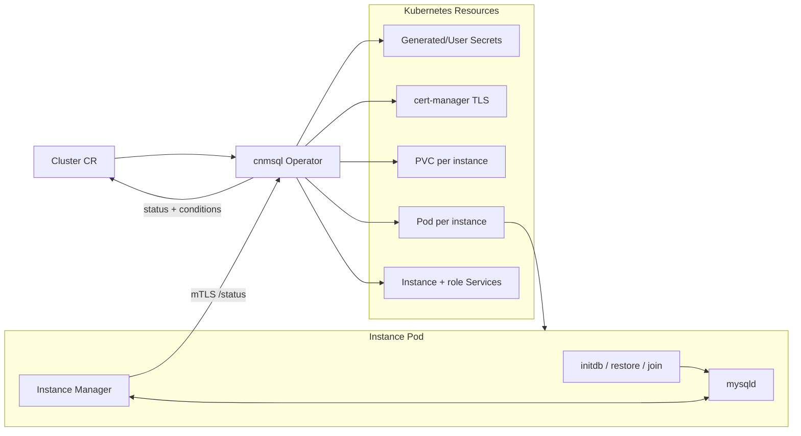

# Cluster lifecycle architecture

This document explains how cnmsql reconciles a `Cluster` into running Percona
Server for MySQL instances. The operator follows the CloudNativePG pattern:
Kubernetes owns the desired state, while each database pod runs an instance
manager that owns local mysqld lifecycle and reports database state back to the
operator.

cnmsql does not use StatefulSets. It creates one Pod and one PVC per instance
so it can control cloning, promotion, fencing, retained storage, and recovery
explicitly.



## Cluster shape

A fresh cluster usually defines an image, an instance count, storage, and an
`initdb` bootstrap:

```yaml
apiVersion: mysql.cnmsql.co/v1alpha1
kind: Cluster
metadata:
  name: cluster-sample
spec:
  instances: 3
  imageName: ghcr.io/cnmsql/cnmsql-instance:8.4
  storage:
    size: 10Gi
  mysql:
    binlogFormat: ROW
  bootstrap:
    initdb:
      database: app
      owner: app
```

`spec.imageName` selects the exact instance image. Alternatively, an
`imageCatalogRef` can resolve an image by MySQL major version. cnmsql is built
for Percona Server for MySQL; the instance image includes mysqld, XtraBackup,
the manager binary, and the small tool set needed for backup and recovery.

## Reconciled resources

For each instance, the operator reconciles stable Kubernetes objects with
predictable names:

- Pod: `<cluster>-1`, `<cluster>-2`, and so on.
- PVC: one data volume per instance, retained during scale-down.
- Headless per-instance Service: stable DNS for instance-to-instance traffic.
- Secrets: root, application, replication, backup, and control credentials when
  the user does not provide them.
- TLS material: cert-manager issuers/certificates for manager mTLS and MySQL TLS.
- Role Services: `<cluster>-rw`, `<cluster>-ro`, and `<cluster>-r`.

The operator labels owned resources with the cluster and instance identity.
Role labels are dynamic: the current primary receives `role=primary`, and the
other ready instances receive `role=replica`.

## Bootstrap modes

The first instance can start in one of two supported ways.

`bootstrap.initdb` creates a new MySQL data directory, initializes the root and
application users, creates the application database, and applies optional
post-init SQL.

`bootstrap.recovery.backup` restores from a `Backup` object into an empty PVC;
`bootstrap.recovery.source` restores directly from an object-store bucket by
referencing an `externalClusters` entry. A raw-S3 recovery discovers the latest
or named (`backupID`) base backup in the destination, needing no source
`Cluster` or `Backup` CR to exist. When a recovery target is present, PITR
planning and binlog replay run before the recovered mysqld is started as the new
primary.

Replicas do not run `initdb`. They join by pulling an XtraBackup stream from
the current primary over the instance-manager mTLS endpoint, preparing it, and
configuring GTID replication.

## Instance manager

Each Pod runs a cnmsql instance manager as PID 1. It is responsible for:

- rendering version-aware MySQL configuration;
- starting and stopping mysqld cleanly;
- initializing or restoring the data directory in init containers;
- exposing an mTLS control API for status and backup streaming;
- running an in-pod role reconciler that promotes or follows based on Cluster
  status;
- running the binlog archiver when continuous archiving is enabled.

The manager uses MySQL's admin interface where available so control operations
do not get locked out by application connection pressure. Older versions fall
back to local socket access and reserved privileges.

## Configuration surface

cnmsql renders the managed MySQL configuration and lets users add safe MySQL
settings through:

```yaml
spec:
  mysql:
    parameters:
      require_secure_transport: "ON"
      max_connections: "500"
    binlogFormat: ROW
    semiSync:
      enabled: true
      timeoutMillis: 1000
```

The operator owns settings required for replication, backup, PITR, and lifecycle
control. User parameters are applied under the mysqld section, but managed keys
are protected by the renderer.

Scheduling and pod shape are controlled through the Cluster spec:
`resources`, `affinity`, `topologySpreadConstraints`, `priorityClassName`,
`schedulerName`, `imagePullPolicy`, `imagePullSecrets`, `env`, `envFrom`,
`podSecurityContext`, and `securityContext`.

TLS material is generated through cert-manager unless you provide Secret names
under `spec.certificates`:

```yaml
spec:
  certificates:
    serverCASecret: my-server-ca
    serverTLSSecret: my-server-tls
    clientCASecret: my-client-ca
    replicationTLSSecret: my-replication-tls
```

Partial overrides are allowed. For example, setting only `serverTLSSecret`
reuses your server certificate while cnmsql still generates the CA issuer and
operator client certificate.

## Status model

During reconciliation and periodic resyncs, the operator queries each
instance-manager `/status` endpoint over mTLS and combines that with Kubernetes
Pod readiness before writing the observed topology into `Cluster.status`.

Important fields include:

- `instances` and `readyInstances`;
- `instanceNames`;
- `currentPrimary` and `targetPrimary`;
- `currentPrimaryTimestamp`;
- `gtidExecutedByInstance`;
- `continuousArchiving`;
- `phase`, `phaseReason`, and Kubernetes conditions.

`Ready=True` means the desired topology is available. `Progressing=True` means
the cluster is still creating, cloning, restoring, or changing primary.
`Degraded=True` surfaces a failure that needs operator attention. Two examples
are a Pod stuck failing to start (`failedInstances`) and a reachable replica
whose replication has aborted with a recorded error (`replicationBrokenInstances`).
This holds even before the cluster first finishes provisioning, so a replica that
comes up but cannot replicate is reported instead of looking like it is still
bootstrapping.

## Scale behavior

Scale-up is ordered. The operator creates one new replica at a time and waits
for it to become healthy before adding the next one. This bounds load on the
primary and makes failures easier to diagnose.

Scale-down removes highest-ordinal replicas first. The Pod is deleted, but the
PVC is retained so the user can inspect or delete data deliberately. cnmsql
never scales below one instance and never removes the current primary as part of
ordinary scale-down.

## Operational notes

- Use at least three instances when relying on automatic failover.
- Keep `binlogFormat: ROW` for replication and PITR safety.
- Set `require_secure_transport` yourself if applications must be forced onto
  TLS; cnmsql renders TLS material but does not force the setting by default.
- Treat retained PVCs after scale-down or failed rejoin as database data, not
  disposable scratch space.
- Watch Events and conditions during bootstrap. Unsupported shapes are reported
  clearly instead of creating partial resources.

## Verification coverage

The controller has unit coverage for supported and unsupported cluster shapes,
image resolution, generated secrets, Pod/PVC templates, status transitions,
role labels, services, scale-up, scale-down, and recovery wiring. The Kind e2e
suite validates single-instance bootstrap, replicated clusters, role services,
switchover, failover, backup, restore, binlog archiving, and PITR flows.
